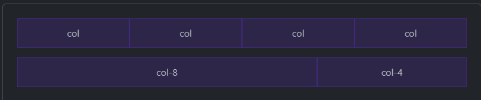

# Overview
Bootstrap's grid system uses a series of containers, rows and columns to layout and align content.  Built with `flexbox`.
- Documentation: https://getbootstrap.com/docs/5.3/layout/grid/
- Containers center and horizontally pad content.
- Rows are wrappers for columns.  Each column has horizontal `padding` (*gutter*).
- Gutters themselves are also customizable.

<o>Note: [flexbox has known bugs](https://github.com/philipwalton/flexbugs).</o>

# Basic Usage
```html
<div class="container text-center">
  <div class="row">
    <div class="col">
      Column
    </div>
    <div class="col">
      Column
    </div>
    <div class="col">
      Column
    </div>
  </div>
</div>
```


# Auto-layout columns
Breakpoint-specific column classes for easy column sizing without explicit numbered classes (ie: `.col-sm-6`).  

## Equal width
No need to use explicit numbered classes like `.col-sm-6`:
```html
<div class="container text-center">
  <div class="row">
    <div class="col">
      1 of 2
    </div>
    <div class="col">
      2 of 2
    </div>
  </div>
  <div class="row">
    <div class="col">
      1 of 3
    </div>
    <div class="col">
      2 of 3
    </div>
    <div class="col">
      3 of 3
    </div>
  </div>
</div>
```


## Setting one column's width
The sibling columns automatically resize around the manually set column:
```html
<div class="container text-center">
  <div class="row">
    <div class="col">
      1 of 3
    </div>
    <div class="col-6">
      2 of 3 (wider)
    </div>
    <div class="col">
      3 of 3
    </div>
  </div>
  <div class="row">
    <div class="col">
      1 of 3
    </div>
    <div class="col-5">
      2 of 3 (wider)
    </div>
    <div class="col">
      3 of 3
    </div>
  </div>
</div>
```


## Variable width
Use `col-{breakpoint}-auto`:
```html
<div class="container text-center">
  <div class="row justify-content-md-center">
    <div class="col col-lg-2">
      1 of 3
    </div>
    <div class="col-md-auto">
      Variable width content
    </div>
    <div class="col col-lg-2">
      3 of 3
    </div>
  </div>
  <div class="row">
    <div class="col">
      1 of 3
    </div>
    <div class="col-md-auto">
      Variable width content
    </div>
    <div class="col col-lg-2">
      3 of 3
    </div>
  </div>
</div>
```


# Responsive classes
## All breakpoints
Use `.col` for grids that are the same for all devices.  
Use `.col-*` when you need a particularly sized column:
```html
<div class="container text-center">
  <div class="row">
    <div class="col">col</div>
    <div class="col">col</div>
    <div class="col">col</div>
    <div class="col">col</div>
  </div>
  <div class="row">
    <div class="col-8">col-8</div>
    <div class="col-4">col-4</div>
  </div>
</div>
```



## Starting stacked then becoming horizontal
This grid system starts out stacked (.col-sm-*) and then becomes horizonal at the small breakpoint (sm):
```html
<div class="container text-center">
  <div class="row">
    <div class="col-sm-8">col-sm-8</div>
    <div class="col-sm-4">col-sm-4</div>
  </div>
  <div class="row">
    <div class="col-sm">col-sm</div>
    <div class="col-sm">col-sm</div>
    <div class="col-sm">col-sm</div>
  </div>
</div>
```


## Some columns stacked, other's not
```html
<div class="container text-center">
  <!-- Stack the columns on mobile by making one full-width and the other half-width -->
  <div class="row">
    <div class="col-md-8">.col-md-8</div>
    <div class="col-6 col-md-4">.col-6 .col-md-4</div>
  </div>

  <!-- Columns start at 50% wide on mobile and bump up to 33.3% wide on desktop -->
  <div class="row">
    <div class="col-6 col-md-4">.col-6 .col-md-4</div>
    <div class="col-6 col-md-4">.col-6 .col-md-4</div>
    <div class="col-6 col-md-4">.col-6 .col-md-4</div>
  </div>

  <!-- Columns are always 50% wide, on mobile and desktop -->
  <div class="row">
    <div class="col-6">.col-6</div>
    <div class="col-6">.col-6</div>
  </div>
</div>
```


## Row columns
Normal column classes (ie: `.col-md-4`) apply to individual columns.
Row column classes (`.row-cols-*`) set the number of columns quickly:
```html
<div class="container text-center">
  <div class="row row-cols-2">
    <div class="col">Column</div>
    <div class="col">Column</div>
    <div class="col">Column</div>
    <div class="col">Column</div>
  </div>
</div>
```  


Or:
```html
<div class="container text-center">
  <div class="row row-cols-3">
    <div class="col">Column</div>
    <div class="col">Column</div>
    <div class="col">Column</div>
    <div class="col">Column</div>
  </div>
</div>
```


Use `row-cols-auto` to give columns their natural width:
```html
<div class="container text-center">
  <div class="row row-cols-4">
    <div class="col">Column</div>
    <div class="col">Column</div>
    <div class="col">Column</div>
    <div class="col">Column</div>
  </div>
</div>
```


# Nesting
To nest content with the default grid, add a new `.row` and set of `.col-sm-*` columns within an existing `.col-sm-*` column:  
```html
<div class="container text-center">
  <div class="row">
    <div class="col-sm-3">
      Level 1: .col-sm-3
    </div>
    <div class="col-sm-9">
      <div class="row">
        <div class="col-8 col-sm-6">
          Level 2: .col-8 .col-sm-6
        </div>
        <div class="col-4 col-sm-6">
          Level 2: .col-4 .col-sm-6
        </div>
      </div>
    </div>
  </div>
</div>
```


# CSS
https://getbootstrap.com/docs/5.3/layout/grid/#css