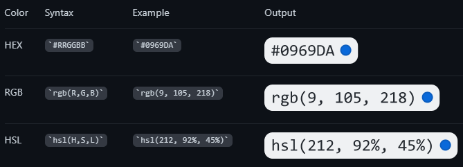
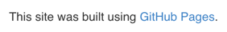

# Overview
[GitHub-Flavored Markdown](https://github.github.com/gfm/) is an extended markdown syntax by GitHub.

# Collapsible Sections
```markdown
<details><summary>CLICK ME</summary>
<p>

#### We can hide anything, even code!

```ruby
   puts "Hello World"
\```

</p>
</details>  
```

<details><summary>CLICK ME</summary>
<p>

#### We can hide anything, even code!

```ruby
   puts "Hello World"
```

</p>
</details>  

# Code Blocks
See also: [linguist/languages.yml at master · github/linguist](https://github.com/github/linguist/blob/master/lib/linguist/languages.yml)

````markdown  
```
function test() {  
  console.log("notice the blank line before this function?");  
}  
```  
````  

## Syntax Highlighting
````markdown
```ruby
require 'redcarpet'
markdown = Redcarpet.new("Hello World!")
puts markdown.to_html
```
````

# Color Models


# Comments
```markdown
<!-- This content will not appear in the rendered Markdown -->
```

# Diagrams
## [Mermaid](https://mermaid-js.github.io/mermaid/#/)
````markdown
Here is a simple flow chart:

````


## [Math](http://en.wikibooks.org/wiki/LaTeX/Mathematics)
Delimit expressions with $:
```markdown
This sentence uses `$` delimiters to show math inline:  $\sqrt{3x-1}+(1+x)^2$
```


### Math Expressions as Blocks
Use a math code block:
````markdown
**Here is some math!**
```math
\sqrt{3}
```
````


# [Emoji](https://github.com/ikatyang/emoji-cheat-sheet/blob/master/README.md)
```markdown
@octocat :+1: This PR looks great - it's ready to merge! :shipit:
```


# Escaping
Use `\`:  
```markdown
Let's rename \*our-new-project\* to \*our-old-project\*.
```

To escape a nested code block, the outer code block needs a different number of backticks than the inner. 

# Footnotes
```markdown
Here is a simple footnote[^1].
A footnote can also have multiple lines[^2].  
You can also use words, to fit your writing style more closely[^note].
[^1]: My reference.
[^2]: Every new line should be prefixed with 2 spaces.  
  This allows you to have a footnote with multiple lines.
[^note]:
    Named footnotes will still render with numbers instead of the text but allow easier identification and linking.  
    This footnote also has been made with a different syntax using 4 spaces for new lines.
```


# Headings
```markdown
# The largest heading
## The second largest heading
###### The smallest heading
```

# Horizontal Line
`___` (3 or more underscores)

# Images
```markdown

```


# Keyboard Shortcuts
```markdown
<kbd>Ctrl</kbd> + <kbd>Alt</kbd> + <kbd>Space</kbd>
```

<kbd>Ctrl</kbd> + <kbd>Alt</kbd> + <kbd>Space</kbd>

# Links
```markdown
This site was built using [GitHub Pages](https://pages.github.com/).
```


Or, links at the end of the file:
```markdown
This site was built using [GitHub Pages][github-pages].

[github-pages]: https://pages.github.com/
```

## Relative Links
```markdown
[Contribution guidelines for this project](docs/CONTRIBUTING.md)
```

## Linking Issues & Pull Requests
| Reference type                                                 | Raw reference                                                                        | Short link                |
| -------------------------------------------------------------- | ------------------------------------------------------------------------------------ | ------------------------- |
| Issue or pull request URL                                      | https://github.com/jlord/sheetsee.js/issues/26                                       | #26                       |
| and issue or pull request number                               | #26                                                                                  | #26                       |
| GH- and issue or pull request number                           | GH-26                                                                                | GH-26                     |
| Username/Repository# and issue or pull request number          | jlord/sheetsee.js#26                                                                 | jlord/sheetsee.js#26      |
| Organization_name/Repository# and issue or pull request number | github/linguist#4039                                                                 | github/linguist#4039      |
| Commit URL                                                     | https://github.com/jlord/sheetsee.js/commit/a5c3785ed8d6a35868bc169f07e40e889087fd2e | a5c3785                   |
| SHA                                                            | a5c3785ed8d6a35868bc169f07e40e889087fd2e                                             | a5c3785                   |
| User@SHA                                                       | jlord@a5c3785ed8d6a35868bc169f07e40e889087fd2e                                       | jlord@a5c3785             |
| Username/Repository@SHA                                        | jlord/sheetsee.js@a5c3785ed8d6a35868bc169f07e40e889087fd2e                           | jlord/sheetsee.js@a5c3785 |

# Lists
## Unordered
```markdown
- George Washington  
* John Adams  
+ Thomas Jefferson  
```

- George Washington  
* John Adams  
+ Thomas Jefferson  

## Ordered
```markdown
1. James Madison
2. James Monroe
3. John Quincy Adams
```

1. James Madison
2. James Monroe
3. John Quincy Adams

## Nested
The list marker character must lie directly below the first character of the text in the item above it:
```markdown
1. First list item
   - First nested list item
     - Second nested list item
```

1. First list item
   - First nested list item
     - Second nested list item

# Mentions
```markdown
@github/support What do you think about these updates?
```


# Quoting Text
```markdown
> Quoted text
```

> Quoted text

# Table of Contents
GitHub generates a ToC when 2+ headings are added:  


# Tables
Tables require a blank line before they start:
```markdown
| Command    | Description                                    |
| ---------- | ---------------------------------------------- |
| git status | List all new or modified files                 |
| git diff   | Show file differences that haven't been staged |
```

| Command    | Description                                    |
| ---------- | ---------------------------------------------- |
| git status | List all new or modified files                 |
| git diff   | Show file differences that haven't been staged |

# Task Lists
```markdown
- [x] #739
- [ ] https://github.com/octo-org/octo-repo/issues/740
- [ ] Add delight to the experience when all tasks are complete :tada:
```


# Text Styling
| Style                  | Syntax         | Output                           |
| ---------------------- | -------------- | -------------------------------- |
| Bold                   | ** ** or __ __ | This is bold text                |
| Italic                 | * * or _ _     | This text is italicized          |
| Strikethrough          | ~~ ~~          | This was mistaken text           |
| Bold and nested italic | ** ** and _ _  | This text is extremely important |
| All bold and italic    | `*** ***`      | All this text is important       |
| Subscript              | `<sub> </sub>` | This is a subscript text         |
| Superscript            | `<sup> </sup>` | This is a superscript text       |
