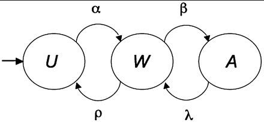

# Overview
Markov models are dynamic; they model probabilistic events over time.  
Dynamic transition models (like Markov) quantify probabilities of future states over time, for both individuals and populations.

# Definition
- Markov models have a set of states with one-step transition probabilities (if discrete time steps) or transition rates (if continuous time).
- The probabilities of the transition intensity to the next state depend only on the current state, not how that state was achieved.
- A Markov chain can only be in one state at a time.
- "transition rate" aka "intensity" aka "rate" = expected transitions per unit of time

# Markov Chain Models
## Competing Risk Models
- A Poisson arrival process may have several distinct types of events, each with its own rate.
- Total Rate = sum of type-specific rates
- The different types compete to be the next one to occur.

  
alpha, beta, lambda, rho

- From state W, two events compete to be next:
    1. Transition to A with rate beta transitions per unit of time.
	2. Transition to U with rate rho transitions per unit of time.
- Probability that A is next state after W = beta / (beta + rho)
- Time until next transition = 1 / (beta + rho)

# Uses
- Markov models can be used to predict time courses of behaviors and outcome probabilities, for both individuals and populations.
- Markov transition models can be used to quantify effects of campaigns and programs on engagement, behaviors, choices (etc) over time.

