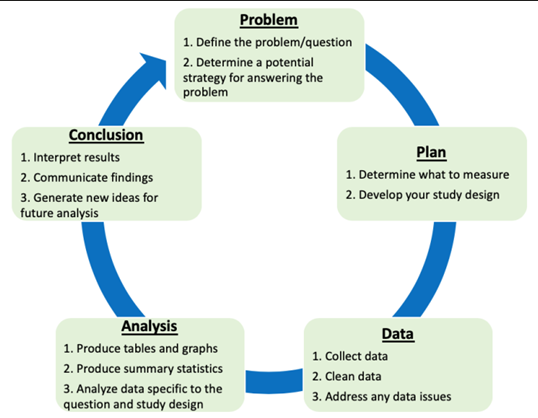

# Template for PPDAC Case Studies
- Problem: What question(s) were addressed? (Why? Why does it matter?)
	- Does distribution of outcome Y depend significantly on variable(s) X? How? On what else does Y depend?
- Plan: How will we use data to address the question?
- Data: Describe the data obtained. What are its strengths and limitations?
	- Variables, sample design and sample size, extent of missing data
	- Limitations of data: missing variables, missing values, study design (e.g., non-random sampling, sample selection biases), and data collection (e.g., variable coding)
- Analysis: 
	- Exploratory analysis: Explore and visualize the data, provide summary statistics and graphs, visualize with scatter plots etc.
	- Confirmatory analyses: Test hypotheses, quantify dependencies (e.g., with regression models, trees, PDPs) and uncertainties
- Conclusion: Communicate the results, interpretation, conclusions
	- What was the answer to the question? What are the limitations of our study?
			§ Uncertain assumptions, imperfect study design, imperfect data, remaining uncertainties
	- Interpretation: Decision recommendations and remaining uncertainties
    - What should be done next?

