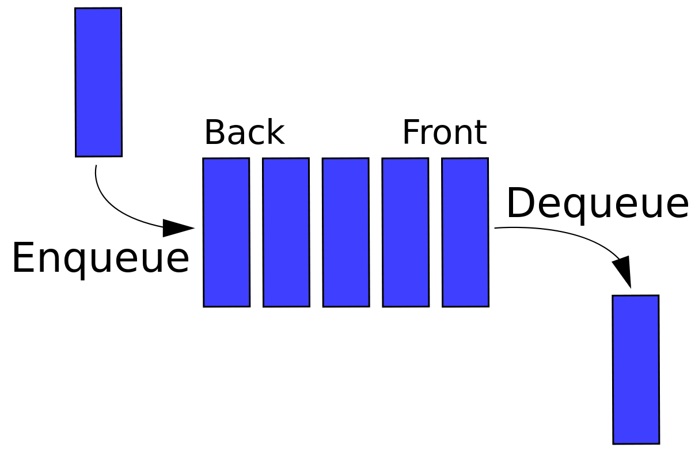

# [Queue](https://docs.microsoft.com/en-us/dotnet/api/system.collections.generic.queue-1?view=net-6.0)
A first-in, first-out collection of objects.  
  

## Namespace  
`Systems.Collections.Generic`  
## Inheritance  
`Object` –> `Queue<T>`

# Notes
- A queue contains elements in the order they were added.
- Queues are FIFO: Elements are inserted at the end (enqueue) and removed from the beginning (dequeue).
- Queues do not have indices.

# Other Queues
`PriorityQueue`
Items in a PriorityQueue have a priority value as well as a position value.

# Construction
```cs
var queue = new Queue<*type*>;
```
# Methods
```cs
.Enqueue(*elem*) // Add *elem* to the end of the queue.
.Dequeue() // Remove and return the first element in the queue.
.Peek() // Return, but do not remove, the first element in the queue.
.TryDequeue(out *type var1*) // Try to dequeue. If successful, store result in *var1*.  Return boolean if dequeue successful.
```
# Iterating
```cs
var current;
while (queue.TryDequeue(current)) { }
```
