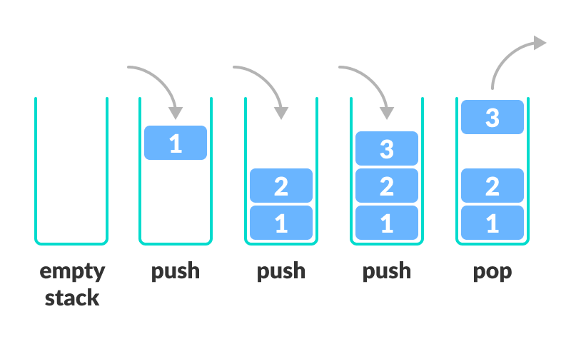

# [Stack](https://docs.microsoft.com/en-us/dotnet/api/system.collections.generic.stack-1?view=net-6.0)
A last-in, first-out collection of objects.  
  

## Namespace
`Systems.Collections.Generic`

## Inheritance
`Object` –> `Stack<T>`

# Construction
```cs
var stk = new Stack<type>();
```
# Methods
```cs
.Peek() // Return, but do not remove, the element at the top of the stack.
Throws exception on empty stack.
.Pop() // Remove and return the element at the top of the stack.
.Push(elem) // Push elem onto stack.
.TryPeek(out var1) // Return, but do not remove, the element at the top of the stack and store it in var1. Return boolean if peek was successful.
```