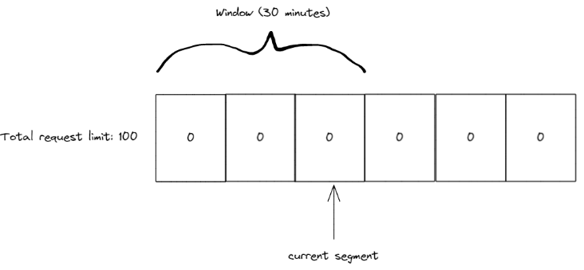
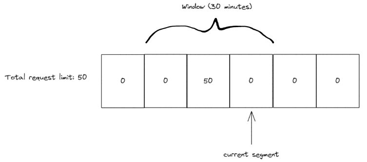
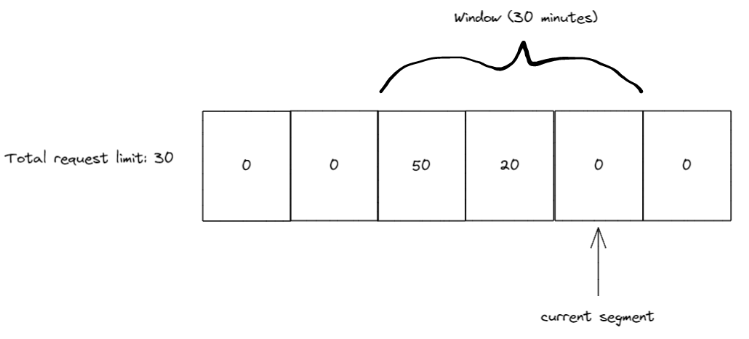

# Overview
<o>Availability: .NET 7</o>
Rate limiting is built into .NET 7.

# Built-in Rate Limiting Algorithms
Namespace System.Threading.RateLimiting
Abstract type RateLimiter

Use:
```cs
RateLimiter limiter = new ConcurrencyLimiter(
    new ConcurrencyLimiterOptions(
        permitLimit: 2,
        queueProcessingOrder: QueueProcessingOrder.OldestFirst,
        queueLimit: 2
    ));
```
## Concurrency limit
Define a maximum number of concurrent requests that can access a resource.

## Token bucket limit
- A bucket is filled with tokens.
- Each request permanently consumes a token.
- At interval, more tokens are added to the bucket.

## Fixed window limit
- During a window of X minutes, Y requests are allowed.
- After X minutes, Y more requests are allowed.

## Sliding window limit

  
  


## Partitioned rate limiter

# RateLimiting Middleware
Namespace `Microsoft.AspNetCore.RateLimiting`
