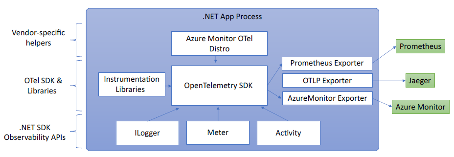

# Overview
*Observability* is the ability to monitor and analyze telemetry about the state of each component in a distributed system, to observe changes in performance, and to diagnose why those changes occur.
- Intended to be transparent to the primary operation and have an insignificant performance impact so that it may be used continuously.
- A combination of logs, metrics, and distributed tracing.

Observability approaches in .NET:
1. Explicitly in code (via [OpenTelemetry](https://opentelemetry.io/))
2. Out of process via EventPipe
3. Inside a process via a *startup hook* — a low-level hook that allows injecting managed code to run before the main application's entry point

These notes focus on approach #1 above.

Documentation: https://learn.microsoft.com/en-us/dotnet/core/diagnostics/observability-with-otel

# OpenTelemetry
A cross-platform, open standard for collecting and emitting telemetry data.  OTel is supported by a wide variety of APM systems including [Prometheus](https://prometheus.io/), [Grafana](https://grafana.com/oss/grafana/), [Azure Monitor](https://learn.microsoft.com/en-us/azure/azure-monitor/app/app-insights-overview?tabs=net), and [many others](https://opentelemetry.io/ecosystem/vendors/).

.NET's OTel implementation uses these platform APIs for instrumentation:
- Logging:  `Microsoft.Extensions.Logging.ILogger<T>`
- Metrics:  `System.Diagnostics.Metrics.Meter`
- Distributed tracing:  `System.Diagnostics.ActivitySource` and `System.Diagnostics.Activity`



OTel collects telemetry from those APIs and other sources and exports them to an APM system for storage and analysis.

## OpenTelemetry Packages
- `OpenTelemetry` — core API
- `OpenTelemetry.Instrumentation.AspNetCore` — instrumentation for ASP.NET Core and Kestrel
- `OpenTelemetry.Instrumentation.Http` — instrumentation for `HttpClient` and `HttpWebRequest`
- `OpenTelemetry.Instrumentation.SqlClient` — instrumentation for `SqlClient`
- `OpenTelemetry.Exporter.Console` — exporter for the console
- `OpenTelemetry.Exporter.Prometheus.AspNetCore` — exporter for Prometheus implemented using an ASP.NET Core endpoint

# Example
This example uses Prometheus for metrics collection, Grafana for a dashboard, and Jaeger for distributed tracing.

1. Create a new simple web API project:
    ```powershell
    dotnet new web
    ```
2. Add metrics and activity definitions:
    ```cs
    // Custom metrics for the application
    var greeterMeter = new Meter("OtPrGrYa.Example", "1.0.0");
    // greetings.count is the metric that will hold the number of times the API has been called
    var countGreetings = greeterMeter.CreateCounter<int>("greetings.count", description: "Counts the number of greetings");

    // Custom ActivitySource for the application
    var greeterActivitySource = new ActivitySource("OtPrGrJa.Example");
    ```
3. Create an API endpoint:
    ```cs
    app.MapGet("/", SendGreeting);
    ```
    ```cs
    async Task<String> SendGreeting(ILogger<Program> logger)
    {
        // Create a new Activity scoped to the method
        using var activity = greeterActivitySource.StartActivity("GreeterActivity");

        // Log a message
        logger.LogInformation("Sending greeting");

        // Increment the custom counter
        countGreetings.Add(1);

        // Add a tag to the Activity
        activity?.SetTag("greeting", "Hello World!");

        return "Hello World!";
    }
    ```
4. Reference the required OTel packages:
    ```xml
    <ItemGroup>
        <PackageReference Include="OpenTelemetry.Exporter.Console" Version="1.5.0" />
        <PackageReference Include="OpenTelemetry.Exporter.OpenTelemetryProtocol" Version="1.5.0" />
        <PackageReference Include="OpenTelemetry.Exporter.Prometheus.AspNetCore" Version="1.5.0-rc.1" />
        <PackageReference Include="OpenTelemetry.Extensions.Hosting" Version="1.5.0" />
        <PackageReference Include="OpenTelemetry.Instrumentation.AspNetCore" Version="1.5.0-beta.1" />
        <PackageReference Include="OpenTelemetry.Instrumentation.Http" Version="1.5.0-beta.1" />
    </ItemGroup>
    ```
5. Configure OpenTelemetry's providers:
    ```cs
    var tracingOtlpEndpoint = builder.Configuration["OTLP_ENDPOINT_URL"];
    var otel = builder.Services.AddOpenTelemetry();

    // Configure OpenTelemetry Resources with the application name
    otel.ConfigureResource(resource => resource
        .AddService(serviceName: builder.Environment.ApplicationName));

    // Add Metrics for ASP.NET Core and our custom metrics and export to Prometheus
    otel.WithMetrics(metrics => metrics
        // Metrics provider from OpenTelemetry
        .AddAspNetCoreInstrumentation()
        .AddMeter(greeterMeter.Name)
        // Metrics provides by ASP.NET Core in .NET 8
        .AddMeter("Microsoft.AspNetCore.Hosting")
        .AddMeter("Microsoft.AspNetCore.Server.Kestrel")
        .AddPrometheusExporter());

    // Add Tracing for ASP.NET Core and our custom ActivitySource and export to Jaeger
    otel.WithTracing(tracing =>
    {
        tracing.AddAspNetCoreInstrumentation();
        tracing.AddHttpClientInstrumentation();
        tracing.AddSource(greeterActivitySource.Name);
        if (tracingOtlpEndpoint != null)
        {
            tracing.AddOtlpExporter(otlpOptions =>
            {
                otlpOptions.Endpoint = new Uri(tracingOtlpEndpoint);
            });
        }
        else
        {
            tracing.AddConsoleExporter();
        }
    });
    ```

    And configure the Prometheus scraping endpoint:
    ```cs
    // By default, the endpoint is /metrics
    app.MapPrometheusScrapingEndpoint();
    ```
6. Run the project:
    ```powershell
    # Access the endpoint at /metrics
    curl -k http://localhost:7275
    ```

## Logging
By default, the Console provider is enabled.  Others can be added.

## Accessing Metrics
Accessing `/metrics` will show output similar to this:
```powershell
curl -k https://localhost:7275/
```

```
Hello World!
```

```powershell {hl_lines=1}
curl -k https://localhost:7275/metrics
```
```
# TYPE greetings_count counter
# HELP greetings_count Counts the number of greetings
greetings_count 1 1686894204856

# TYPE current_connections gauge
# HELP current_connections Number of connections that are currently active on the server.
current_connections{endpoint="127.0.0.1:7275"} 1 1686894204856
current_connections{endpoint="[::1]:7275"} 0 1686894204856
current_connections{endpoint="[::1]:5212"} 1 1686894204856
...
```

## Accessing Tracing
In the server's console, the console trace exporter's output is visible without output from two activities: one from the custom ActivitySource, and one from ASP.NET Core:
```
Activity.TraceId:            2e00dd5e258d33fe691b965607b91d18
Activity.SpanId:             3b7a891f55b97f1a
Activity.TraceFlags:         Recorded
Activity.ParentSpanId:       645071fd0011faac
Activity.ActivitySourceName: OtPrGrYa.Example
Activity.DisplayName:        GreeterActivity
Activity.Kind:               Internal
Activity.StartTime:          2023-06-16T04:50:26.7675469Z
Activity.Duration:           00:00:00.0023974
Activity.Tags:
    greeting: Hello World!
Resource associated with Activity:
    service.name: OTel-Prometheus-Grafana-Jaeger
    service.instance.id: e1afb619-bc32-48d8-b71f-ee196dc2a76a
    telemetry.sdk.name: opentelemetry
    telemetry.sdk.language: dotnet
    telemetry.sdk.version: 1.5.0

Activity.TraceId:            2e00dd5e258d33fe691b965607b91d18
Activity.SpanId:             645071fd0011faac
Activity.TraceFlags:         Recorded
Activity.ActivitySourceName: Microsoft.AspNetCore
Activity.DisplayName:        /
Activity.Kind:               Server
Activity.StartTime:          2023-06-16T04:50:26.7672615Z
Activity.Duration:           00:00:00.0121259
Activity.Tags:
    net.host.name: localhost
    net.host.port: 7275
    http.method: GET
    http.scheme: https
    http.target: /
    http.url: https://localhost:7275/
    http.flavor: 1.1
    http.user_agent: curl/8.0.1
    http.status_code: 200
Resource associated with Activity:
    service.name: OTel-Prometheus-Grafana-Jaeger
    service.instance.id: e1afb619-bc32-48d8-b71f-ee196dc2a76a
    telemetry.sdk.name: opentelemetry
    telemetry.sdk.language: dotnet
    telemetry.sdk.version: 1.5.0
```

## Collecting Metrics with Prometheus
Prometheus is a metrics collection, aggregation, and time-series database system.  
Follow [this documentation](https://learn.microsoft.com/en-us/dotnet/core/diagnostics/observability-with-otel#71-install-and-configure-prometheus) to install and configure Prometheus.

## Creating a Dashboard with Grafana
Grafana is a dashboard creation tool that can create dashboards and alerts from Prometheus and other data sources.  
Follow [this documentation](https://learn.microsoft.com/en-us/dotnet/core/diagnostics/observability-with-otel#8-use-grafana-to-create-a-metrics-dashboard) to install and configure Grafana.

## Distributed Tracing with Jaeger
Jaeger is an open source tool to collect information on *activities* (units of work) and visualize this information.  
Follow [this documentation](https://learn.microsoft.com/en-us/dotnet/core/diagnostics/observability-with-otel#9-distributed-tracing-with-jaeger) to install and configure Jaeger.

# Observability with Application Insights (Azure Monitor)
Application Insights, part of Azure Monitor, is an APM system that combines metrics collection, dashboards, and distributed tracing.  
Follow [this documentation](https://learn.microsoft.com/en-us/dotnet/core/diagnostics/observability-with-otel#example-use-azure-monitor-and-application-insights) to use Azure Monitor and Application Insights.