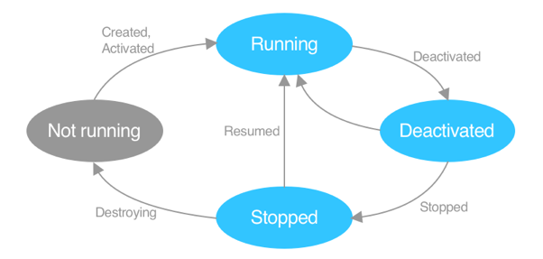

# Overview
.NET MAUI raises cross-platform lifecycle events on the `Window` class when the app transitions states.

# State Transitions
| Begin State | Event              | End State   |
| ----------- | ------------------ | ----------- |
| Running     | Deactivated        | Deactivated |
| Deactivated | Stopped            | Stopped     |
| Stopped     | Resumed            | Running     |
| Stopped     | Destorying         | Not running |
| Not running | Created, Activated | Running     |

# Events
Note: These events have different names on Android, iOS.
| Event       | Raised when                                                           | Action                                                          |
| ----------- | --------------------------------------------------------------------- | --------------------------------------------------------------- |
| Created     | Native window created (but perhaps not yet visible)                   | N/A                                                             |
| Activated   | Window activated                                                      | N/A                                                             |
| Deactivated | Window no longer focused                                              | N/A                                                             |
| Stopped     | Window no longer visible                                              | Disconnect; cancel pending requests                             |
| Resumed     | App resumes from being Stopped (never raised first time app launches) | Subscribe to events; refresh content that's visible on the page |
| Destroying  | Native window is being destroyed                                      | Remove event subscriptions attached to the native window.       |

# Window Class Virtual Methods
These methods are invoked when the corresponding event is raised:
`OnCreated`, `OnActivated`, `OnDeactivated`, `OnStopped`, `OnResumed`, `OnDestroying`

# Subscribing to Window Lifecycle Events
Override the `CreateWindow` method in `App` class and create a `Window` instance:
```cs
public partial class App : Application 
{
    public App() 
    {
        InitializeComponent();

        MainPage = new MainPage();
    }

    protected override Window CreateWindow(IActivationState activationState) 
    {
        Window window = base.CreateWindow(activationState);

        window.Created += (s, e) => 
        {
            // Custom logic
        };

        return window;
    }
}
```

# Consuming Window Lifecycle Events
Create a class that derives from `Window`:
```cs
public class MyWindow : Window 
{
    public MyWindow() : base() { }

    public MyWindow(Page page) : base(page) 
    {
        // Note: if this constructor is used and `App.MainPage` is already set, `InvalidOperationException`
        is thrown.
    }

    protected override void OnCreated() 
    {
        // Register services
    }
}
```
Then, override the `CreateWindow` method in `App` class and return a `MyWindow` instance.

# [Custom Lifecycle Events](https://learn.microsoft.com/en-us/dotnet/maui/fundamentals/app-lifecycle#custom-lifecycle-events)

