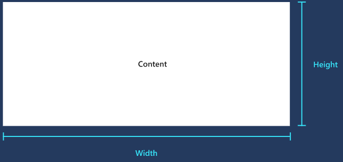
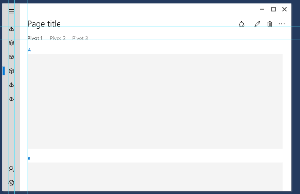
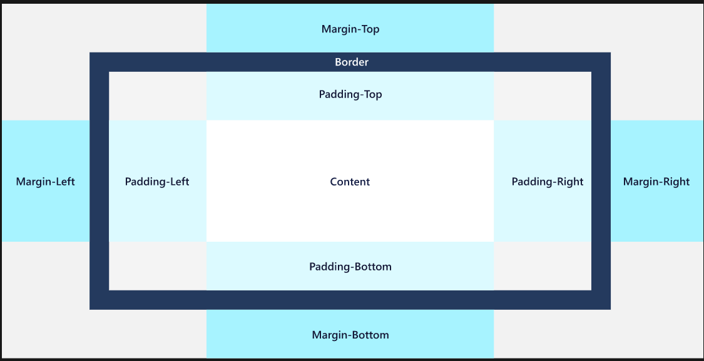
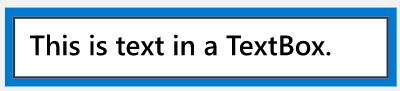
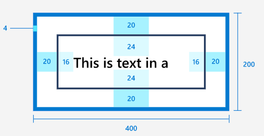

  

  

  

# Dimensions
Dimensions should be set in increments of 4 effective pixels.
- `Height` / `Width` specify element size. Default = `NaN`. Use `Auto` or star sizing for fluid behavior.
- `ActualHeight` / `ActualWidth` report element size at runtime and are changed in a `SizeChanged` event.
- `MinWidth` / `MaxWidth` and `MinHeight` / `MaxHeight` provide constraints while still supporting fluid sizing.
- Text element dimensions are controlled by `FontSize`.
  - They do not have a Height / Width property but do have a calculated `ActualHeight` / `ActualWidth`.

# Alignment
- `HorizontalAlignment`—`Left`, `Center`, `Right`, `Stretch` (default)
- `VerticalAlignment`—`Top`, `Center`, `Bottom`, `Stretch` (default)
- `HorizontalContentAlignment` / `VerticalContentAlignment` specify how children are positioned in the container.
- Text elements use the `TextAlignment` property (default=`left-alignment`)

# Margin
The amount of empty space around an element.
Margin should be set in increments of 4 effective pixels.
- Does not add pixels to `ActualHeight` / `ActualWidth`.
- Uniform margin (`Margin="20"`) results in margin of 20 pixels left, top, right, bottom.
- Distinct margin (`Margin="0 10 5 25"`) sets each side individually.
- If two elements both specify a margin of 10 pixels and are adjacent, the distance between them will be 20 pixels.
- Negative margins are supported but discouraged (can cause clipping).
- Margin values are constrained last—can cause an element's dimension to be constrained to 0.

# Padding
The amount of empty space between the inner border of an element and its child content/elements.
Padding should be set in increments of 4 effective pixels.
- A positive padding value decreases the content area of the element.
- Does not inherit from `FrameworkElement` (unlike dimensions, alignment, and margin).

Several classes define their own padding property:
- `Control.Padding`—for all Control derived classes
  - For controls that have no content, this property does nothing.
  - For controls that have a border, the padding applies inside that border.
- `Border.Padding`—space between the rectangle line created by `BorderThickness`/`BorderBrush` and the `Child` element.
- `ItemsPresenter.Padding`—for items in item controls.
- `TextBlock.Padding` and `RichTextBlock.Padding`—expand the bounding box around the text element.
  - Recommendation: use `Margin` settings on `Block` containers instead since padding can be visually difficult to see because these elements have no background.

Example:
```xml
Margin="0", Padding="0"
```



```xml
<Grid BorderBrush="Blue" BorderThickness="4" Width="200">
<TextBox Text="This is text in a TextBox." Margin="20" Padding="16,24"/>
</Grid>
```

  

