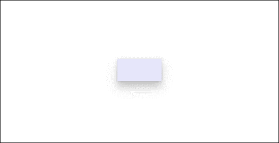

# Overview
*Z-depth* is the distance between two surfaces on the z-axis. It illustrates how close an object is to the viewer.

Shadows also express depth and visual hierarchy.

# Shadow APIs
## `ThemeShadow`
- Can be applied to any XAML element.
- Applies shadows to elements based on a z-depth value.
- Built in to common controls at 32px depth.

## `ThemeShadow` in Popups
To apply to an element in a `Popup`, apply a `ThemeShadow` to the element's `Shadow` property then elevate the element from others behind it by using the Z component of the `Translation` property:

```xml
<Popup>
    <Rectangle x:Name="PopupRectangle" Fill="Lavender" Height="48" Width="96">
        <Rectangle.Shadow>
            <ThemeShadow />
        </Rectangle.Shadow>
    </Rectangle>
</Popup>
```
```cs
// Elevate the rectangle by 32px
PopupRectangle.Translation += new Vector3(0, 0, 32);
```
  

## Automatic `ThemeShadow` on `Flyout` Controls
Controls based on `Flyout`, `DatePickerFlyout`, `MenuFlyout`, or `TimePickerFlyout` automatically use `ThemeShadow` to caste a shadow.

This can be disabled:
```xml
<Flyout>
    <Flyout.FlyoutPresenterStyle>
        <Style TargetType="FlyoutPresenter">
            <Setter Property="IsDefaultShadowEnabled" Value="False" />
        </Style>
    </Flyout.FlyoutPresenterStyle>
</Flyout>
```

## See also 
[DropShadow](https://learn.microsoft.com/en-us/uwp/api/windows.ui.composition.dropshadow)
