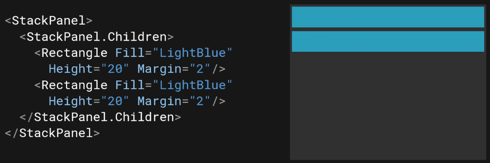

# WinUI Layout Panels
# StackPanel
Often used to stack OK/Cancel buttons.  
  
Note: `StackPanel.Children` can be omitted  

  

# Grid
Often used for the main layout of a UI.
Displays a UI's elements in rows and columns.

Add `RowDefinition`s to the `Grid.RowDefinitions` property. Specifying two `RowDefinitions` results in two rows.  
The same is true for ColumnDefinitions.  

  

`RowDefinition` has a `Height` property; `ColumnDefinition` has a `Width` property.

`ColumnSpan` and `RowSpan` properties span an element across multiple columns or rows.

# Canvas
In a canvas, setting `Left="*n*"` moves the element *n* pixels from the left. `Top`, `Bottom`, and `Right` work the same way:  
  

Set `Zindex` on a rectangle to a value greater than zero to render that rectangle on top of other elements.

