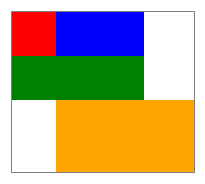
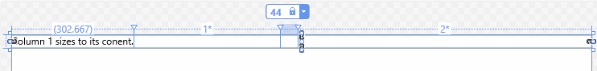

Overview
Layout panels are containers to arrange and group UI elements.

# Common Panel Properties
## Panel attached properties
Used to let child elements inform parent element how they should be positioned in UI.
Syntax: `AttachedPropertyProvider.PropertyName`

This `Button` control informs the parent `Canvas` that the `Button` should be positioned 50 eps from the left edge of the `Canvas`:
```xml
<Canvas>
    <Button Canvas.Left="50">Hello</Button>
</Canvas>
```

## Panel borders
`RelativePanel`, `StackPanel`, and `Grid` panels have border properties to draw a border around them without requiring a Border element: `BorderBrush`, `BorderThickness`, `CornerRadius`, and `Padding.`

# RelativePanel
Arrange UI elements by specifying their location relative to other elements and relative to the panel.  
Upper left is default location.

| Panel alignment                                                                                                                                           | Sibling alignment                                                                                                                               | Sibling position                                                                                          |
| --------------------------------------------------------------------------------------------------------------------------------------------------------- | ----------------------------------------------------------------------------------------------------------------------------------------------- | --------------------------------------------------------------------------------------------------------- |
| [AlignTopWithPanel](https://learn.microsoft.com/en-us/uwp/api/windows.ui.xaml.controls.relativepanel.aligntopwithpanelproperty)                           | [AlignTopWith](https://learn.microsoft.com/en-us/uwp/api/windows.ui.xaml.controls.relativepanel.aligntopwithproperty)                           | [Above](https://learn.microsoft.com/en-us/uwp/api/windows.ui.xaml.controls.relativepanel)                 |
| [AlignBottomWithPanel](https://learn.microsoft.com/en-us/uwp/api/windows.ui.xaml.controls.relativepanel.alignbottomwithpanelproperty)                     | [AlignBottomWith](https://learn.microsoft.com/en-us/uwp/api/windows.ui.xaml.controls.relativepanel.alignbottomwithproperty)                     | [Below](https://learn.microsoft.com/en-us/uwp/api/windows.ui.xaml.controls.relativepanel.belowproperty)   |
| [AlignLeftWithPanel](https://learn.microsoft.com/en-us/uwp/api/windows.ui.xaml.controls.relativepanel)                                                    | [AlignLeftWith](https://learn.microsoft.com/en-us/uwp/api/windows.ui.xaml.controls.relativepanel.getalignleftwith)                              | [LeftOf](https://learn.microsoft.com/en-us/uwp/api/windows.ui.xaml.controls.relativepanel.leftofproperty) |
| [AlignRightWithPanel](https://learn.microsoft.com/en-us/uwp/api/windows.ui.xaml.controls.relativepanel.alignrightwithpanelproperty)                       | [AlignRightWith](https://learn.microsoft.com/en-us/uwp/api/windows.ui.xaml.controls.relativepanel.alignrightwithproperty)                       | [RightOf](https://learn.microsoft.com/en-us/uwp/api/windows.ui.xaml.controls.relativepanel.setrightof)    |
| [AlignHorizontalCenterWithPanel](https://learn.microsoft.com/en-us/uwp/api/windows.ui.xaml.controls.relativepanel.alignhorizontalcenterwithpanelproperty) | [AlignHorizontalCenterWith](https://learn.microsoft.com/en-us/uwp/api/windows.ui.xaml.controls.relativepanel.alignhorizontalcenterwithproperty) |                                                                                                           |
| [AlignVerticalCenterWithPanel](https://learn.microsoft.com/en-us/uwp/api/windows.ui.xaml.controls.relativepanel.alignverticalcenterwithpanelproperty)     | [AlignVerticalCenterWith](https://learn.microsoft.com/en-us/uwp/api/windows.ui.xaml.controls.relativepanel.alignverticalcenterwithproperty)     |                                                                                                           |
```xml
<RelativePanel BorderBrush="Gray" BorderThickness="1">
    <Rectangle x:Name="RedRect" Fill="Red" Height="44" Width="44"/>
    <Rectangle x:Name="BlueRect" Fill="Blue" Height="44" Width="88" RelativePanel.RightOf="RedRect" />
    <!-- Width determined by alignment to red and blue rectangles: -->
    <Rectangle x:Name="GreenRect" Fill="Green" Height="44" RelativePanel.Below="RedRect"
        RelativePanel.AlignLeftWith="RedRect"
        RelativePanel.AlignRightWith="BlueRect"
    />
        <!-- Left side aligned with blue rectangle and bottom & right aligned with the panel itself -->
    <Rectangle Fill="Orange" RelativePanel.Below="GreenRect"
        RelativePanel.AlignLeftWith="BlueRect"
        RelativePanel.AlignRightWithPanel="True"
        RelativePanel.AlignBottomWithPanel="True"
    />
</RelativePanel>
```

  

# StackPanel
Arrange UI elements into a single line that can be oriented horizontally or vertically (default) via Orientation property.
```xml
<StackPanel>
    <!-- Because Width is not set, elements will stretech to
    fill available space: -->
    <Rectangle Fill="Red" Height="44"/>
    <Rectangle Fill="Blue" Height="44"/>
    <Rectangle Fill="Green" Height="44"/>
    <Rectangle Fill="Orange" Height="44"/>
</StackPanel>
```

  

# Grid
Arrange UI elements in multi-row and multi-column layouts via RowDefinitions and ColumnDefinitions properties.
To position elements in specific cells, use Grid.Column and Grid.Row attached properties.
To make elements span multiple rows or columns, use Grid.RowSpan and Grid.ColumnSpan attached properties.
```xml
<Grid>
    <Grid.RowDefinitions>
        <RowDefinition/>
            <!-- Since second row has explicit height of 44, the first row will fill whatever space is left. -->
        <RowDefinition Height="44"/>
    </Grid.RowDefinitions>
    <Grid.ColumnDefinitions>
        <!-- Column width is Auto so it will be defined by width
        of largest child. -->
        <ColumnDefinition Width="Auto"/>
        <ColumnDefinition/>
    </Grid.ColumnDefinitions>
    <Rectangle Fill="Red" Width="44"/>
    <Rectangle Fill="Blue" Grid.Row="1"/>
    <Rectangle Fill="Green" Grid.Column="1"/>
    <Rectangle Fill="Orange" Grid.Row="1" Grid.Column="1"/>
</Grid>
```

  

## Grid Star Sizing
| Column     | Sizing | Description                                                                                                                            |
| ---------- | ------ | -------------------------------------------------------------------------------------------------------------------------------------- |
| `Column_1` | Auto   | The column will size to fit its content.                                                                                               |
| `Column_2` |        | After the Auto columns are calculated, the column gets part of the remaining width. `Column_2` will be one-half as wide as `Column_4`. |
| `Column_3` | 44     | The column will be 44 pixels wide.                                                                                                     |
| `Column_4` | 2      | After the Auto columns are calculated, the column gets part of the remaining width. `Column_4` will be twice as wide as `Column_2`.    |

```xml
<Grid>
    <Grid.ColumnDefinitions>
        <ColumnDefinition Width="Auto"/>
            <!-- Since no Width specified, default of "" will be used: -->
        <ColumnDefinition/>
        <ColumnDefinition Width="44"/>
        <ColumnDefinition Width="2"/>
    </Grid.ColumnDefinitions>
    <TextBlock Text="Column 1 sizes to its conent." FontSize="24"/>
</Grid>
```

  


# `VariableSizedWrapGrid`
Arrange UI elements in a grid where rows or columns automatically wrap into new rows or columns when `MaximumRowsOrColumns` is reached.  

Use `Orientation="Vertical"` so grid adds items from top to bottom until column is full then wraps to a new column.  

Cell dimensions are specified with `ItemHeight` / `ItemWidth`.
- If not specified, first cell sizes to fit its content, then all subsequent cells use size of first cell.
Use `VariableSizeWrapGrid.ColumnSpan` / `RowSpan` attached properties to specify how many adjacent cells a child element should fill.

```xml
<VariableSizedWrapGrid MaximumRowsOrColumns="3" ItemHeight="44" ItemWidth="44">
    <Rectangle Fill="Red"/>
    <Rectangle Fill="Blue"
        VariableSizedWrapGrid.RowSpan="2"/>
    <Rectangle Fill="Green"
        VariableSizedWrapGrid.ColumnSpan="2"/>
    <Rectangle Fill="Orange"
        VariableSizedWrapGrid.RowSpan="2"
        VariableSizedWrapGrid.ColumnSpan="2"/>
</VariableSizedWrapGrid>
```

  

# Canvas
Arrange UI elements using fixed coordinate points by setting Canvas.Top and Canvas.Left attached properties on each element.
Elements can overlap.
Canvas renders child elements in order in which they are declared (last child is rendered on top)
Use Canvas.Zindex attached property to change the draw order of elements at runtime: element with highest value draws last (on top of all others).

```xml
<Canvas Width="120" Height="120">
    <Rectangle Fill="Red" Height="44" Width="44"/>
    <Rectangle Fill="Blue" Height="44" Width="44" Canvas.Left="20" Canvas.Top="20"/>
    <Rectangle Fill="Green" Height="44" Width="44" Canvas.Left="40" Canvas.Top="40"/>
    <Rectangle Fill="Orange" Height="44" Width="44" Canvas.Left="60" Canvas.Top="60"/>
</Canvas>
```
  