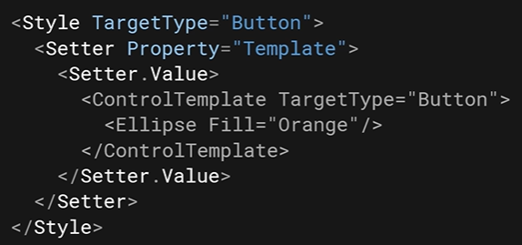

# Overview
There are *user controls* and *custom controls*:
- User controls have hardcoded UI's in their XAML files
- Custom controls have UIs defined in a ControlTemplate.
  - Set the Template property to change the UI of a custom control.
  - This allows for changing the UI even if you don't own the code for the control.
- All WinUI controls (Button, TextBox, CheckBox, etc) are implemented as custom controls.

# Define the Look of a Custom Control
Starting with a normal grey button…  
  

Now:
1.  Assign a `ControlTemplate` with target type `Button` to the `Button`'s `Template` property.
2.  Create the UI for the Button (using any UI element like `Shape`, `Panel`, etc) inside the `ControlTemplate` tag.

You now have an orange circular button:  
  

# Setting the Button's `Background` property to Blue has no effect because it is overriden by the `ControlTemplate`:  
  

# Use the `TemplateBinding` static markup extension to reference a property:  
  

# A `ControlTemplate` can also be defined in a Style:  
  