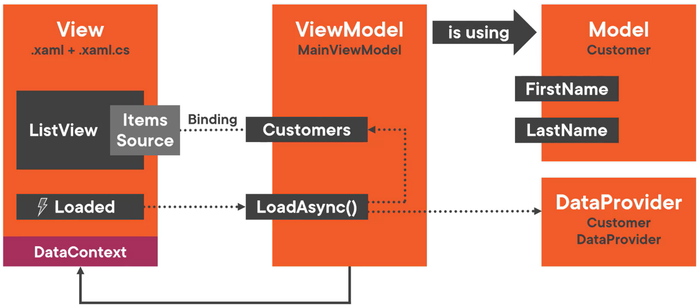

# Model View ViewModel Pattern
## View
- `.xaml` and corresponding `.xaml.cs` file
- Visual elements (like `ListView`)

## ViewModel
- This is a model that is actually made for the View (hence "ViewModel")
- Contains UI logic
- ViewModel uses the Model
- The View is connected to the ViewModel via data bindings
  - A ViewModel instance is assigned to the View's `DataContext` property to enable this
- Usually contains a `LoadAsync()` method that uses the `DataProvider` to fill the `Customers` property
  - In the View's code-behind, create an event handler for the `Loaded` event. Call the `LoadAsync` method from this handler.

## Model
- `Customer` class
- `DataProvider` class — in this case, a Customer DataProvider class that loads and saves customers (in a file, a database, or a web API, etc)  

  

# Advantages of MVVM
- ViewModel and Model are UI-independent
- Maintainability and testability are increased since the UI and the UI logic are separated.
