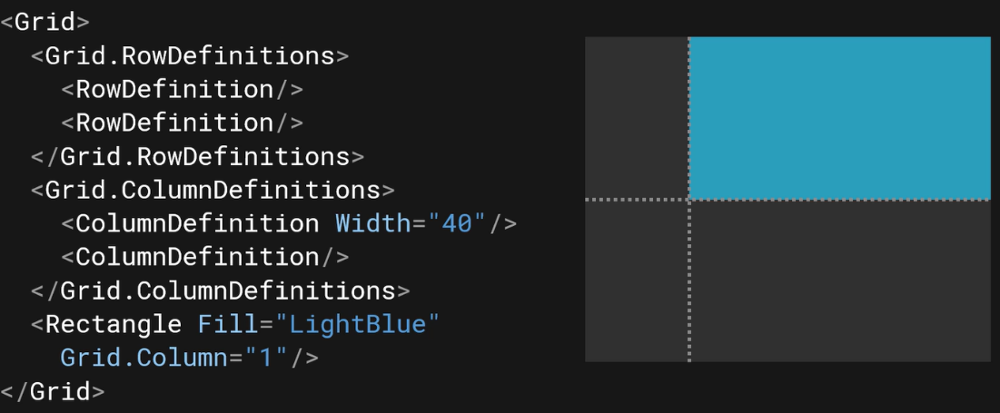
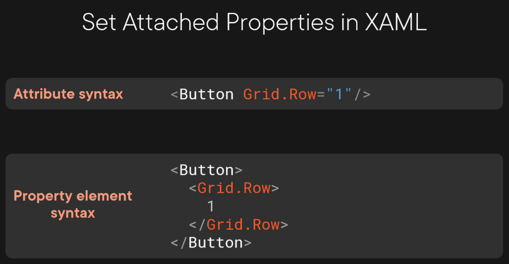

# In XAML
`Grid.Column` is an *attached property*; it is a property defined in the `Grid` class but set on the `Rectangle.`  
  

Set `Grid.Row="1"` to move to the second row of the grid.  



# In C#
```cs
var btn = new Button();
btn.SetValue(Grid.RowProperty, 1);

var row = (int)btn.GetValue(Grid.RowProperty);
```
