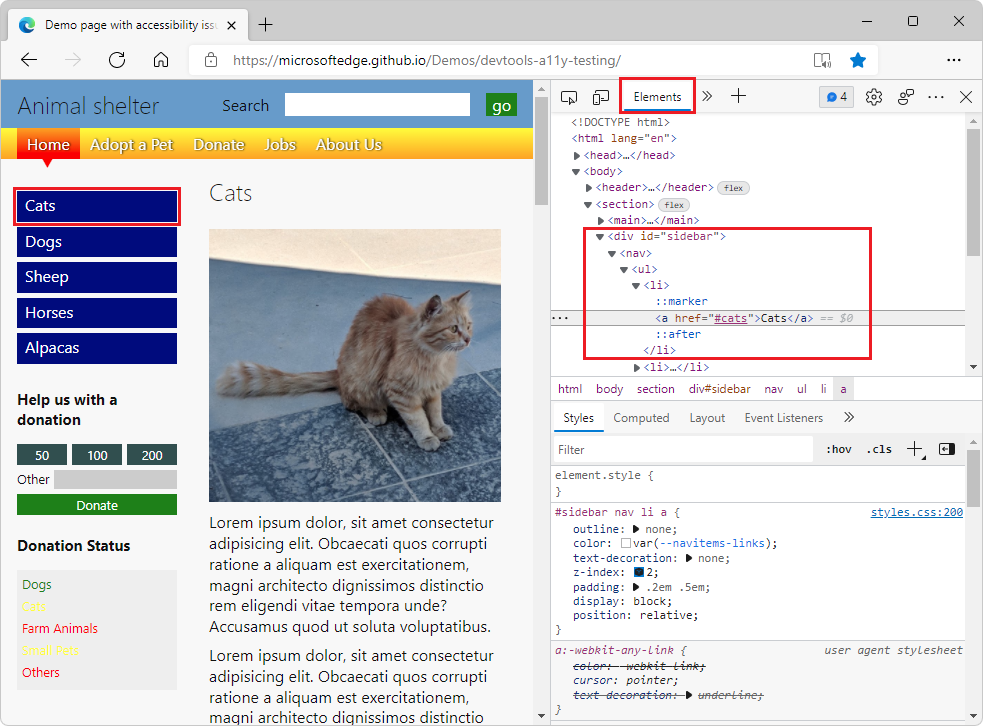
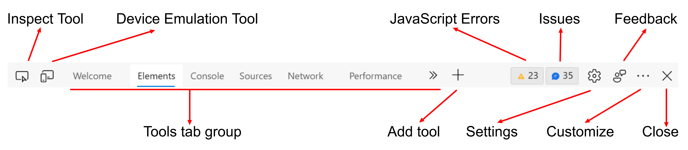

# Overview
> Documentation: https://learn.microsoft.com/en-us/microsoft-edge/devtools-guide-chromium/overview

Inspect and debug web pages with DevTools.

# Keyboard Shortcuts
> Documentation: https://learn.microsoft.com/en-us/microsoft-edge/devtools-guide-chromium/shortcuts/

- <kbd>Ctrl</kbd>+<kbd>Shift</kbd>+<kbd>I</kbd> — Open DevTools to Welcome  
- <kbd>Ctrl</kbd>+<kbd>Shift</kbd>+<kbd>J</kbd> — Open DevTools to Console
- <kbd>Ctrl</kbd>+<kbd>Shift</kbd>+<kbd>C</kbd> — Open DevTools to Elements
- <kbd>Ctrl</kbd>+<kbd>Shift</kbd>+<kbd>H</kbd> — Display DevTools tooltips
- <kbd>Ctrl</kbd>+<kbd>Shift</kbd>+<kbd>P</kbd> — Open Command menu

# Elements
The Elements tab displays the DOM tree:  

# Main Toolbar
