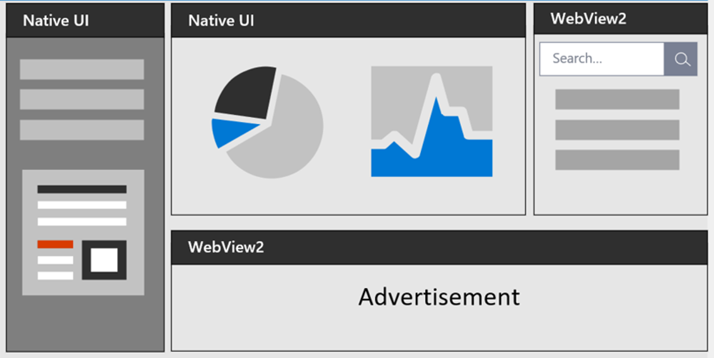

# [Overview](https://learn.microsoft.com/en-us/microsoft-edge/webview2/)  

Edge WebView2 is a *control* that allows for embedding web technologies (HTML/CSS/JS) into native apps. It uses Microsoft Edge as the rendering engine to display the web content in the app.

WebView2 provides a hybrid approach between the extremes of websites and PWAs on one end of the spectrum and fully native apps on the other end.

Supported platforms:
- .NET Framework 4.5+
- .NET Core 3.1
- .NET 5
- .NET 6
- WinUI 2.0
- WinUI 3.0
- Windows 10+