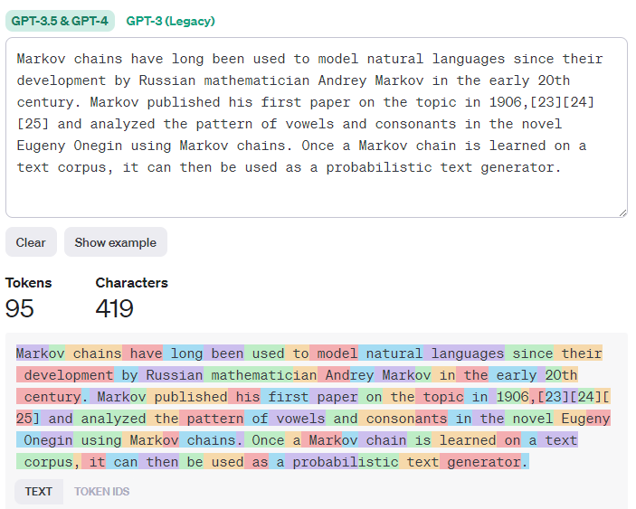

# Overview 
> **Large Language Model** — A generative AI model that receives natural language text as input and generates text as output.

# Components
- neural network
- parameters
- weights
- tuning

# Input and Output
## Prompts
The input of the large language model.
- A prompt may be an *instruction* specifying the type of output is expected of the model.
  - Example instructions: 
    - Summarizing a text ("Summarize the following and extract insights")
    - Creative ideation and design ("Write an assignment for high school students including four open-ended questions about Louis XIV and his court")
    - Q&A ("Who is Louis XIV and why is he an important historical character?")
    - Writing assistance ("Louis XIV is an important historical character because...")
    - A unit of code to be created ("Create a Python function that sums two numbers")

## Context
The optional input that provides details to the *prompt* and, optionally, examples. Providing context is a form of *prompt engineering.*

## Completion
the output of the large language model.

# Prompt Engineering
A field of study of the design and optimization of prompts to deliver consistent and quality completions for a given model.

## Tokenization
An LLM sees a prompt as a sequence of tokens. Different models (and even different versions of the same model) can tokenize a prompt differently. 
The way a prompt is tokenized has a marked impact on the quality of the completion.

Use [OpenAI Tokenizer](https://platform.openai.com/tokenizer?WT.mc_id=academic-105485-koreyst) to visualize how a prompt is tokenized:  

## Instruction-Tuned LLM
An instruction-tuned LLM starts with the foundation model and tunes it with examples or input/output pairs. These are multi-turn messages that contain clear 
*instructions*. For example, consider this instruction which is provided to a model after some initial prompt: "Summarize content you are provided with for a 
second-grade student. Keep the result to one paragraph with 3-5 bullet points."

# How it Works
## Tokenization
   1. A *token* is some arbitrary chunk of text. 
   2. LLMs use a *tokenizer* to create arrays of tokens. 
   3. Each token is then mapped with a *token index* — an integer encoding the original token.

## Token prediction 
   1. Given *n* tokens as input (with max *n* varying from one model to another), this model can predict one token as output. 
   2. In the next iteration, the previous *output token* is incorporated. 
   3. This is how LLMs generate multiple sentences.

## Selection process
   1. The *output token* is chosen according to its probability of occurring after the current chunk of text.
      1. This is done by creating a probability distribution of all possible "next tokens" based on the model's training.
      2. A degree of randomness is added which results in this process being non-deterministic.
         1. This degree of randomness is a tunable model parameter.

# Types of LLMs [[Documentation](https://platform.openai.com/docs/models/overview)]
LLMs have different *model types* based on their architecture, training data, and use case. Underneath each type are different *models*.

| Model Type                                                                                            | Use Case                     |
| ----------------------------------------------------------------------------------------------------- | ---------------------------- |
| [Whisper](https://platform.openai.com/docs/models/whisper?WT.mc_id=academic-105485-koreyst)           | Audio and speech recognition |
| [DALL-E](https://platform.openai.com/docs/models/dall-e?WT.mc_id=academic-105485-koreyst), Midjourney | Image generation             |
| GPT-3.5, GPT-4                                                                                        | Text generation              |

## Foundation Models [[Documentation](https://hai.stanford.edu/news/reflections-foundation-models)]
*Foundation* models are:
- trained using unsupervised learning or self-supervised learning
- very large (based on deep neural networks trained on billions of parameters)
- intended to serve as a foundation for other models

For example, GPT-3.5 served as the foundation model for ChatGPT-4.

## Embedding vs. Image Gen vs. Text Gen vs. Code Gen
LLMs can also be categorized by the output they generate:
- *Embeddings* — models that can convert text into numerical form (called *embedding*).
- *Image generation* — models that generate new images or edit existing ones.
- *Text generation* — models that generate text 
- *Code generation* — models that generate code

## Encoder-only vs Encoder-Decoder vs Decoder-only
- *Decoder-only* models examine some input and generate output based on that input (like GPT-3). They are *generative*.  
- *Encoder-only* models examine some input, examine some output, and identify the relationship between them (like BERT). They are not generative.  
- *Encoder-Decoder* models do both (like BART and T5).

## Development
LLMs can be developed through several different approaches:
1. Prompt engineering with context — provide enough context in the prompt to get useful completions.
2. Retrieval Augmented Generation (RAG) — fetching relevant data and make it part of the prompt.
   1. RAG augments prompts with external data in the form of chunks of documents.
   2. It allows the LLM to overcome the limitation of only being trained on static data.
3. Fine-tuning — results in a new model being generated with updated weights and biases.
   1. Requires a set of training examples that consist of a single prompt and the associated output for each prompt.