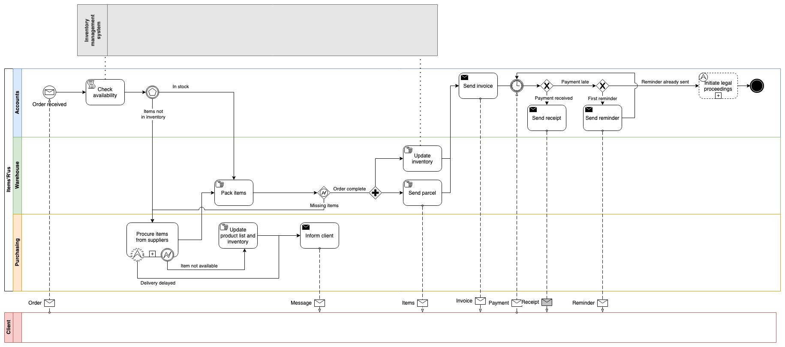
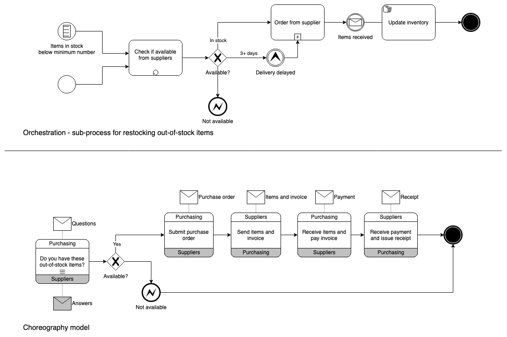

# Abstract
Business Process Modeling Notation (BPMN) 2.0 is a standard for graphically representing [business process models](https://en.wikipedia.org/wiki/Business_process_modeling).
> Credit: Some content from https://www.drawio.com/blog/bpmn-2-0

This mind map describes the elements of BPMN 2.0 along with rules and naming conventions. Click the image for the full-size version.

> Credit: This mind map was created with content from https://www.bpmnquickguide.com/

# Rules
## Overview

* A BPMN **Diagram** depicts a subset (which may be complete) of a BPMN *Process Model*.
  * A BPMN Diagram is not a dataflow diagram.
* A BPMN **Model** may contain one or more BPMN *Business Processes*.
  * A BPMN Model may be depicted using multiple Diagrams.

* Orchestration, Collaboration & Choreography
  * **Orchestration** models a *Process* within a single business entity and is presented by a *Pool*.
  * **Collaboration** models the communication between business entities across *Pool* boundaries. 
  * A single BPMN *Diagram* can represent both *Orchestration* and *Collaboration*. 
  * **Choreography** models the interaction between *Roles*, focusing on the *Message* flow between two or more *Roles*.

## Activities 
* **Activities** are *Tasks* or *Sub-processes*.
* **Call Activities** — use these to re-use other *Processes*.
* **Sub-Processes** split a *Process* into "phases".
  * A *Start Event* in a *Sub-process* must be of type *None*.
* **Tasks** — the basic steps taken by *Roles*.
  * Use **Manual Task** to depict work performed without the aid of any software application.
  * Use **User Task** to depict semi-automated work where a human performer uses a software application to complete the *Task*.
  * Use **Service Task** to depict automated work.

### Naming Conventions
* All *Activities* must be named with a *verb-noun* phrase.
  * Use the present tense of an active verb of meaning to the business.
  * Use a qualified noun of meaning to the business.
* Activities other than *Call Activities* cannot have the same name. 

## Data Objects
* **Data Objects** are databases and documents or data generated from a *Task*.
### Naming Conventions
* All *Data Objects* must be named with a qualified noun that is the name of a business object or information object of meaning to the business.
* Name multiple instances of the same *Data Object* using a matching name followed by the applicable *State* in square brackets.

## Events 
* **Events** are things that occur within the flow of an *Activity*.
* Boundary Events
  * Must have at most one outgoing *Sequence Flow*.
  * Must not have any incoming *Sequence Flows*.
* **End Events**
  * Distinguish various end states as separate *End Events*.
  * Flows that end in the same end state merge to the same *End Event*.
* **Start Events**
  * Distinguish alternative instantiation of the process as separate *Start Events*.

### Naming Conventions
* All *Events* must be named.
* *Conditional Events* — name these with their trigger condition.
* *End Events* — name these with the name of the end state.
* *Link Events* — name these with a noun.
* *Message*, *Signal*, *Escalation* and *Error Events* — name these with a past participle using an active verb.
* Paired *Message*, *Link*, *Signal*, *Escalation*, and *Error Events* — name these with a matching name.
* Timer Events — name these with their schedule.

## Flows 
* *Association* Flows are laid out vertically.
* *Data Association* Flows are laid out vertically.
* **Message** Flows depict the communication that happens between two different *Pools* or *Participants* with a dotted line.
  * At the source, the connector has a round head. At the destination, the connector is an unfilled triangle.
  * Cannot connect objects that are within the same *Pool*.
  * Are laid out vertically.
* **Sequence** Flows  connect *Tasks*, *Events*, and *Gateways*, always in order of execution.
  * Are used to show the order that *Activities* are performed in a process.
  * Cannot cross *Sub-process* boundaries.
  * Cannot cross *Pool* boundaries.
  * Are laid out horizontally.
* **Messages**
  * Use a *Message Event* if the sending or receiving of the Message is instantaneous.
  * Use a *Message Task* if the sending or receiving of the Message can be interrupted.

### Naming Conventions
* *Sequence Flows* connect Tasks
  * Name *Sequence Flows* coming out of diverging *Gateways* of type *Exclusive*, *Inclusive* and *Complex* using their associated conditions stated as outcomes.
  * Name *Conditional Sequence Flows* using their associated conditions stated as outcomes.
  * Do not name *Default Sequence Flows*.

## Gateways   
* **Gateways** are decision points and branching or merging of *Flows*. Can be exclusive (or), inclusive (and/or), parallel (and), or event-based.
* Gateways are either converging or diverging (but not both).
* Gateways are *decision points*, not *decisions*:
  * They do not make decisions; they only direct flow.
  * Decision outcome (diverging conditions) must be determined in an *Activity* after the *Gateway*.
* Use a *Business Rule Task* instead of multiple, chained diverging Gateways.

### Naming Conventions
* Converging
  * Do not name these.
  * Use a text annotation when converging logic is not obvious.
* Diverging
  * Name exclusive diverging *Gateways* with an interrogative phrase.

## Pools
* **Pools** are whole organizations or collections of associated *Roles*.
### Naming Conventions
 * Name these using the *Role*'s name.
 * Do not use the *Process* name (in BPMN, a *Pool* is always a depiction of a *Role).*
  
## Roles
* **Roles** are unique participants in a *Process*.
### Naming Conventions
Name these using a qualified noun or noun phrase.

## Swimlanes
* **Swimlanes** represent unique *Roles* in a *Process*.
### Naming Conventions
 * Are often used to categorize elements by *Roles*.
 * Name these using the *Category's* name.