# absract
> Documentation: https://mermaid.js.org/intro/

A JavaScript-based diagramming and charting tool that renders Markdown-inspired text into diagrams.


# syntax
## declaration
All diagrams begin with a *diagram type declaration*: this is the first line of the code.

## comments
Comments are prefixed with `%%` and must be on their own line:
```
flowchart LR
%% this is a sample comment
    A --> B --> C
```
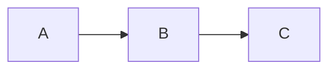

## keywords
The following are restricted keywords/phrases with workarounds:
| Keyword/Phrase | Workaround                                                     |
| -------------- | -------------------------------------------------------------- |
| `%%{``}%%`     | Avoid using "{}" in comments that use `%%`                     |
| end            | Wrap the word *end* in quotes or capitalize any of its letters |

# configuration
> Documentation: https://mermaid.js.org/config/configuration.html

Configuration is passed via the `config:` section of frontmatter:
```
---
title: Hello Title
config:
  theme: base
  themeVariables:
    primaryColor: "#00ff00"
---
flowchart
	Hello --> World
```
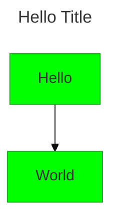

See [here](https://mermaid.js.org/config/schema-docs/config.html) for various config properties.

# diagrams
## class diagram
> Documentation: https://mermaid.js.org/syntax/timeline.html

UML diagrams that describe the structure of a system with classes, their attributes, operations (methods), and relationships among objects.
```
classDiagram
Class01 <|-- AveryLongClass : Cool
Class03 *-- Class04
Class05 o-- Class06
Class07 .. Class08
Class09 --> C2 : Where am i?
Class09 --* C3
Class09 --|> Class07
Class07 : equals()
Class07 : Object[] elementData
Class01 : size()
Class01 : int chimp
Class01 : int gorilla
Class08 <--> C2: Cool label
```
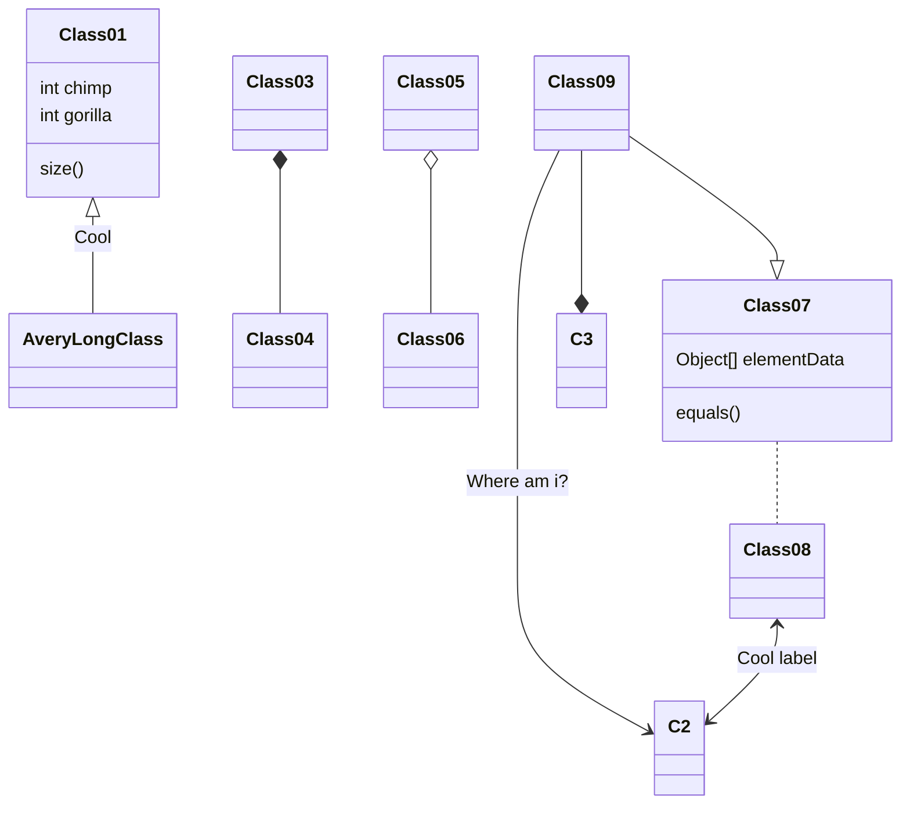

## erd
> Documentation: https://mermaid.js.org/syntax/entityRelationshipDiagram.html

```
erDiagram
    CUSTOMER ||--o{ ORDER : places
    ORDER ||--|{ LINE-ITEM : contains
    CUSTOMER }|..|{ DELIVERY-ADDRESS : uses

```
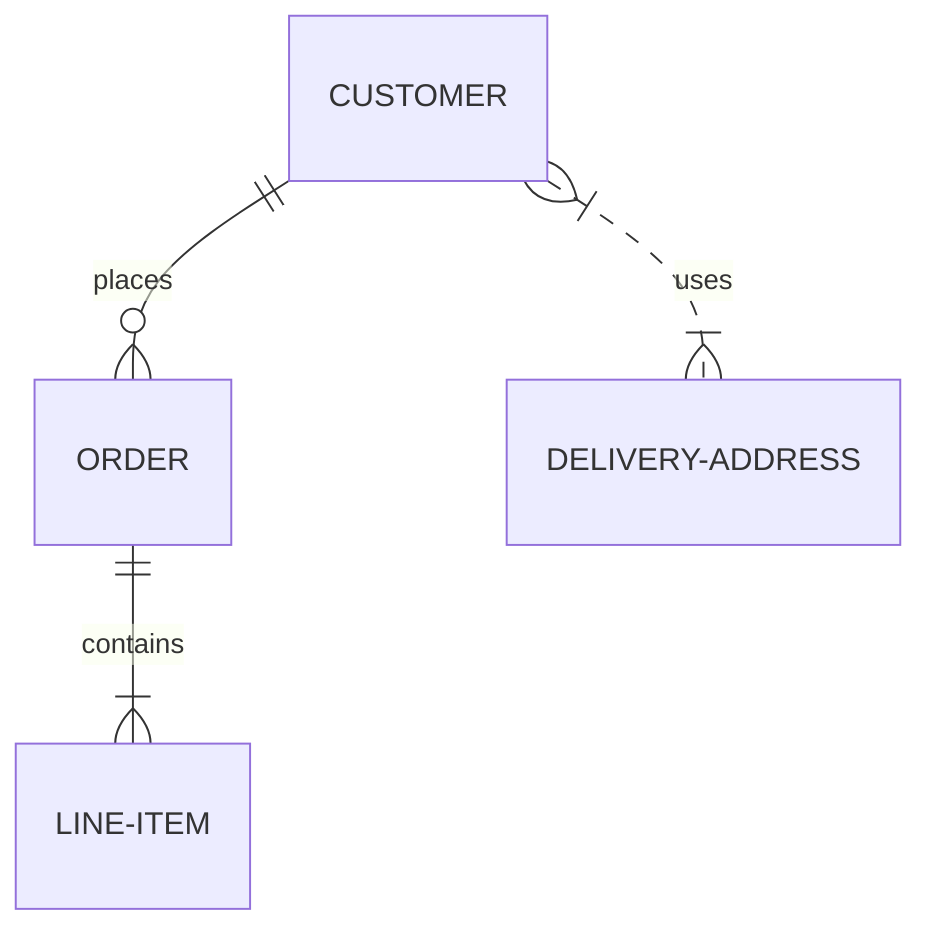

## flowchart
> Documentation: https://mermaid.js.org/syntax/flowchart.html

```
graph TD;
    A-->B;
    A-->C;
    B-->D;
    C-->D;
```


### nodes
Flowcharts consist of **nodes** (shapes) and **edges** (arrows or lines).

Below:
* `box` is what is displayed in the box and can be any name
* `graph` can be used as an alias for `flowchart`.
* `LR` defines the direction of the flowchart(left -> right). 
  * `TB` = top -> bottom (`TD` is an alias to `TB`)
  * `BT` = bottom -> top
  * `LR` = left -> right

```
---
title: Node
---
flowchart LR 
    box

    box1[Text in the box]
    box2["This text contains Unicode ❤ so its wrapped in double quotes"]
    box3["`This box contains **Markdown** and is wrapped in ticks and double quotes`"]
    box4["`Markdown text
    also supports
    newlines`"]
    box1 --> box2
```

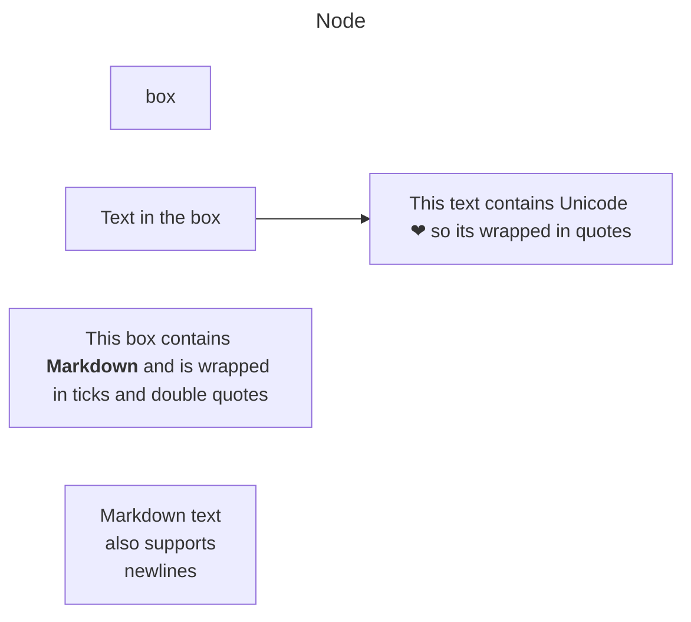

### node shapes
```
flowchart TB
    box3(Round edges)
    box4([Stadium shaped])
    box5[[Sub-routine shaped]]
    box6[(Database shape)]
    box7>Flag shape]
    box8((Circle))
    box8v2(((Double circle)))
    box9{Rhombus/Diamond}
    box11{{Hexagon}}
    box10[/Parallelogram/]
    box12[\Parallelogram 2\]
    box13[/Trapezoid\]
    box14[\Trapezoid 2\]
```
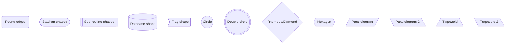

### Links (edges)
```
flowchart LR
    A1 --- B1
    A2-- with text ---B2
    A3---|with text|B3
    C1 -.- D1
    C2-. with text .-D2
    E1 --> F1
    E2 <--> F2
    E3 -- with text --> F3
    E4 -.-> F4
    E5-. with text .-> F5
    E6 ==> F6
    E7 == with text ==> F7
    G1 -- chained --> G2 -- links --> G3
    H1 --o I1
    H2 o--o I2
    J1 --x K1
    J2 x--x K2
```
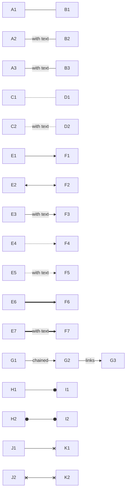

### Mulitple Links to/from a Node
```
flowchart LR
    A --> B
    A --> C
    B --> D
    C --> D
```
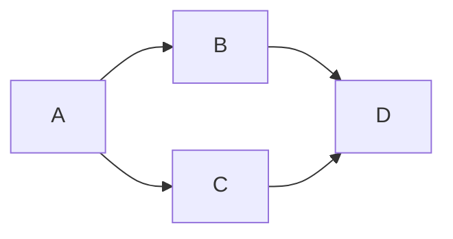

This syntax is more succinct than the above:
```
flowchart LR
    A --> B & C --> D
```


And also:
```
flowchart LR
    A & B --> C & D
```
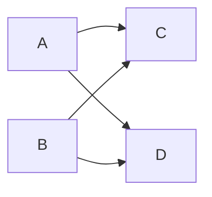

### flowchart with subgraphs
```
flowchart TB
    c1-->a2
    subgraph one
    a1-->a2
    end
    subgraph two
    b1-->b2
    end
    subgraph three
    c1-->c2
    end
    one --> two
    three --> two
    two --> c2
```

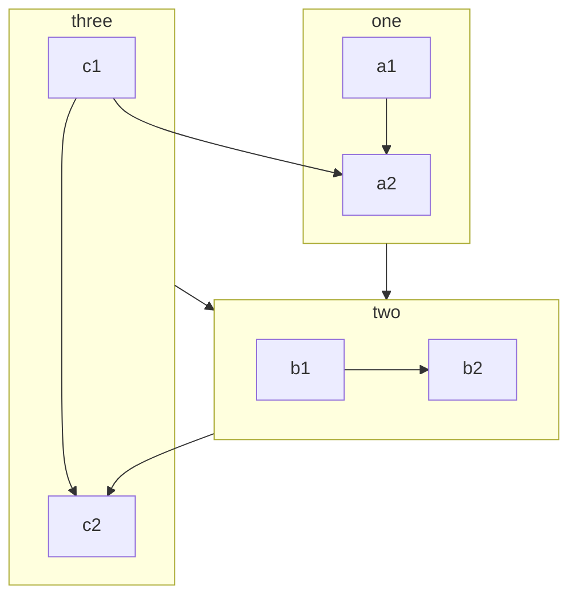

## gantt chart
> Documentation: https://mermaid.js.org/syntax/gantt.html

Use Gantt charts to illustrate project schedules. Each scheduled task is one continuous bar that extends from left to right. The *x* axis is time; the *y* axis is records tasks in the order in which they are to be completed. 
```
gantt
    dateFormat  YYYY-MM-DD
    title       Adding GANTT diagram functionality to mermaid
    excludes    weekends
    %% (`excludes` accepts specific dates in YYYY-MM-DD format, days of the week ("sunday") or "weekends", but not the word "weekdays".)

    section A section
    Completed task            :done,    des1, 2014-01-06,2014-01-08
    Active task               :active,  des2, 2014-01-09, 3d
    Future task               :         des3, after des2, 5d
    Future task2              :         des4, after des3, 5d

    section Critical tasks
    Completed task in the critical line :crit, done, 2014-01-06,24h
    Implement parser and jison          :crit, done, after des1, 2d
    Create tests for parser             :crit, active, 3d
    Future task in critical line        :crit, 5d
    Create tests for renderer           :2d
    Add to mermaid                      :until isadded
    Functionality added                 :milestone, isadded, 2014-01-25, 0d

    section Documentation
    Describe gantt syntax               :active, a1, after des1, 3d
    Add gantt diagram to demo page      :after a1  , 20h
    Add another diagram to demo page    :doc1, after a1  , 48h

    section Last section
    Describe gantt syntax               :after doc1, 3d
    Add gantt diagram to demo page      :20h
    Add another diagram to demo page    :48h

```
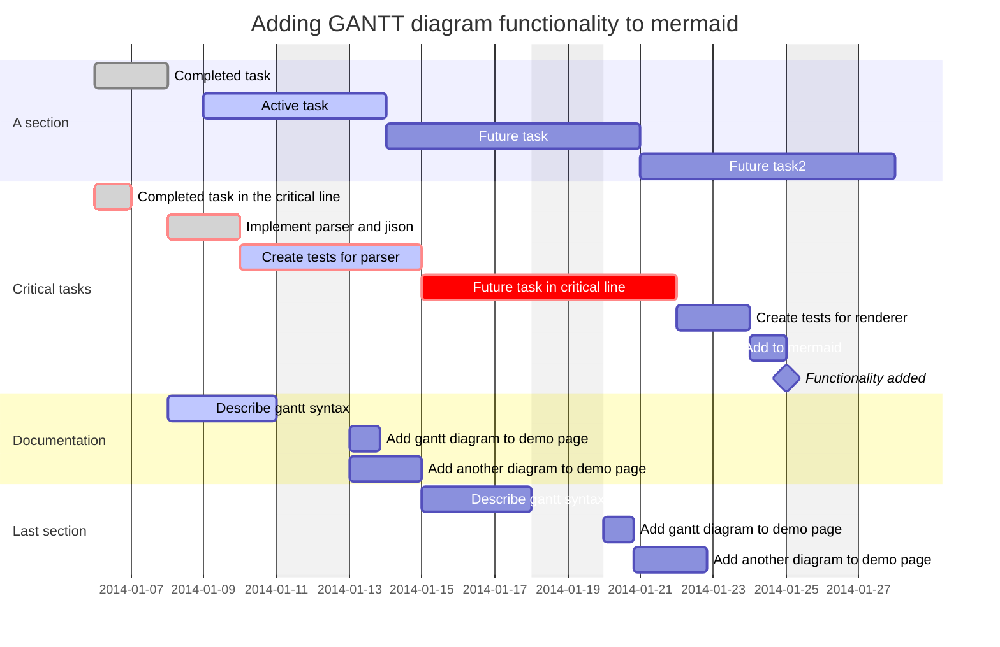

### syntax
#### title
The `title` is optional and displayed at the top of the Gantt chart if specified.

#### tasks
Tasks are added to Gantt charts in `task name : metadata` format. 

Metadata can include tags:
* Tags are optional. If used, they must be specified first. 
* Valid tags: `active`,`done`,`crit`, and `milestone`.

After the tags, remaining metadata items are interpreted as follows:  
* If one item (Scenario A):
   * Determines when the task ends. May be a date/time or a duration. Examples of durations are `1d`, `5h`, `2w`, etc.
     * Durations are addeed to the start date of the task to determine its end date and takes into account any exclusions.
* If two items (#1 and #2) (Scenario B)
  * #1 can be: 
    * A start date/time in the format specified in the `dateFormat` directive, or 
    * A reference another task using `after <otherTaskId> [[otherTaskId2 [otherTaskId3]]...]`. In this case, the start date of the task is set according to the latest end date of any referenced task.
  * #2 is interpreted as one item in Scenario A above.
* If three items (#1, #2 and #3)
  * #1 denotes the ID of the task. This can be referenced using `later <taskId>`.
  * #2 and #3 are interpreted as Scenario B above.

#### sections
Gantt charts can have their own sections. The syntax is `section <section name>` where `<section name>` is required.

#### milestones
Milestones represent a single instance in time:
```
gantt
    dateFormat HH:mm
    axisFormat %H:%M
    Initial milestone : milestone, m1, 17:49, 2m
    Task A : 10m
    Task B : 5m
    Final milestone : milestone, m2, 18:08, 4m
```
```mermaid
gantt
    dateFormat HH:mm
    axisFormat %H:%M
    Initial milestone : milestone, m1, 17:49, 2m
    Task A : 10m
    Task B : 5m
    Final milestone : milestone, m2, 18:08, 4m
```

The location of the milestone on the chart is determined using this formula: *initial date + duration / 2*.

### configuration
#### dates
Input date format is defined in `dateFormat`. The default is `YYYY-MM-DD`. Custom formats can be provided using [these tokens](https://day.js.org/docs/en/parse/string-format/).

Output date format is defined in `axisFormat`. The default is `YYYY-MM-DD`. Custom formats can be prfovided using [these tokens](https://github.com/d3/d3-time-format/tree/v4.0.0#locale_format).

#### axis ticks
The format of ticks is defined in `tickInterval`. The default is `auto`. Other options are like `1day` or `2week` where the timespan can be `millisecond`, `second`, `minute`, `hour`, `day`, `week`, or `month`.

If you specify a `week` tick interval, you can also specify the weekday the week starts on. The default is `sunday`:
```
gantt
  tickInterval 1week
  weekday monday
```

#### display mode
The `displayMode` is set in frontmatter. `compact` mode displays multiple tasks in the same row:
```
---
displayMode: compact
---
gantt
    title A Gantt Diagram
    dateFormat  YYYY-MM-DD

    section Section
    A task           :a1, 2014-01-01, 30d
    Another task     :a2, 2014-01-20, 25d
    Another one      :a3, 2014-02-10, 20d
```
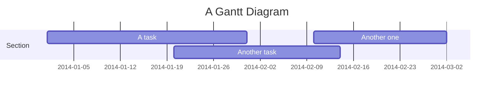

#### today marker
The `todayMarker` is included by default. It can be hidden with `todayMarker off`.

## git graph
> Documentation: https://mermaid.js.org/syntax/gitgraph.html
```
    gitGraph
       commit
       commit
       branch develop
       commit
       commit
       commit
       checkout main
       commit
       commit
```
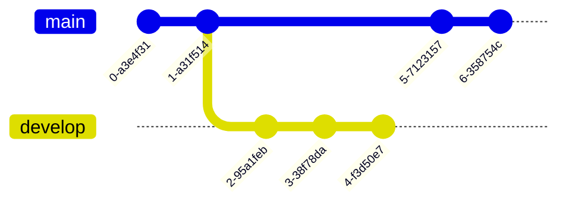

## mindmaps
> Documentation: https://mermaid.js.org/syntax/mindmap.html

Use mindmaps to visually organize information and show relationships among the main idea and subtopics.

```
mindmap
  root((mindmap))
    Origins
      Long history
      Popularisation
        British popular psychology author Tony Buzan
    Research
      On effectiveness<br/>and features
      On Automatic creation
        Uses
            Creative techniques
            Strategic planning
            Argument mapping
    Tools
      Pen and paper
      Mermaid
```
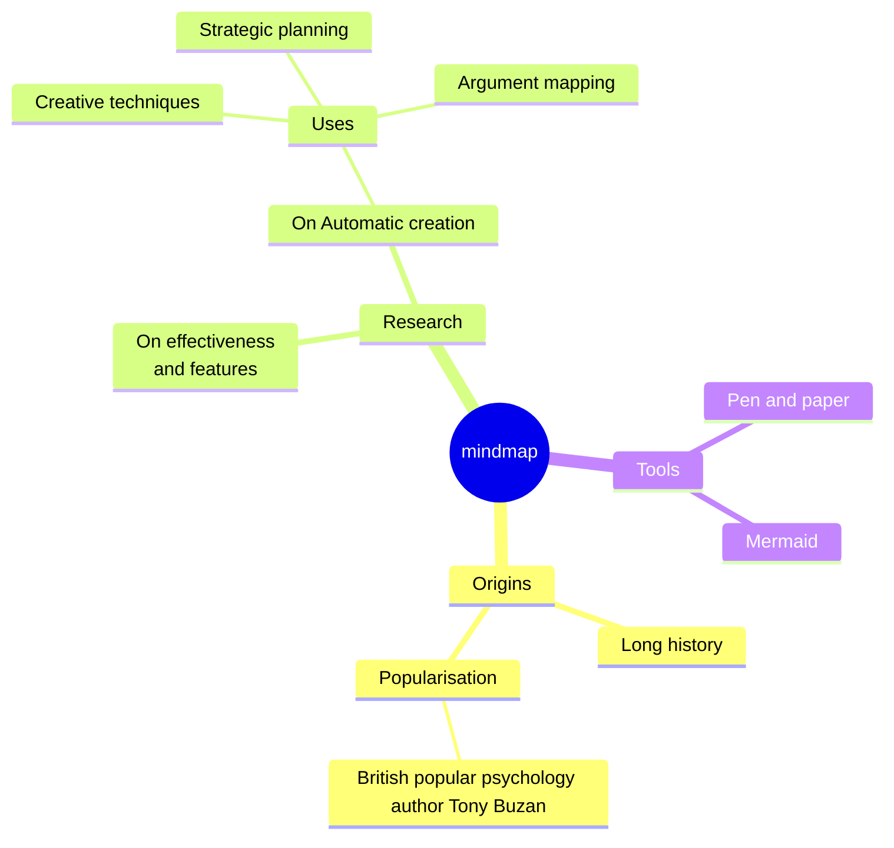

### shapes
```
mindmap
    id[square]
        a(rounded square)
        b((circle))
        c)cloud(
        d))bang((
        e{{hexagon}}
        d
```
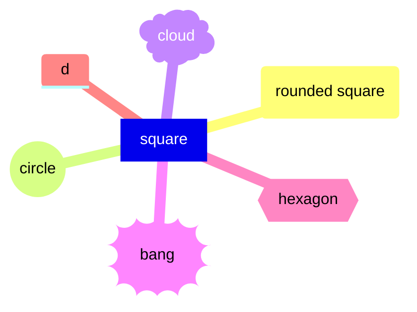

### classes
Classes are added with the syntax `:::` like so:
```
mindmap
    Root
        A[A]
        :::urgent large
        B(B)
        C
```
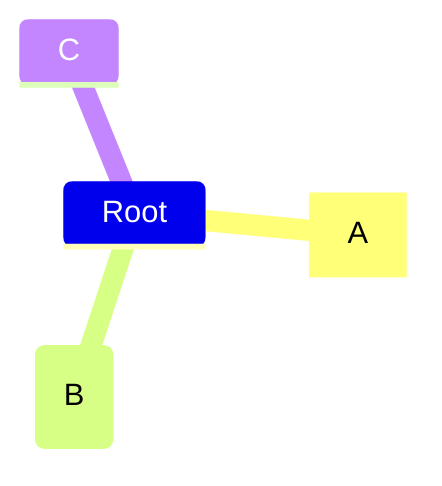

### markdown strings
Mindmaps support Markdown strings:
```
mindmap
    id1["`**Root** with
a second line
Unicode works too: 🤓`"]
      id2["`The dog in **the** hog... a *very long text* that wraps to a new line`"]
      id3[Regular labels still works]
```
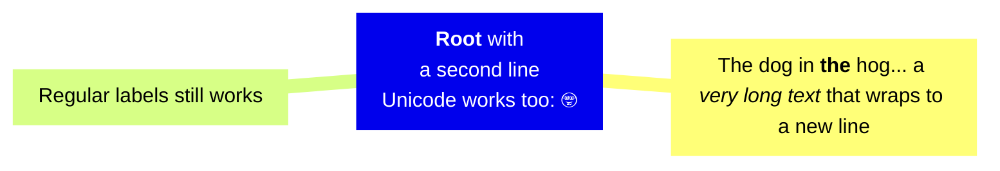

## pie chart
> Documentation: https://mermaid.js.org/syntax/pie.html

```
pie 
    title Pets adopted by volunteers
    "Dogs" : 386
    "Cats" : 85
    "Rats" : 15
```
```mermaid
pie 
    title Pets adopted by volunteers
    "Dogs" : 386
    "Cats" : 85
    "Rats" : 15
```

Use the `showData` directive immediately after the diagram type declaration to annotate the legend with data values:
```
pie showData
    title Pets adopted by volunteers
    "Dogs" : 386
    "Cats" : 85
    "Rats" : 15
```
```mermaid
pie showData
    title Pets adopted by volunteers
    "Dogs" : 386
    "Cats" : 85
    "Rats" : 15
```

## quad chart
> Documentation: https://mermaid.js.org/syntax/quadrantChart.html

Use quad charts to visually represent data divided into 4 quadrants.
```
quadrantChart
    title Reach and engagement of campaigns
    x-axis Low Reach --> High Reach
    y-axis Low Engagement --> High Engagement
    quadrant-1 We should expand
    quadrant-2 Need to promote
    quadrant-3 Re-evaluate
    quadrant-4 May be improved
    Campaign A: [0.3, 0.6]
    Campaign B: [0.45, 0.23]
    Campaign C: [0.57, 0.69]
    Campaign D: [0.78, 0.34]
    Campaign E: [0.40, 0.34]
    Campaign F: [0.35, 0.78]
```
```mermaid
quadrantChart
    title Reach and engagement of campaigns
    x-axis Low Reach --> High Reach
    y-axis Low Engagement --> High Engagement
    quadrant-1 We should expand
    quadrant-2 Need to promote
    quadrant-3 Re-evaluate
    quadrant-4 May be improved
    Campaign A: [0.3, 0.6]
    Campaign B: [0.45, 0.23]
    Campaign C: [0.57, 0.69]
    Campaign D: [0.78, 0.34]
    Campaign E: [0.40, 0.34]
    Campaign F: [0.35, 0.78]
```

## sequence diagram
> Documentation: https://mermaid.js.org/syntax/sequenceDiagram.html

```
sequenceDiagram
    participant Alice
    participant Bob
    Alice->>John: Hello John, how are you?
    loop HealthCheck
        John->>John: Fight against hypochondria
    end
    Note right of John: Rational thoughts <br/>prevail!
    John-->>Alice: Great!
    John->>Bob: How about you?
    Bob-->>John: Jolly good!
```
```mermaid
sequenceDiagram
    participant Alice
    participant Bob
    Alice->>John: Hello John, how are you?
    loop HealthCheck
        John->>John: Fight against hypochondria
    end
    Note right of John: Rational thoughts <br/>prevail!
    John-->>Alice: Great!
    John->>Bob: How about you?
    Bob-->>John: Jolly good!
```

## timeline
> Documentation: https://mermaid.js.org/syntax/timeline.html

Use timelines to illustrate a chronology of events.

```
timeline
    title History of Social Media Platform
    2002 : LinkedIn
    2004 : Facebook
         : Google
    2005 : Youtube
    2006 : Twitter
```
```mermaid
timeline
    title History of Social Media Platform
    2002 : LinkedIn
    2004 : Facebook
         : Google
    2005 : Youtube
    2006 : Twitter
```

Timelines consist of `time period : event` pairs:
```
    2002 : LinkedIn
    2004 : Facebook
```

Multiple events can be added to the same time period:
```
    2004 : Facebook
         : Google
```

This syntax is more succinct than the above:
```
    2004 : Facebook : Google
```

### sections
Time periods can be grouped into sections:
```
timeline
    title Timeline of Industrial Revolution
    section 17th-20th century
        Industry 1.0 : Machinery, Water power, Steam <br>power
        Industry 2.0 : Electricity, Internal combustion engine, Mass production
        Industry 3.0 : Electronics, Computers, Automation
    section 21st century
        Industry 4.0 : Internet, Robotics, Internet of Things
        Industry 5.0 : Artificial intelligence, Big data, 3D printing
```
```mermaid
timeline
    title Timeline of Industrial Revolution
    section 17th-20th century
        Industry 1.0 : Machinery, Water power, Steam <br>power
        Industry 2.0 : Electricity, Internal combustion engine, Mass production
        Industry 3.0 : Electronics, Computers, Automation
    section 21st century
        Industry 4.0 : Internet, Robotics, Internet of Things
        Industry 5.0 : Artificial intelligence, Big data, 3D printing
```

## user journey
> Documentation: https://mermaid.js.org/syntax/userJourney.html

```
journey
    title My working day
    section Go to work
      Make tea: 5: Me
      Go upstairs: 3: Me
      Do work: 1: Me, Cat
    section Go home
      Go downstairs: 5: Me
      Sit down: 5: Me
```
```mermaid
journey
    title My working day
    section Go to work
      Make tea: 5: Me
      Go upstairs: 3: Me
      Do work: 1: Me, Cat
    section Go home
      Go downstairs: 5: Me
      Sit down: 5: Me
```