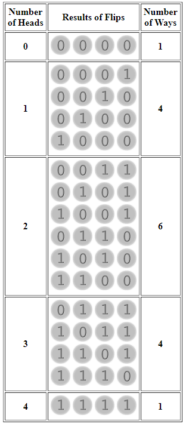
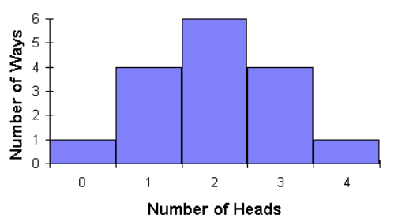
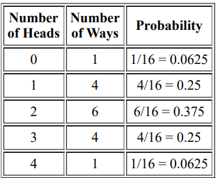

# Overview
Notes from John Walker: https://www.fourmilab.ch/rpkp/experiments/statistics.html.

# Definitions
- $\sigma$ = standard deviation
- $\sigma^2$ = variance

# Permutations
The number of permutations of $n$ different things taken $n$ at a time is $n!$.  
The number of permutations of $n$ different things taken $x$ at a time is or $\binom{n}{x} = \frac{n!}{x!(n-x)!}$

# Flipping a Coin
If a coin is flipped four times, there are 16 possible outcomes:  

Plotting this data results in this bar graph:  

# Probability
Each flip has an equal chance of coming up heads or tails, so all 16 possible outcomes are equally *probable*.

However, since there are 6 ways to get 2 heads, the *probability* of two heads is greater than any other outcome:  

## Calculating Probability of One Outcome or Another
Sum the probabilities.  The probability of getting either one or two heads $0.25 + 0.375 = 0.625$.

## Calculating Probability of One Outcome and Another From Two Separate Experiments
Multiply the probabilities.  The probability one head in each of two successive sets of four fips is $0.25 * 0.25 = 0.0625$

The probability of any number of heads $x$ in any number of flips $n$ is ${\binom{n}{x}\over2^n} = \frac{n!}{{2^n}x!(n-x)!}$

# The normal distribution of probability equation
The probability for $x$ heads in $n$ flips where $\mu=n/2$  
${{1}\over{\sqrt{2\pi\sigma}}}e^-{(x-\mu)^2\over{2\sigma^2}}$

# Experiments and Evidence
- Evidence for the existence of a phenomenon must be *signficant*, *persistent*, and *consistent*.
- Statistical analysis can never entirely rule out the possibility that the results of an experiment were entirely due to chance—it can only calculate the probability of occurrence by chance.
- No experiment or series of experiments can ever *prove* a hypothesis; one can only rule out other hypotheses and provide evidence that assuming the truth of the hypothesis better explains the results than discarding it.

# $\Chi^2$ (Chi-Square) Test
- The measure of the significance to which experimental results support or refute a hypothesis.
- It is applicable to any experiment where discrete results can be measured.
- If the probability that the null hypothesis can explain the experimental results is above 1%, an experiment is generally not considered evidence of a different hypothesis.

The chi-square test is the final step in the following process:
1. A phenomenon is suggested to exist based eitehr on theory or examination of empirical data.
2. A hypothesis is framed incorporating the supposed phenomenon.
3. An experiment is designed to test the hypothesis.
   1. The experiment must produce results which differ based on the validity of the hypothesis.
   2. The results for the experiment for the null hypothesis (the hypothesis-false case) are calculated.
4. A series of experiments are conducted and the results tabulated.
5. The chi-square test is applied to determine the significance of the discrepancy between the calculated null hypothesis case and the experimental results, and the probability that the discrepancy is the result of chance.

The chi-square statistic for an experiment with $k$ possible values performed $n$ times in which $Y_1, Y_2, ... Y_k$ are the number of experiments which resulted in each possible outcome, where the probabilities of each outcome are $p_1, p_2, p_k$ is:  
$\Chi^2=\sum_{\substack{1\le{s}\le{k}}} {(Y_s-np_s)^2\over{np_s}}$
