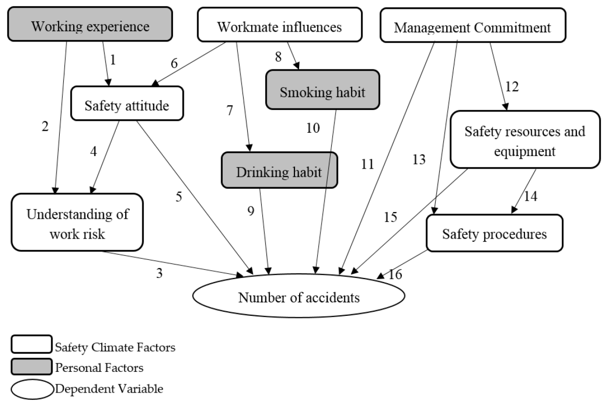

# Bayesian Networks (BNs)
- Regression models have one dependent variable and multiple independent variables.
- Bayesian networks allow networks of dependencies, both direct and indirect.
- Many interdependent variables are allowed.
- Each variable has a conditional distribution that depends on its parents' values.
- Conditioning on values of observed variables gives confiditional CDFs for an unobserved variable.

