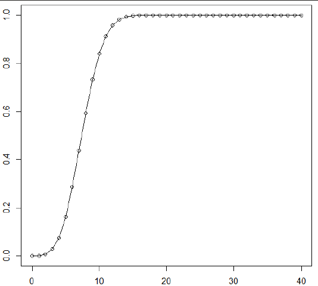
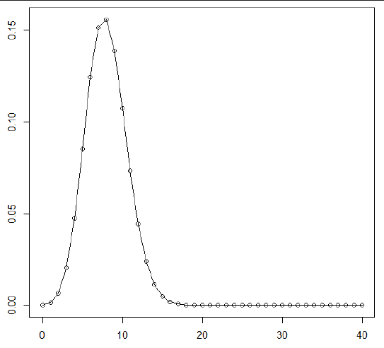

# Binomial Confidence Interval
Definition:
- Computes the mean (x/n) and the lower and upper confidence limits (default=95%) from inputs x and n.
```r
library(binom)
binom.confint(x,		            # number of successes
		      n,		            # number of trials
	          conf.level = 0.95,	# confidence interval
	          method = "all")	    # method to construct the interval
```
Solves: Find an exact 95% confidence interval for the success probability p.

Interpretation: 
- 95% statistical confidence that true value of population parameter p is between lower and upper.
- Values of p between the lower and upper are roughly consistent with the data.

# Binomial Probability Models
Characteristics:
- Two (and only two) possible outcomes (like 1 and 0, or success and failure) 
- Multiple independent trials
- Same probability of success on each trial
	- Useful for solving bivariate predictive modeling problems.

```r
dbinom(x, size=n, prob=p)	# probability of exactly x successes in n trial, 
                            # each independently having success probability p
```
This is the probability density function (PDF), `P(x)`, for the total number of successes (a random variable).  
The PDF is probabilities of specific values.

```r
pbinom(x, size=n, prob=p)	# probability of at most x successes in n trials, 
                            # each independently having  success probability p
```
This is the cumulative distribution function (CDF) for the total number of successes.  
The CDF is probabilities that `X <= x` for different values of `x`.

```r
1 - pbinom(x-1, size=n, prob=p)	# probability of at least x successes
```
## Plotting PDFs and CDFs using plot() and line()
```r 
x = c(0:n)			        # create a vector (ordered list) of x values
plot(x, pbinom(x, n, p))	# to plot CDF
plot(x, dbinom(x, n, p))	# to plot PDF
lines(x, dbinom(x, n, p))	# connect the dots
pbinom(x, n, p) or dbinom(x, n, p)	# list the values
```

### Example: Plotting a CDF
Problem:  Plot CDF of X having a binomial distribution with size = 40, prob = 0.2
```r
x = (0:40)
plot(x, pbinom(x, 40, 0.2))
```
  

Interpretation: X is unlikely to be smaller than ~4 or larger than ~12.

## Getting specific numbers out of a CDF using pbinom()
Notes:
- We can quantify that X is smaller than 4.

```r
pbinom(3, 40, 0.2)					        # = 0.02846: the probability that X <= 3
pbinom(14, 40, 0.2) - pbinom(3, 40, 0.2) 	# = 0.96: the probability that 3 <= X <= 14
```

## Plotting a binomial PDF using plot() and dbinom()
Problem:  Plot PDF rv X having a binomial distribution with size = 40, prob = 0.2
```r
x = (0:40)
plot(x, dbinom(x, 40, 0.2)
```

  

Interpretation: PDF shows the probability of each possible value:
- Most likely is x = 8
- Next most likely is x = 7

## Solving problems using binomial probability models
1. Predict number of deaths: 10 patients in a cardiac care unit in a hospital each independently has a 5% probability of dying. What is the probability that none of them dies? 

```r
dbinom(0, 10, .05)		# 10 patients, 5% prob, none of them die
[1] 0.5987369
```

2. Predict number of insurance claims: Each of 1000 employees independently has a 0.6 probability of submitting an insurance claim each year. What is the probability that fewer than 630 of them will submit claims next year?

```r
pbinom(629, 1000, 0.6)	# 1000 employees, 0.6 prob, < 630
[1] 0.9719571
```
3. Predict time to an event: Each day a restaurant has a 1% probability of being closed due to COVID restrictions. What is the probability that it remains open for at least 180 days?

```r
dbinom(0, 180, 0.01)
[1] 0.163808
```

also:
```r
days = c(0:180)
plot(days, dbinom(0, size = 180, prob = 0.01)) # this is the survival curve
```

4. Predict success probabilities: Each of 10 different groups proposing to develop a new drug (or vaccine) on a crash schedule has a 15% probability of succeeding if funded, independent of the rest. How does the probability of at least one success depend on the number of groups funded?
```r
x = c(0:10)
plot(x, 1 - dbinom(0, size = x, prob = 0.15)) # the probability that there are not exactly 0 successes (subtracting 0 from 1)
```

5. Each of 100 elderly patients independently has a 3% probability of an adverse reaction to a new drug. What is the probability that at most 5 of them will have an adverse reaction?

```r
pbinom(5, size = 100, prob = 0.03)	# 100 patients, 3% prob, at most 5
[1] 0.9191629
```

6. Each of 100 elderly patients independently has a 3% probability of an adverse reaction to a new drug. What is the probability that at least 5 of them will have an adverse reaction?

```r
1 - pbinom(4, size = 100, prob = 0.03)		# if you don't have 4 or fewer, than you have 5 or more.
[1] 0.1821452
```

7. Each of 100 elderly patients independently has a 3% probability of an adverse reaction to a new drug. What is the probability that none of them will have an adverse reaction?

8. Each of 100 people has made a reservation.  Each independently has a 97% probability of keeping it.  What is the probability that at least 2 will not show up?
