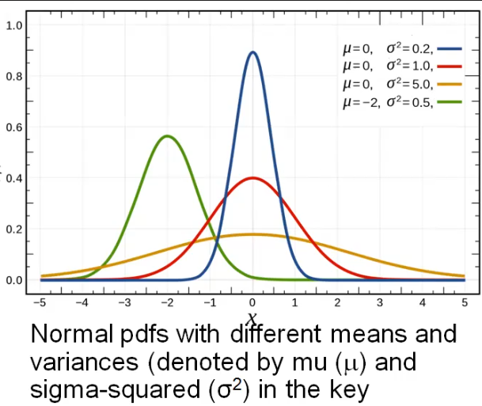

# Normal Distribution
Notes:
- Used for sums of random variables
- Characterized by 2 numbers:
	- mean (mu)
	- standard deviation (sigma-squared)
- They have continuous outcomes (weight, cost, time, etc)



Example:
- 95% prediction interval for normal distribution:
	- Problem: Each customer spends a random amount of money, mean = $25, SD = $5.  What is a 95% PI for the amount spent by a randomly selected customer?
	- Solution: mean +/- 2 * sd = 25 +/- 2 * 5, so 95% PI is [$15, $35]
- 95% of normal probability density function is within 1.96 * SD of its mean.
	- 1.96 is often rounded to 2.

Notes:
- **Prediction Interval** (PI) – an estimate of an interval in which a future observation will fall, with certain probability, given what has already been observed.
- **Confidence Interval** – an estimated interval within which an unknown parameter may plausibly lie.
	- It describes ranges of parameter values that are consistent with data.
	- Confidence Level – a probability with which an estimated interval will plausibly contain the value of a parameter.
```r
dnorm(x, mean=n, sd=m)	# returns the probability density function (PDF) at x for a normal 
				        # distribution with parameter values specified for its mean and 
				        # standard deviation.
pnorm(x, mean=n, sd=m) 	# returns the cumulative distribution function (CDF); used to find 
				        # probabilities that the outcome falls in a specified interval.
```

## Inverse-CDF Function (Quantile Function) (Q) (qnorm)
Notes:
- Inverse functions start on the Y axis and read off of the X axis to find the value for the input on the Y axis.

```r
qnorm(p, mean, sd) # returns value Q such that fraction p of a normal distribution is less than Q.
```
- Q becomes the p-th "quantile"
- This is the inverse of the CDF (pnorm())

Example:
- A customer's spend is normally distributed with mean = $25, sd = $5.  What dollar amount do 99% of customers spend more than?
```r
qnorm(0.5, 0, 23)
``` 
> 13.37

### Example (95% prediction interval for normal distribution)
- Quesetion:  Each customer at a store spends a random amount of money with mean = $25 and SD = $5.  What is a 95% prediction interval (PI) for the amount spent by a randomly selected customer?  

`mean +/- 2 * SD = 25 +/- 2 * 5`, so 95% PI is [$15, $35] (this uses 2 as an approximation for 1.96)

### Example (pnorm)
- Question: If a customer's expenditures are normally distributed with mean = $25 and SD = $5, what is the probability that the customer spends less than $20?
```r
pnorm(20, 25, 5)
```
> 0.1586553

# Practice
## Practice with pnorm()
- Q: The waiting time at a shop is approximately normally distributed with mean = 75 minutes and SD = 25 mins.  What is the probability that a customer's waiting time will exceed 90 minutes?
- A: `1 - pnorm(90, 75, 25)` = 0.226
	- Q: What fraction of customers are predicted to have waiting times of less than 60 minutes?
	- A: `pnorm(60, 75, 25)` = 0.226
			§ Q: What is the waiting time that only 5% of customers exceed?
			§ A: `qnorm(0.95, 75, 20)` = 107.9 minutes
- Q: An insurance pool pays a random number of claims per year.  Suppose that the number of claims is modeled as a normal distribution with mean = 600 and SD = 15.49.  What is the probability that the number of claims is less than 630?
- A: `pnorm(630, 600, 15.49)` = 0.973
- Q: A gas station seels a random amount of gas per day.  Amount sold per day has a normal distribution with mean = 5400 gallons and SD = 150 gallons.  How much gasoline should the station "stock" at the start of the day to keep the probability of running out by the end of the day <= 2%?
- A: `qnorm(0.98, 5400, 150)` = 5708.06 gallons.  If the gas station stocks 5708.06 gallons, there is a 98% probability that daily demand will be less than this, and hence a 2% probability of running out.

## Practice CDF calculations
- Q: Finish times for runners a normally distributed with mean = 200 mins, SD = 30 mins.  What is the probability that a runner will complete the marathon within 3 hours?
- A: `pnorm(180, 200, 30)` = 0.252
	- Q: By what time will 10% of runners have completed the marathon?
	- A: `qnorm(0.10, 200, 30)` = 161.55
			§ Q: What fraction of runners will complete the marathon between 3 and 4 hours?
			§ A: `pnorm(240, 200, 30) - pnorm(180, 200, 30)` = 0.656
