# Algorithms
Algorithm – A series of instructions that perform a task.

## Big-O Notation 
Used to describe time and space complexities of algorithms:
- `O(1)` — O of 1 time aka constant time
- `O(n)` — Linear time
- `O(log(n))` — Logarithmic time
- `O(n^2)` — Exponential timeLeast efficient
- `O(n!)` — Factorial time

# Hashing
> Credit: [ByteByteGo blog](https://blog.bytebytego.com/)
## Simple Hashing
A mechanism to distribute data evenly across servers.

### Implementing
1. For each object, hash its key with a hashing function (like MD5):  `serverIndex = hash(object_key) % N` where `N` is the size of the server pool  
   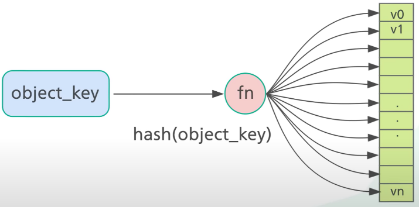

2. Perform modulo operation on the hash against the number of servers:  `hash(object_key) % numberOfServers`

    This determines which server the object belongs to.  As long as the number of servers stays the same, an object key will always map to the same server.

    Assuming a cluster of 4 servers:  
    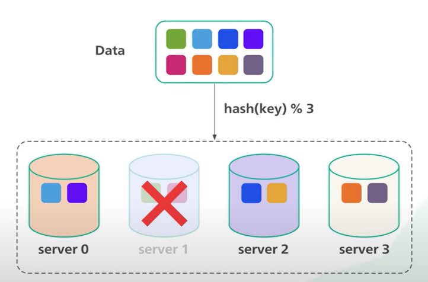

    If Server 1 goes offline:
    - The modulo operation changes from 4 to 3.
    - Most of the keys (but not all) get distributed.
    - A storm of misses and objects moving ensues.

    The solution to this problem is *consistent hashing*.

## Consistent Hashing
Hashing the object keys but also the server hostnames (or IP addresses) with the same hashing function to the same range of values:  
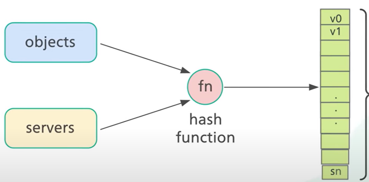

*Hash space*: the range of `x0` to `xN`:  
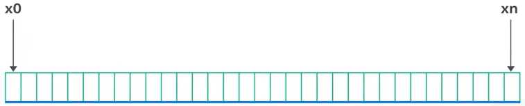

*Hash ring*: created by connecting the end of the hash range:  
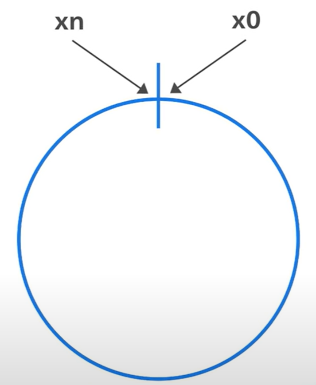

Consistent hashing is used by:
- Apache Cassandra and Amazon DynamoDB for data partitioning
- CDNs to distribute web content evently
- Load balanaces to distribute persistent connections evenly

### Implementing
1. Hash the server by its hostname or IP and place it on the hash ring.
2. Hash the object key using the same hash function from step #1 and place it into the hash ring. The hash is used directly to map the object keys onto the ring:  
   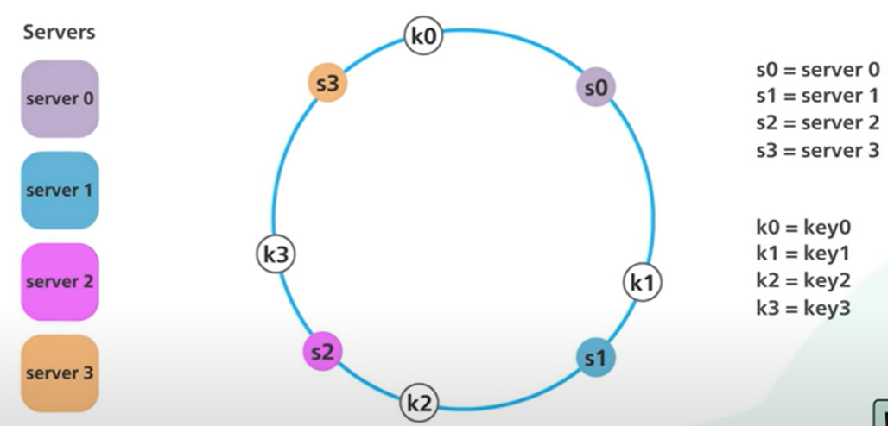
   * To locate a server for a particular object, go clockwise from the location of the object key on the ring until a server is found.
   * If another server is added, only a fraction of the keys need to be redistributed:  
     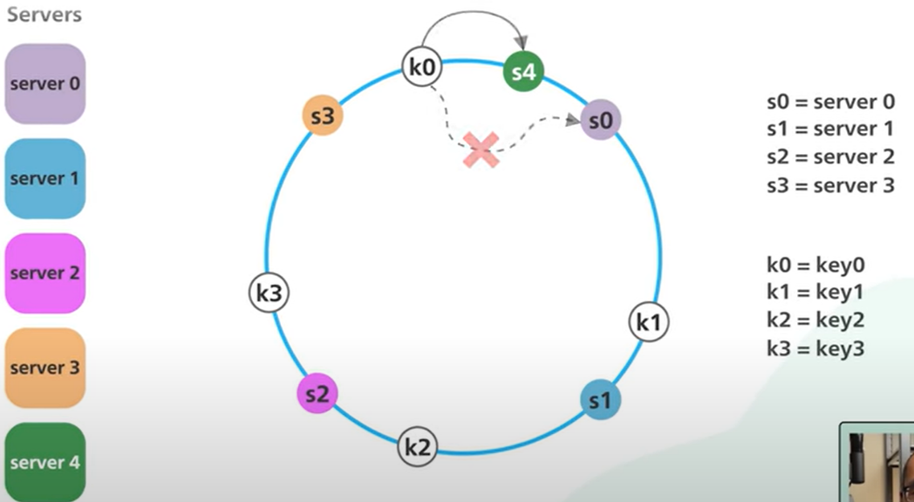
   * If server 1 is removed, only k1 needs to be remapped (to s2); the rest of the keys are unaffected:  
     

### Size of Segments
If server 1 is removed, the segment for server 2 is now twice the size as the ones for server 0 and server 3:  
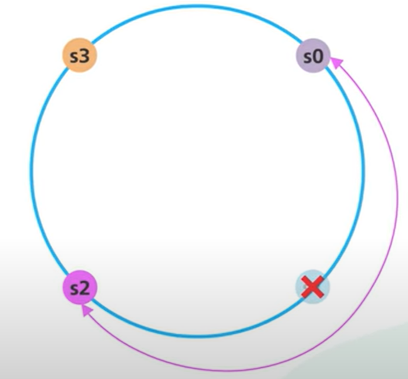

This is solved via *virtual nodes*. Each server appears multiple times on the ring. Each location is a virtual node representing a server:  
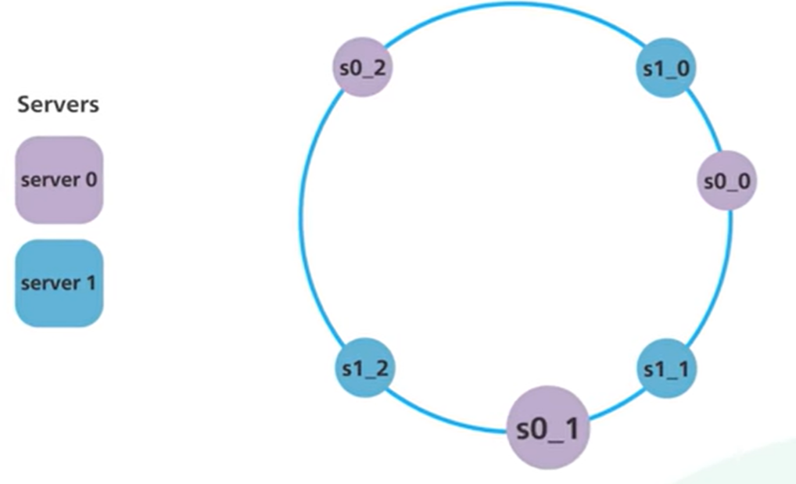

Each server handles multiple segments on the ring (one for each of its virtual nodes):  

As the number of virtual nodes increases, the distribution of objects becomes more balanced. But more virtual nodes means taking more space for the metadata of those nodes. This is a tradeoff.

# Linked Lists
Elements are ordered one after another. They are not stored in contiguous locations. They are linked using pointers. 

Linked Lists do not have indices. Each element is a node, which contains data and a reference to the next node. Size of a linked list is dynamic.

`ele0 ele1 ele2 ele3`  
`5 –> 8 –> 10 –> 13 –> null`  
head is `5`  
tail is `null`  

setting 10 to null results in:  
`5 –> 8 –> null`

# Load Balancing Algorithms
> Credit: [ByteByteGo blog](https://blog.bytebytego.com/)  
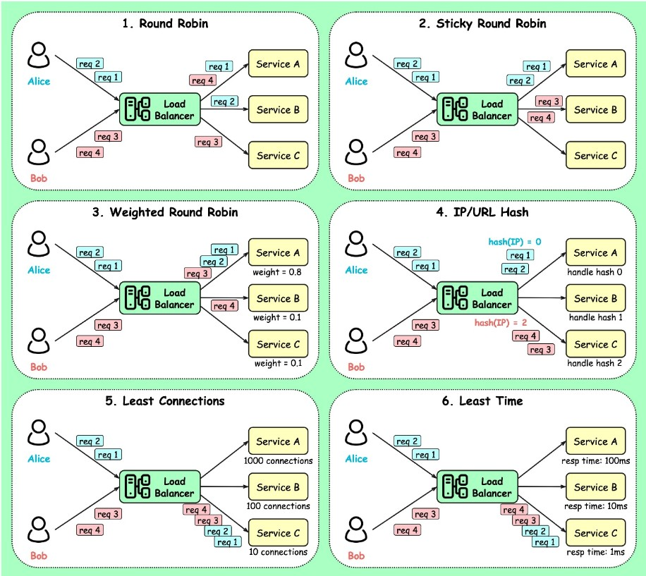

## Static load-balancing algorithms
- *Round Robin* — standard round robin
- *Sticky Round Robin* — if initial request goes to Service A, remaining requests from that user will "stick" to Service A.
- *Weighted Round Robin* — weight is specified for each service; the higher the weight, the more request that service handles.
- *Hash* — a hash function is applied on the incoming requests' IP or URL; requests are routed to relevant service instances.

## Dynamic load-balancing algorithms
- Least connections
- Least lag (fastest response time)

# Queues
- A queue contains elements in the order they were added.  
- Queues are FIFO: Elements are inserted at the end (enqueue) and removed from the beginning (dequeue).  
- Queues do not have indicies.

## Blocking Queue
> Credit: [ByteByteGo blog](https://blog.bytebytego.com/)  
A blocking queue algorithm uses locks. Thread A acquires the lock first, and Thread B might wait for arbitrary lengthy periods if Thread A gets suspended while holding the lock. This algorithm may cause Thread B to starve.

## Non-blocking Queue
The non-blocking algorithm allows Thread A to access the queue, but Thread A must complete a task in a certain number of steps.
Other threads like Thread B may still starve due to the rejections.

This is the main difference between blocking and non-blocking algorithms: The blocking algorithm blocks Thread B until the lock is released. A non-blocking algorithm notifies Thread B that access is rejected.

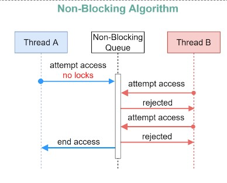

### Non-blocking Queue Implementation
Compare and Swap (CAS) can be used to implement a non-blocking queue:

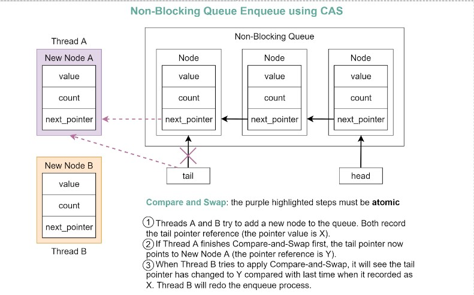

# Trees
A collection of nodes where each node can be linked to more nodes. Nodes are collected by links. Useful for nonlinear data.
