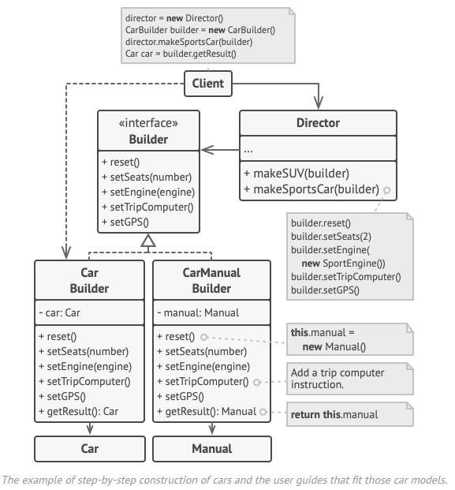

# Builder
Type: Creational  
Purpose: Produce different types and representations of an object using the same construction code.  
Use to:
- Create different representations of some product
- Create composite trees or other complex objects  
Principles: Single Responsibility Principle  
Complexity: 2/3  
Popularity: 3/3  
In .NET: `StringBuilder`, `ApplicationBuilder`, EF `CoreModelBuilder`  

# Overview


1.  The Builder interface declares product construction steps that are common to all types of builders.
2.  Concrete Builders provide different implementations of the construction steps. Concrete builders may produce products that don’t follow the common interface.
3.  Products are resulting objects. Products constructed by different builders don’t have to belong to the same class hierarchy or interface.
4.  The Director class defines the order in which to call construction steps, so you can create and reuse specific configurations of products.
5.  The Client must associate one of the builder objects with the director. Usually, it’s done just once, via parameters of the director’s constructor. Then the director uses that builder object for all further construction. However, there’s an alternative approach for when the client passes the builder object to the production method of the director. In this case, you can use a different builder each time you produce something with the director.

# Implementing
Clearly define the common construction steps for building all available product representations. Declare a base *builder* interface with these steps.
```cs
public interface IBuilder
{
    void BuildPartA();
    void BuildPartB();
    void BuildPartC();
}

// Create a concrete *builder* class for each of the product representations and implement their constructions steps.

public class ConcreteBuilder : IBuilder
{
    private Product _product = new();

    // Every builder instance should contain a blank product object:
    public ConcreteBuilder() { this.Reset(); }

    public void Reset() { this._product = new Product(); }

    public void BuildPartA() { this._product.Add("PartA1"); }

    public void BuildPartB() { this._product.Add("PartB1"); }

    public void BuildPartC() { this._product.Add("PartC1"); }

    // Include a method for fetching the result of the construction.
    public Product GetProduct()
    {
        // After returning the end result to the caller, the builder is expected to be ready to start building another product.
        Product result = this._product;
        this.Reset();
        return result;
    }
}

// The product class:
public class Product
{
    private List<object> _parts = new List<object>();

    public void Add(string part)
    {
        this._parts.Add(part);
    }

    public string ListParts()
    {
        string str = string.Empty;

        foreach (var part in parts)
            str += this_part + ", ";

        return $"Parts: {str}";
    }
}
```
Consider creating a *director* class that encapsulates various ways to construct a product using the same builder object. It is responsible for executing the building steps in a particular sequence. This class is optional.
```cs
public class Director
{
    private IBuilder _builder;

    public IBuilder Builder { set; }

    public void BuildMinimalViableProduct()
    {
        this._builder.BuildPartA();
    }

    public void BuildFullProduct()
    {
        this._builder.BuildPartA();
        this._builder.BuildPartB();
        this._builder.BuildPartC();
    }
}
```

In *client* code, create both the *builder* and *director* objects. The client must pass a builder object to the director (via parameters of the director's class constructor). The director uses the builder object in all further construction.
```cs
public static void Main(string[] args)
{
    var director = new Director();
    var builder = new Builder();
    director.Builder = builder;

    // If using the director:
    director.BuildMVP();
    director.BuildFullProduct();

    // Else:
    builder.BuildPartA();
    builder.BuildPartB();
    builder.BuildPartC();

    // The client fetches the result from the builder.
    builder.GetProduct().ListParts();
}
```

