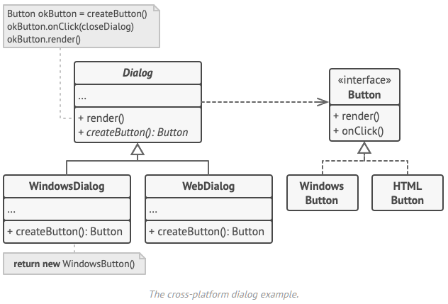

# Factory Method
Type: Creational  
Purpose: Provides an interface for creating objects in a superclass but allows subclasses to alter the type of the objects created.  
Use when:
- You don't know ahead of time the exact types and dependencies of the objects your code will work with.
- You want to provide users of your code with a way to extend its internal components.  
Principles: Single Responsibility Principle; Open/Closed Principle  
Complexity: 1/3  
Popularity: 3/3  
In .NET: A logger factory  

# Overview


1.  The Product declares the interface, which is common to all objects that can be produced by the creator and its subclasses.
2.  Concrete Products are different implementations of the product interface.
3.  The Creator class declares the factory method that returns new product objects. It’s important that the return type of this method matches the product interface.
    * You can declare the factory method as abstract to force all subclasses to implement their own versions of the method. As an alternative, the base factory method can return some default product type.
    * Note, despite its name, product creation is not the primary responsibility of the creator. Usually, the creator class already has some core business logic related to products. The factory method helps to decouple this logic from the concrete product classes. Here is an analogy: a large software development company can have a training department for programmers. However, the primary function of the company as a whole is still writing code, not producing programmers.

4.  Concrete Creators override the base factory method so it returns a different type of product.

Note that the factory method doesn’t have to create new instances all the time. It can also return existing objects from a cache, an object pool, or another source.

# Implementing
Declare an interface with methods that make sense for every product. All products must implement this interface.
```cs
public interface IProduct
{
    Operation();
}
```

In the creator:
- add an empty factory method inside the creator class with a return type of the aforementioned interface
- replace references to product constructors with calls to the factory method and extract product creation code into the factory method.

```cs
abstract class Creator
{
    public abstract IProduct FactoryMethod();

    public string SomeOperation()
    {
        var product = FactoryMethod();
        var result = product.Operation();
        return result;
    }
}
```
Create a set of creator subclasses for each type of product listed in the factory method. Override the factory method in the subclasses.
```cs
class ConcreteCreator1
{
    public override IProduct FactoryMethod()
    {
        return new ConcreteProduct1();
    }
}

class ConcreateCreator2 { … }

class ConcreteProduct1 : IProduct
{
    public string Operation()
    {
        return "Result of ConcreteProduct1";
    }
}

class ConcreteProduct2 : IProduct { … }

class Client
{
    public void Main()
    {
        SomeMethod(new ConcreteCreator1());
        SomeMethod(new ConcreteCreator2());
    }

    public void SomeMethod(Creator creator)
    {
        creator.SomeOperation();
    }
}
```


