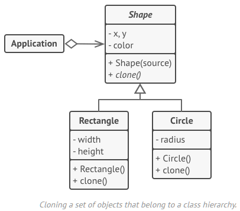

# Prototype
Type: Creational  
Purpose: Copy (clone) existing objects without making your code dependent on their classes.  
Use to:
- Prevent a dependency on the concrete classes of objects needing cloned.
- Reduce the number of subclasses that only differ in the way they initialize their respective objects.  
Principles:  
Complexity: 1/3  
Popularity: 2/3  
In .NET: `System.Net.Http.Headers`  

# Overview
## Basic Implementation


1.  The Prototype interface declares the cloning methods. In most cases, it’s a single clone method.
2.  The Concrete Prototype class implements the cloning method. In addition to copying the original object’s data to the clone, this method may also handle some edge cases of the cloning process related to cloning linked objects, untangling recursive dependencies, etc.
3.  The Client can produce a copy of any object that follows the prototype interface.

## Prototype registry implementation


1.  The Prototype Registry provides an easy way to access frequently-used prototypes. It stores a set of pre-built objects that are ready to be copied. The simplest prototype registry is a name → prototype hash map. However, if you need better search criteria than a simple name, you can build a much more robust version of the registry.

# Implementing
Note: C# provides for this pattern via `ICloneable`.

Either create a prototype interface and declare a Clone() method on it, or just add the method to all classes of an existing class hierarchy.
```js
abstract class Shape is
    field X: int
    field Y: int
    field color: string

// A regular constructor.
constructor Shape() is
// ...

// The prototype constructor. A fresh object is initialized with values from the existing object.
constructor Shape(source: Shape) is
    this()
    this.X = source.X
    this.Y = source.Y
    this.color = source.color

// The clone operation returns one of the Shape subclasses.
abstract method clone():Shape
```

A prototype class must define the alternative constructor that accepts an object of that class as an argument. The constructor must copy the values of all fields defined in the class from the passed object into the newly created instance. If you’re changing a subclass, you must call the parent constructor to let the superclass handle the cloning of its private fields.
```js
class Rectangle extends Shape is
    field width: int
    field height: int

constructor Rectangle(source: Rectangle) is
    // A parent constructor call is needed to copy private
    // fields defined in the parent class.
    super(source)
    this.width = source.width
    this.height = source.height

method clone():Shape is
    return new Rectangle(this)

class Circle extends Shape is
    field radius: int

constructor Circle(source: Circle) is
    super(source)
    this.radius = source.radius
```

The `Clone()` method is usually one line: it calls the new operator with the prototypical version of the constructor. Every class must explicitly override the `Clone()` method and use its own class name along with the new operator.

```js
method clone():Shape is
    return new Circle(this)

// Somewhere in the client code.
class Application is
    field shapes: array of Shape

constructor Application() is
    Circle circle = new Circle()
    circle.X = 10
    circle.Y = 10
    circle.radius = 20

shapes.add(circle)

Circle anotherCircle = circle.clone()
shapes.add(anotherCircle)
// The `anotherCircle` variable contains an exact copy of the `circle` object.

Rectangle rectangle = new Rectangle()
rectangle.width = 10
rectangle.height = 20
shapes.add(rectangle)

method businessLogic() is
    // Prototype rocks because it lets you produce a copy of an object without knowing anything about its type.
    Array shapesCopy = new Array of Shapes.

foreach (s in shapes) do
    shapesCopy.add(s.clone())

// The `shapesCopy` array contains exact copies of the `shape` array's children.
```
Optionally, create a centralized prototype registry to store a catalog of frequently used prototypes. This can be a new factory class or it can be put in the base prototype class with a static method for fetching the prototype. This method should search for a prototype based on criteria that client code passes to the method and then clones it and returns the copy to the client.

