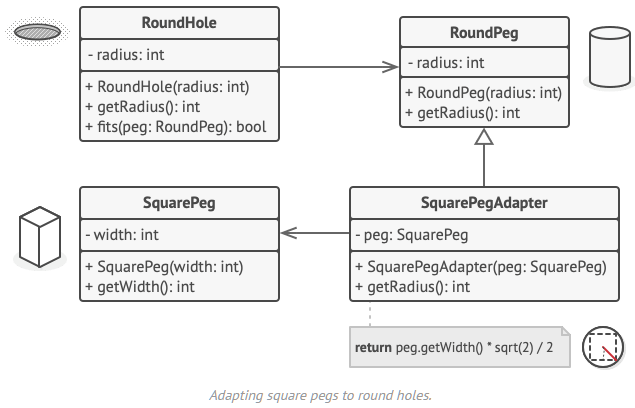

# Adapter
Type: Structural  
Purpose: Enables objects with incompatible interfaces to collaborate.  
Use to:
- Enable use of an existing class whose interface is not compatible with your code.
- Reuse several existing subclasses that lack some common functionality that cannot be added to the superclass.  
Principles: Single Responsibility Principle; Open/Closed Principle  
Complexity: 1/3  
Popularity: 3/3  

# Overview
## Object Adapter


1.  The Client is a class that contains the existing business logic of the program.
2.  The Client Interface describes a protocol that other classes must follow to be able to collaborate with the client code.
3.  The Service is some useful class (usually 3rd-party or legacy). The client can’t use this class directly because it has an incompatible interface.
4.  The Adapter is a class that’s able to work with both the client and the service: it implements the client interface, while wrapping the service object. The adapter receives calls from the client via the adapter interface and translates them into calls to the wrapped service object in a format it can understand.
5.  The client code doesn’t get coupled to the concrete adapter class as long as it works with the adapter via the client interface. Thanks to this, you can introduce new types of adapters into the program without breaking the existing client code. This can be useful when the interface of the service class gets changed or replaced: you can just create a new adapter class without changing the client code.

# Implementing
Assumes you have a *service* class (that you cannot change) and one or more *client* classes that would benefit from the services class.
```cs
public SomeService
{
    public string GetSpecificRequest()
    {
        return "Specific request";
    }
}

// Declare the client interface and describe how clients communicate with the service.
public interface ITarget
{
    string GetRequest();
}

// Create the adapter class and inherit the client interface.
public class Adapter : ITarget
{
    // Add a field to the adapter class to store a reference to the service object (either initialize the field via the constructor or pass it to
    // the adapter when calling its methods).
    private readonly SomeService _service;

    public Adapter(SomeService service)
    {
        this._service = service;
    }

    // Implement all methods of the client interface in the adapter class (delegating most of the real work to the service object).
    public string GetRequest()
    {
        return this._service.GetSpecificRequest();
    }
}

// Clients use the adapter via the client interface.
public static void Main(string[] args)
{
    Service service = new();
    ITarget target = new Service(service);

    target.GetRequest();
}
```
