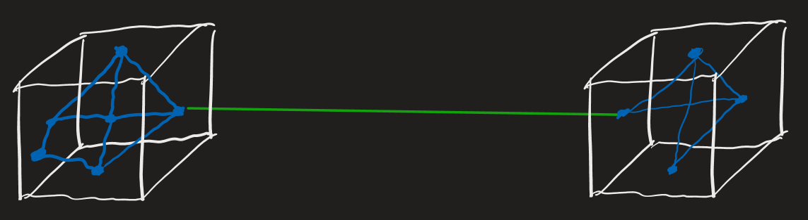

Loose coupling between modules  
High cohesion within modules

# coupling
The degree of interdependence between software modules.

## advantages
1.  A change in one module does not have a ripple effects requiring a change in another.
2.  Promotes code re-use and ease of testing by reducing dependencies.

# cohesion
The degree to which elements inside a module belong together.
- If methods of a class are similar in many aspects, the class has high *cohesion*.

## advantages
1.  Improved code readability
2.  Improved code reusability
3.  Complexity is manageable

# examples
Bad: The only relationship between the parts is that they have been grouped together.
- Ex: A "utilities" class

Good: Parts are grouped because they operate on the same data.
- Ex: A class that manipulates XML.

*Robustness*—the ability of a system to cope with bad input and/or errors during execution.
*Redundancy*—one way to support a system's robustness.
