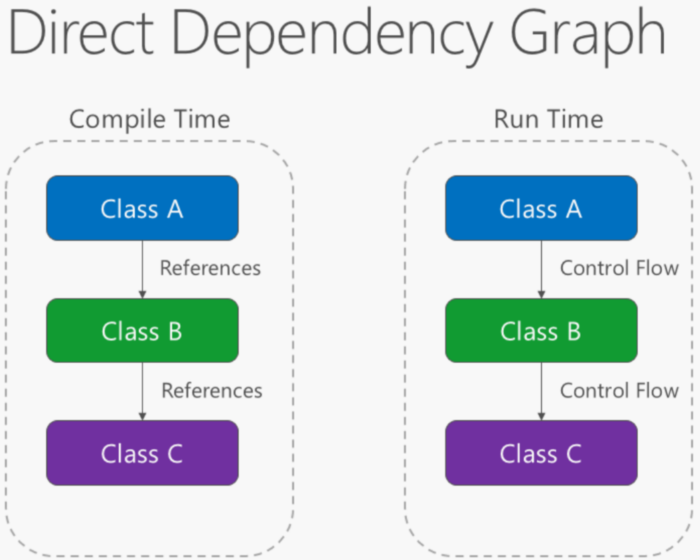
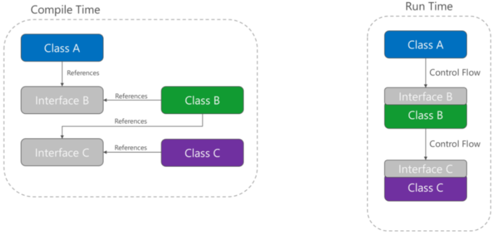

# Inversion of Control (Dependency Inversion)
If class `A` calls a method of class `B`, and class `B` calls a method of class `C`, then, at compile time, class `A` will *depend on* class `B`, and class `B` will depend on class `C`:  

Instead, class `A` can call methods on an abstraction that `B` implements.  `B` depends on an interface controlled by `A` at compile time:

This inverts the dependency.  
Dependency inversion is what enables dependency injection.