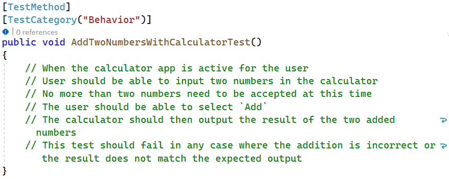

# types of tests
From most number of tests to least for a given project (italicized are not in the Testing Pyramid):
| Type        | Description                                                                                   |
| ----------- | --------------------------------------------------------------------------------------------- |
| Unit        | Tests the smallest unit of code possible, usually a method or function.                       |
| Integration | Tests if smaller units and larger components work together as a single piece of software.     |
| System      | Tests the whole system environment in which the software runs.                                |
| Performance | Tests the performance (time required) to run (ie: return a web page to a visitor in < 20 ms). |
| Load        | Tests how many requests software can handle simultaneously.  Tests an app for scalability.    |
| UAT         | Tests that are created from a list of requirements/criteria.                                  |
| UI          | Tests the UI of an app; mimics clicks and interactions.                                       |
- Playwright automates the browser to mimic a user using a website.

# doctrines on testing
## Test-Driven Development (TDD)
- Tightly coupling testing with every part of development.  
- Start first by writing a test that fails, then code that makes the test pass.

### Test-Driven Development Process
1. Write a test (arrange, act, assert):
    a. Arrange:  Declare and instantiate variables for input / output.
    b. Act:  Execute the unit test.
    c. Assert:  Assert that, if true, the test passed.  Else, the test failed.
2. Run test (confirm it fails) (Red)
3. Write the minimum meaningful code needed to satisfy the test
4. Re-run the tests (confirm it succeeds) (Green)
5. Refactor

## Behavior-Driven Development (BDD)
Similar to TDD, but greater focus on acceptance tests.  
The developer works with the business to define a set of tests that list the needed criteria for the product.  
BDD focuses on documenting different stages of expectations for the functionality:  

