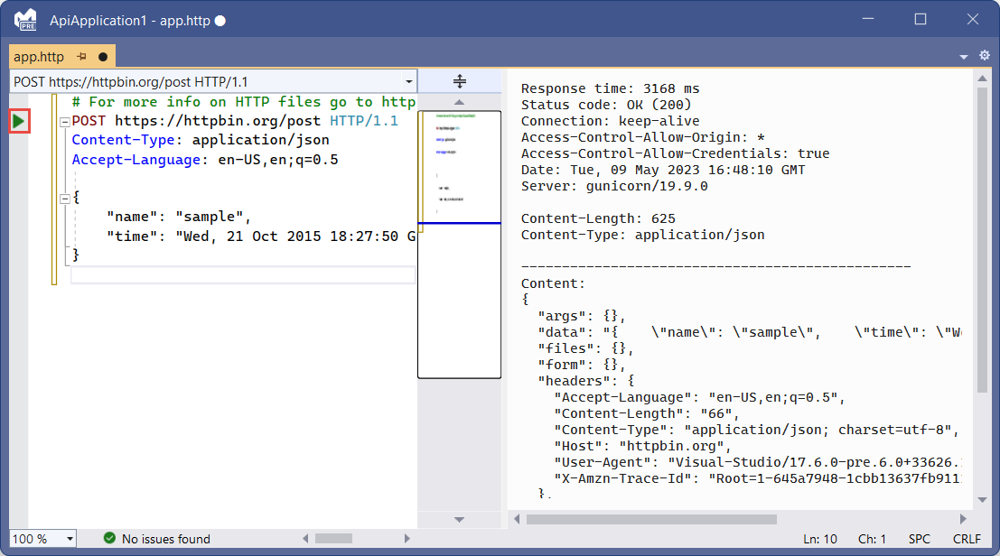
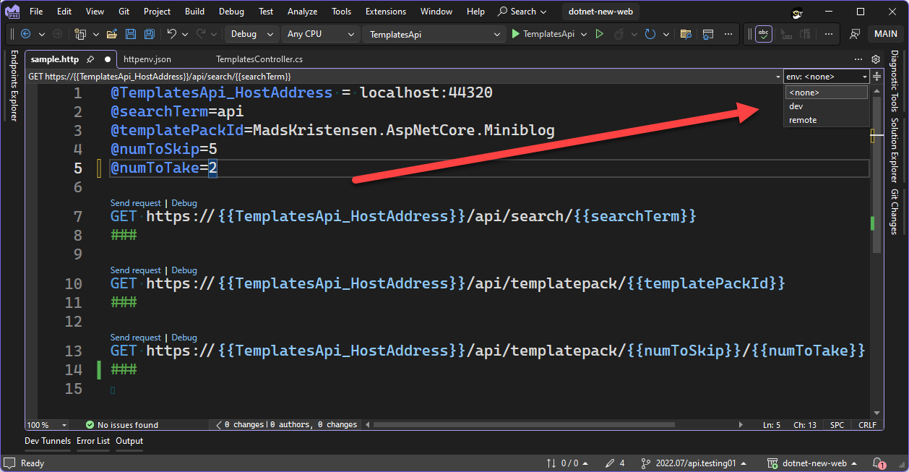

# Overview [[Documentation](https://learn.microsoft.com/en-us/aspnet/core/test/http-files?view=aspnetcore-8.0)]   [[Documentation](https://devblogs.microsoft.com/visualstudio/safely-use-secrets-in-http-requests-in-visual-studio-2022/?ocid=visualstudio_eml_tnp_autoid21_title)]  

<g>Availability</g>: ASP.NET Core 8? (documentation is unclear), Visual Studio 2022 v17.6+

HTTP files in Visual Studio allow you to create HTTP requests. You can use the editor to create and send requests and view responses.

# File Format
The sequence is important:
1. Variables
2. HTTP request
3. Headers (optional)
4. Body (optional)

The request must be in the format `HTTP_METHOD URL HTTP_VERSION` where `HTTP_VERSION` is optional and is one of `HTTP/1.1` `HTTP/2` `HTTP/3`.

```
# This is a comment
// This is also a comment
// These are variables:
@hostname=localhost
@port=44320
// Variables are accessed with double curly braces:
GET https://{{hostname}}:{{port}}/weatherforecast 
```

## Requests
Request format = `HTTP_VERB URL [HTTP_VERSION]`
- where HTTP_VERB is one of: CONNECT, DELETE, GET, HEAD, OPTIONS, PATCH, POST, PUT, TRACE
- where HTTP_VERSION is one of: HTTP/1.2, HTTP/2, HTTP/3

### Multiple requests
Multiple requests can be delimited via `###`:
```
GET https://localhost:7220/weatherforecast
###
GET https://localhost:7220/weatherforecast?date=2023-05-11&location=98006
###
GET https://localhost:7220/weatherforecast HTTP/3
###
```

## Headers
Headers must immediately follow the request with no additional spacing:
```
GET https://localhost:7220/weatherforecast
Date: Wed, 27 Apr 2023 07:28:00 GMT
###
GET https://localhost:7220/weatherforecast
Cache-Control: max-age=604800
Age: 100
###
```

## Body
The request body can be added after a blank line following the headers:
```
POST https://localhost:7220/weatherforecast
Content-Type: application/json
Accept-Language: en-US,en;q=0.5

{
    "date": "2023-05-10",
    "temperatureC": 30,
    "summary": "Warm"
}

###
```

## Built-in Functions
| Function         | Description                                                                                                                                                                           |
| ---------------- | ------------------------------------------------------------------------------------------------------------------------------------------------------------------------------------- |
| `$randomInt`     | Generates a random integer. Syntax: `{{$randomInt [min max]}}` where the min and max values are optional.                                                                             |
| `$datetime`      | Generates a datetime string. Formats supported include ISO8601, RFC1123 or a custom format. Syntax: `{{$datetime <rfc1123 \| iso8601 \| “custom format”> [offset option]}}`.          |
| `$timestamp`     | Generates a UTC timestamp. Default behavior generates a timestamp from the current time. With options you can generate an offset timestamp. Syntax: `{{$timestamp [offset option]}}`. |
| `$localdatetime` | Generates a datetime string in your local time zone. Syntax: `{{$localdatetime <rfc1123 \| iso8601 \| “custom format”> [offset option]}}`.                                            |
| `$processEnv`    | Returns the value of the provided process environment variable. Syntax: `{{$processEnv envVarName}}`.                                                                                 |
| `$dotenv`        | Returns the value of the provided variable in a .env file. Syntax: `{{$dotenv variableName}}`.                                                                                        |

# Usage
- **Add** > **New Item** > ASP.NET Core > General > **HTTP File**
- Save the file
- Click the green "run" arrow.  The response pulls up next to the request:  


## With Endpoints Explorer
- View > Other Windows > Endpoints Explorer
- Right-click a request > **Generate Request**

If an `.http` file with the project name as the file name exists, the request is added to that file.  
Otherwise, an `.http` file is created with the project name as the file name, and the request is added to that file.

# Environments
<g>Availability</g>: Visual Studio 17.8+  

By creating an `http-client.env.json` file, variables for `.http` files can be scoped to a specific environment:   
`http-client.env.json`
```json
{
  "dev": {
    "TemplatesApi_HostAddress": "localhost:44320",
    "searchTerm": "wpf"
  },
  "remote": {
    "TemplatesApi_HostAddress": "dotnetnew-api.azurewebsites.net",
    "searchTerm": "mads"
  }
}
```

Since the `TemplatesApi_HostAddress` variable is defined in the environment file, it should *not* be defined in the HTTP file (even if they are, precedence is given to the environment file):

`sample.http`  
```
@searchTerm=api
@templatePackId=MadsKristensen.AspNetCore.Miniblog
@numToSkip=5
@numToTake=2

GET https://{{TemplatesApi_HostAddress}}/api/search/{{searchTerm}}
###
GET https://{{TemplatesApi_HostAddress}}/api/templatepack/{{templatePackId}}
###
GET https://{{TemplatesApi_HostAddress}}/api/templatepack/{{numToSkip}}/{{numToTake}}
###
```

An environment picker is now available:  


## Environments — User-specific
Create a `http-client.env.json.user` file. These files are useful if you want to test something but don't want to change the environment file the rest of the team is using. By default, `*.user` files are excluded from version control.

The precedence for loading variables is as follows:
1. `http-client.env.json.user` file
2. `http-client.env.json` file
3. `.http` file

## Accessing Secrets in Environment Files
### via ASP.NET Core User Secrets
Use this syntax to access user secrets in the `http-client.env.json` files:
```json {hl_lines=[4-6]}
{
  "dev": {
    "searchTerm": "maui",
    "templatesApiKey": { // <-- This is the name of the variable that will hold the value
      "provider": "AspnetUserSecrets",
      "secretName": "config:templatesApiKeyDev"
    }
  }
}
```

### via Azure Key Vault
<o>Note</o>: To access a secret in Azure Key Vault you must be signed into Visual Studio with an account which has access to the given Key Vault.

For Azure Key Vault, the syntax is different:
```json {hl_lines=[4-8]}
{
  "dev": {
    "searchTerm": "maui",
    "otherSecret": { // <-- This is the name of the variable that will hold the value
      "provider": "AzureKeyVault",
      "keyVaultName": "sayedapi-keyvault-01", // name of key vault that contains the secret
      "secretName": "SayedSecretValue1", // name of the secret
      "resourceId": "/subscriptions/21e74a87-523d-4a15-87e9-8c5eb2df7716/resourceGroups/sayed-api-demo1" // Azure resource ID
    }
  }
}
```

### via Windows DPAPI
<o>Note</o>: Since Windows Data Protection API encrypts values with a key based on the machine, these values cannot be shared.

Syntax:
```json
{
  "dev": {
    "searchTerm": "maui",
    "secretValue": { // <-- This is the name of the variable that will hold the value
      "provider": "Encrypted",
      "value": "AQAAANCMnd8BFdERjHoAwE/Cl+sBAAAA5qwfg4+Bhk2nsy6ujgg3GAAAAAACAAAAAAAQZgAAAAEAACAAAAAqNXhXc098k1TtKmaI4cUAbJVALMVP1zOR7mhC1RBJegAAAAAOgAAAAAIAACAAAABKu4E9WC/zX5LYZZhOS2pukxMTF9R4yS+XA9HoYF98GzAAAAAzFXatt461ZnVeUWgOV8M/DkqNviWUUjexAXOF/JfpJMw/CdsizQyESus2QjsCtZlAAAAAL7ns3u9mEk6wSMIn+KNsW/vdAw51OaI+HPVrt5vFvXRilTtvGbU/JnxsoIHj0Z7OOxlwOSg1Qdn60zEqmlFJBg=="
    }
  }
}
```

To encrypt a value using Windows DPAPI:
```powershell
dotnet add package system.security.cryptography.protecteddata
```

```cs
using System.Security.Cryptography;
using System.Text;

string stringToEncrypt = "Hello, World!";
byte[] encBytes = ProtectedData.Protect(Encoding.Unicode.GetBytes(stringToEncrypt), 
                                        optionalEntropy: null, 
                                        scope: DataProtectionScope.CurrentUser); // For the value to work in the HTTP file, you MUST use this scope
string base64 = Convert.ToBase64String(encBytes);

Console.WriteLine(base64);
```