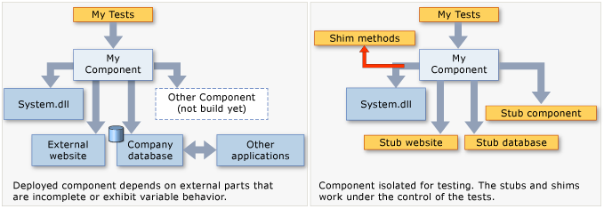

# Overview
> Documentation: https://learn.microsoft.com/en-us/visualstudio/test/isolating-code-under-test-with-microsoft-fakes?view=vs-2022  
<g>Availability</g>: Visual Studio Enterprise Edition, Visual Studio 2019 Update 6+

Code isolation is a testing strategy that isolates code under test from the rest of the application. This allows for
testing the specific functionality of the code in isolation. If a test fails, the cause is in the isolated code, not
somewhere else. It also enables testing code even if other parts of the application are not yet functional.

# How it Works
Microsoft Fakes achieves code isolation using *stubs* and *shims*:
- **Stubs** — used to replace a class with a small substitute that implements the same interface.
  - Requires application design such that each component depends only on interfaces, not other components.
  - Typically, used for calls within a solution.
  - Some external assemblies do not provide interface definitions, so shims needs to be used instead.
  - Pros: 
    - Stubs can be generated from interface definitions in Visual Studio.
  - Cons:
    - Stubs cannot be used for static methods or sealed types (since  they cannot have an interface).
    - Can only replace visible (non-private) methods.
- **Shims** — used to modify the compiled code at runtime. Instead of making a specified call, the application runs the provided shim code. Shims replace calls to assemblies that are not in your control.
  - Typically, used for calls to other referenced assemblies.
  - Pros:
    - Can replace calls to private methods if all the types on the method signature are visible.
  - Cons:
    - Shims run slower than stubs because they rewrite code at runtime.



# Creating a Microsoft Fakes Assembly
 1. Solution Explorer > **TEST_PROJECT_NAME** > [**Assemblies**, **Projects** or **Packages**] 
 2. Right-click the assembly that contains class definitions to be stubbed > **Add Fakes Assembly**

# Stubs


## Example of Creating and Using Stubs
1. Create an interface:
    ```cs
    // IStockFeed.cs
    public interface IStockFeed
    {
        int GetSharePrice(string company);
    }
    ```

2. Create a class that uses the interface:
    ```cs
    // StockAnalyzer.cs
    public class StockAnalyzer
    {
        private IStockFeed stockFeed;
        public StockAnalyzer(IStockFeed feed)
        {
            stockFeed = feed;
        }
        public int GetContosoPrice()
        {
            return stockFeed.GetSharePrice("COOO");
        }
    }
    ```
3. Create a test project.
4. From the test project, add a project reference to StockAnalyzer.
5. Add a Fakes Assembly:
   1. Solution Explorer > **TestProject** > [**Assemblies**, **Projects** or **Packages**] 
   2. Right-click the assembly that contains class definitions to be stubbed > **Add Fakes Assembly**
6. Create a unit test.
7. Modify the default UnitTest1.cs file with this test method:
    ```cs
    [TestClass]
    class UnitTest1
    {
        [TestMethod]
        public void TestContosoPrice()
        {
            // Arrange:
            int priceToReturn = 345;
            string companyCodeUsed = "";
            var componentUnderTest = new StockAnalyzer(new StockAnalysis.Fakes.StubIStockFeed()
            {
                GetSharePriceString = (company) =>
                {
                    companyCodeUsed = company; // Store the parameter value
                    return priceToReturn; // Return the value prescribed by this test
                }
            });

            // Act:
            int actualResult = componentUnderTest.GetContosoPrice();

            // Assert:
            // Verify the correct result in the usual way:
            Assert.AreEqual(priceToReturn, actualResult);

            // Verify that the component made the correct call:
            Assert.AreEqual("COOO", companyCodeUsed);
        }
    }
    ```
    For every interface in the referenced assembly, Microsoft Fakes generates a stub class. The name of the stub class is
    derived from the name of the interface with `Fakes.Stub` as a prefix. Stubs are generated for getters/setters, events,
    and generic methods.
8. Run the test.

## Creating Stubs for Methods
Consider this interface with a method:
```cs
// IStockFeed.cs
interface IStockFeed
{
    int GetSharePrice(string company);
}
```

Methods can be stubbed by attaching a delegate to an instance of the *stub type*. The name of the stub type is derived from 
the names of method properties and parameters. The `GetSharePrice` method has a stub type of `GetSharePriceString`:
```cs {hl_lines=[7]}
// unit test code
int priceToReturn = 345;
string companyCodeUsed = "";
var componentUnderTest = new StockAnalyzer(
    new StockAnalysis.Fakes.StubIStockFeed()
    {
        GetSharePriceString = (company) =>
        {
            companyCodeUsed = company; // Store the parameter value
            return priceToReturn; // Return the value prescribed by this test
        }
    });
```

If a stub for a method is not provided, Fakes generates a method that returns the default value of the return type. 

