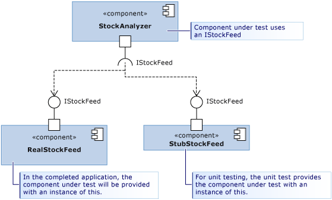

# Overview
> Documentation: https://learn.microsoft.com/en-us/visualstudio/test/using-stubs-to-isolate-parts-of-your-application-from-each-other-for-unit-testing?view=vs-2022&tabs=csharp  

A *stub* is a small piece of code that replaces another component during testing. 


Using stubs effectively requires application design such that each component depends only on interfaces, not other components:  


## Example: Creating and Using Stubs
1. Create an interface:
    ```cs
    // IStockFeed.cs
    public interface IStockFeed
    {
        int GetSharePrice(string company);
    }
    ```

2. Create a class that uses the interface:
    ```cs
    // StockAnalyzer.cs
    public class StockAnalyzer
    {
        private IStockFeed stockFeed;
        public StockAnalyzer(IStockFeed feed)
        {
            stockFeed = feed;
        }
        public int GetContosoPrice()
        {
            return stockFeed.GetSharePrice("COOO");
        }
    }
    ```
3. Create a test project.
4. From the test project, add a project reference to StockAnalyzer.
5. Add a Fakes Assembly:
   1. Solution Explorer > **TestProject** > [**Assemblies**, **Projects** or **Packages**] 
   2. Right-click the assembly that contains class definitions to be stubbed > **Add Fakes Assembly**
6. Create a unit test.
7. Modify the default `UnitTest1.cs` file with this test method:
    ```cs
    [TestClass]
    class UnitTest1
    {
        [TestMethod]
        public void TestContosoPrice()
        {
            // Arrange:
            int priceToReturn = 345;
            string companyCodeUsed = "";
            var componentUnderTest = new StockAnalyzer(new StockAnalysis.Fakes.StubIStockFeed()
            {
                GetSharePriceString = (company) =>
                {
                    companyCodeUsed = company; // Store the parameter value
                    return priceToReturn; // Return the value prescribed by this test
                }
            });

            // Act:
            int actualResult = componentUnderTest.GetContosoPrice();

            // Assert:
            // Verify the correct result in the usual way:
            Assert.AreEqual(priceToReturn, actualResult);

            // Verify that the component made the correct call:
            Assert.AreEqual("COOO", companyCodeUsed);
        }
    }
    ```
    For every interface in the referenced assembly, Microsoft Fakes generates a stub class. The name of the stub class is
    derived from the name of the interface with `Fakes.Stub` as a prefix. Stubs are generated for getters/setters, events,
    and generic methods.
8. Run the test.

## Stub Behavior
Each generated stub type receives an `IStubBehavior` through the `IStub.InstanceBehavior` property. Whenever a client calls a member 
with *no attached custom delegate*, this behavior is invoked. If no behavior has been set, it uses `StubBehaviors.Current` which throws
a `NotImplementedException` by default.

This example changes the behavior so that the stub either does nothing or returns the default value of the return type:
```cs
// unit test code
var stub = new StockAnalysis.Fakes.StubIStockFeed();
stub.InstanceBehavior = StubsBehaviors.DefaultValue; // return default(T) or do nothing
```

To change the behavior globally for all stubs where behavior has not been set, use `StubBehaviors.Current`:
```cs
// unit test code
StubBehaviors.Current = BehavedBehaviors.DefaultValue;
```

# Stubbing Different Members
## Stubs of Methods
Consider this interface with a method:
```cs
// IStockFeed.cs
interface IStockFeed
{
    int GetSharePrice(string company);
}
```

Methods can be stubbed by attaching a delegate to an instance of the *stub type*. The name of the stub type is derived from 
the names of method properties and parameters. The `GetSharePrice` method has a stub type of `GetSharePriceString`:
```cs {hl_lines=[7]}
// unit test code
int priceToReturn = 345;
string companyCodeUsed = "";
var componentUnderTest = new StockAnalyzer(
    new StockAnalysis.Fakes.StubIStockFeed()
    {
        GetSharePriceString = (company) =>
        {
            companyCodeUsed = company; // Store the parameter value
            return priceToReturn; // Return the value prescribed by this test
        }
    });
```

If a stub for a method is not provided, Fakes generates a method that returns the default value of the return type. 

## Stubs of Generic Methods
Stub generic methods by providing a delegate for each desired instantiation:
```cs
interface IGenericMethod
{
    T GetValue<T>();
}
```
To stub GetValue<int>
```cs
[TestMethod]
public void TestGetValue()
{
    var stub = new StubIGenericMethod();
    stub.GetValueOf1<int>(() => 5);

    IGenericMethod target = stub;
    Assert.AreEqual(5, target.GetValue<int>());
}
```

## Stubs of Properties
A property's getter and setter are exposed as separate delegates and can be stubbed individually:
```cs
interface IStockFeedWithProperty
{
    int Value { get; set; }
}
```
```cs
// unit test code
int i = 5;
var stub = new StubIStockFeedWithProperty();
stub.ValueGet = () => i;
stub.ValueSet = (value) => i = value;
```

If a stub for either the getter or setter of a property is not provided, Fakes generates a stub that stores values (making
the stub property behave like a simple variable).

## Stubs of Events
Events are exposed as delegate fields. Any stubbed event can be raised by invoking the event's backing field:
```cs
interface IStockFeedWithEvents
{
    event EventHandler Changed;
}
```
```cs
// unit test code
var withEvents = new StubIStockFeedWithEvents();
withEvents.ChangedEvent(withEvents, EventArgs.Empty); // raises the Changed event
```

## Stubs of Virtual Classes
Stubs can be generated from classes that have abstract or virtual members:
```cs
// Base class in application under test
public abstract class MyClass
{
    public abstract void DoAbstract(string x);
    public virtual int DoVirtual(int n) => n + 42;

    public int DoConcrete() => 1;
}
```

You can then set delegate methods for `DoAbstract()` and `DoVirtual()` (but not `DoConcrete()`):
```cs
// unit test
var stub = new Fakes.MyClass();
stub.DoAbstractString = (x) => { Assert.IsTrue(x>0); };
stub.DoVirtualInt32 = (n) => 10 ;
```

If a delegate of a virtual method is not provided, Fakes can either:
1. Provide the default behavior
2. Call the method in the base class

For #2:
```cs
// unit test code
var stub = new Fakes.MyClass();
stub.CallBase = false;

// No delegate set - default delegate:
Assert.AreEqual(0, stub.DoVirtual(1));
stub.CallBase = true;

// No delegate set - calls the base:
Assert.AreEqual(43,stub.DoVirtual(1));
```