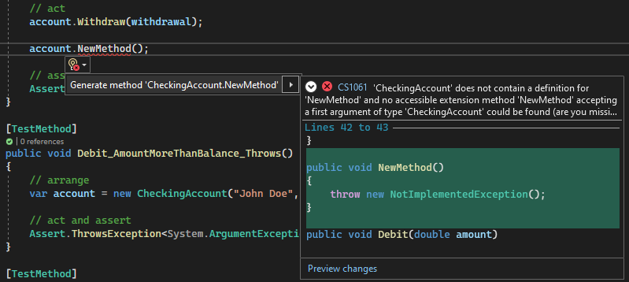

# Overview
> Documentation: https://learn.microsoft.com/en-us/visualstudio/test/unit-test-basics?view=vs-2022

Key points:
* Use unit tests as both design documentation and functional specifications.
* Visual Studio installs the Microsoft unit testing frameworks for managed and native code (MSTest).
* Visual Studio Test Explorer also supports 3rd-party testing frameworks (xUnit, NUnit, others).

# Generating Unit Tests from Existing Code
<g>Availability</g>: C#, Visual Studio 2019+

Visual Studio > Code editor > right-click > **Create Unit Tests**  
The unit test stubs are created in a new unit test projects for all methods of the class.

## Generate Unit Tests that Take Multiple Sets of Input
See [here](https://learn.microsoft.com/en-us/visualstudio/test/how-to-create-a-data-driven-unit-test?view=vs-2022).

# Generating Code from Unit Tests (TDD)
1. In a test method, write a statement that calls a class or method to be generated
2. Open the light bulb under the error > **Generate type** or **Generate method**  


# Configuring Unit Tests
## Unit Test Timeouts (MSTest)
Unit tests can be configured with a timeout:
```cs
[TestMethod]
[Timeout(2000)]  // Milliseconds
// Or, for the maximum allowed time:
[Timeout(TestTimeout.Infinite)]
public void My_Test()
{ ...
}
```

# Running Tests with Test Explorer
- Open Test Explorer: <kbd>Ctrl + E,T</kbd>
- Run all tests: <kbd>Ctrl + R,V</kbd>
- Run a subset of tests: <kbd>Ctrl + R,T</kbd>
- Run tests after every build: Text Explorer toolbar > Gear icon > **Run Tests After Build**

# Code Coverage
Code coverage refers to the amount of code that is covered by unit tests.  
Visual Studio's code coverage tools requires Enterprise edition.  
As an alternative, see [dotnet-coverage](https://learn.microsoft.com/en-us/dotnet/core/additional-tools/dotnet-coverage).  