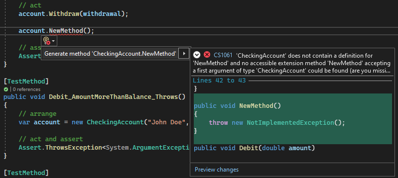

# Overview [[Documentation](https://learn.microsoft.com/en-us/visualstudio/test/unit-test-basics?view=vs-2022)]  
> See also: [Notes on Unit Testing with MSTest](../../../../_net/testing/unit-testing/unit-testing-with-mstest)  

Key points:
* Use unit tests as both design documentation and functional specifications.
* Visual Studio installs the Microsoft unit testing frameworks for managed and native code (MSTest).
  * Note: MSTest is both a *framework* and an *adapter* to that framework.
* Visual Studio Test Explorer also supports 3rd-party adapters to the MSTest framework: xUnit, NUnit, others(?).

# Generating Unit Tests and Generating Code
## Generating Unit Tests from Existing Code
> [!IMPORANT] Availability: C#, Visual Studio 2019+

Visual Studio > Code editor > right-click > **Create Unit Tests**  
The unit test stubs are created in a new unit test projects for all methods of the class.

## Generate Unit Tests that Take Multiple Sets of Input
See [here](https://learn.microsoft.com/en-us/visualstudio/test/how-to-create-a-data-driven-unit-test?view=vs-2022).

## Generating Code from Unit Tests (TDD)
1. In a test method, write a statement that calls a class or method to be generated
2. Open the light bulb under the error > **Generate type** or **Generate method**  
