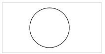
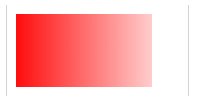

# Overview
The `<canvas>` element is a container for graphics drawn by JavaScript.
Syntax: 
```html
<canvas id="myCanvas" width="200" height="100"></canvas>
```
# Empty Canvas
```html
<canvas id="myCanvas"width="200"height="100"style="border:1px solid #000000;">
</canvas>
```
  

# Line
```html
<canvas id="myCanvas" width="200" height="100" style="border:1px solid #d3d3d3;">
Your browser does not support the HTML canvas tag.</canvas>

<script>
    var c = document.getElementById("myCanvas");
    var ctx = c.getContext("2d");
    ctx.moveTo(0,0);
    ctx.lineTo(200,100);
    ctx.stroke();
</script>
```
  

# Circle
```html
<script>
    var c = document.getElementById("myCanvas");
    var ctx = c.getContext("2d");
    ctx.beginPath();
    ctx.arc(95, 50, 40, 0, 2 * Math.PI);
    ctx.stroke();
</script>
```
  

# Text
```html
<script>
    var c = document.getElementById("myCanvas");
    var ctx = c.getContext("2d");
    ctx.font = "30px Arial";
    /* or strokeText: */
    ctx.fillText("Hello World", 10, 50);
</script>
```
  

# Gradient
```html
<script>
    var c = document.getElementById("myCanvas");
    var ctx = c.getContext("2d");

    // Create gradient
    /* or createRadialGradient: */
    var grd = ctx.createLinearGradient(0, 0, 200, 0);
    grd.addColorStop(0, "red");
    grd.addColorStop(1, "white");

    // Fill with gradient
    ctx.fillStyle = grd;
    ctx.fillRect(10, 10, 150, 80);
</script>
```




