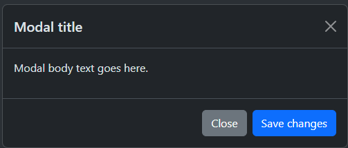
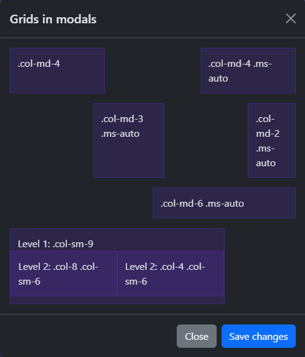

# Overview
- A JavaScript modal plugin to add dialogs for lightboxes, notifications, or custom content
- Built with HTML, CSS and JavaScript
- Documentation: https://getbootstrap.com/docs/5.3/components/modal/

# Details
- Positioned over everything else in the document and remove scroll from the `<body>` (the modal scrolls instead)
- Clicking on the modal's backdrop closes it
- Only one modal window at a time is supported
- Uses `position: fixed`; whenever possible, place the modal HTML in a  top-level position
  - Nesting a `.modal` in another element is often problematic
- The HTML `autofocus` attribute has no effect in modals
- The animation in modals is dependent on `prefers-reduced-motion` media query

# Examples
## Static modals
This modal is **static**:  


```html
<div class="modal" tabindex="-1">
  <div class="modal-dialog">
    <div class="modal-content">
      <div class="modal-header">
        <h5 class="modal-title">Modal title</h5>
        <button type="button" class="btn-close" data-bs-dismiss="modal" aria-label="Close"></button>
      </div>
      <div class="modal-body">
        <p>Modal body text goes here.</p>
      </div>
      <div class="modal-footer">
        <button type="button" class="btn btn-secondary" data-bs-dismiss="modal">Close</button>
        <button type="button" class="btn btn-primary">Save changes</button>
      </div>
    </div>
  </div>
</div>
```

## Fading modals
This modal **fades**:   
```html
<div class="modal fade">
  <!-- ... -->
</div>
```

## Controlling How Modals Close
This modal has a static backdrop and cannot be closed by clicking outside of it:
```html
<div class="modal fade" id="staticBackdrop" data-bs-backdrop="static" data-bs-keyboard="false" 
     tabindex="-1" aria-labelledby="staticBackdropLabel" aria-hidden="true">
  <div class="modal-dialog">
    <div class="modal-content">
      <div class="modal-header">
        <h1 class="modal-title fs-5" id="staticBackdropLabel">Modal title</h1>
          <!-- ... -->
      </div>
    </div>
  </div>
</div>
```

## Positioning
A modal can be **vertically centered** on the page...
```html
<div class="modal-dialog modal-dialog-centered">
  ...
</div>
```
...or vertically-centered and scrollable:
```html
<div class="modal-dialog modal-dialog-centered modal-dialog-scrollable">
  ...
</div>
```

Modals can use the **grid system**:  


```html
<div class="modal-body">
  <div class="container-fluid">
    <div class="row">
      <div class="col-md-4">.col-md-4</div>
      <div class="col-md-4 ms-auto">.col-md-4 .ms-auto</div>
    </div>
    <div class="row">
      <div class="col-md-3 ms-auto">.col-md-3 .ms-auto</div>
      <div class="col-md-2 ms-auto">.col-md-2 .ms-auto</div>
    </div>
    <div class="row">
      <div class="col-md-6 ms-auto">.col-md-6 .ms-auto</div>
    </div>
    <div class="row">
      <div class="col-sm-9">
        Level 1: .col-sm-9
        <div class="row">
          <div class="col-8 col-sm-6">
            Level 2: .col-8 .col-sm-6
          </div>
          <div class="col-4 col-sm-6">
            Level 2: .col-4 .col-sm-6
          </div>
        </div>
      </div>
    </div>
  </div>
</div>
```

## Sizing
The modal's **size** can be changed...
```html
<div class="modal-dialog modal-xl">...</div>
<div class="modal-dialog modal-lg">...</div>
<div class="modal-dialog modal-sm">...</div>
```

...or it can be made **fullscreen**:  
```html
<div class="modal-dialog modal-fullscreen-sm-down">
  ...
</div>
```
