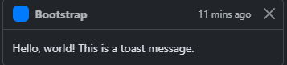
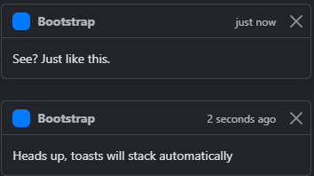

# overview
- Lightweight notifications that mimic push notifications
- Documentation: https://getbootstrap.com/docs/5.3/components/toasts/

# details
- Built with flexbox
- Opt-in for performance reasons; must be manually initialized
- Toasts autohide unless `autohide: false` is specified
- Toasts are automatically slightly translucent to blend in with their background

# creating
## a simple toast

```html
<div class="toast" role="alert" aria-live="assertive" aria-atomic="true">
  <div class="toast-header">
    
    <strong class="me-auto">Bootstrap</strong>
    <small>11 mins ago</small>
    <button type="button" class="btn-close" data-bs-dismiss="toast" aria-label="Close"></button>
  </div>
  <div class="toast-body">
    Hello, world! This is a toast message.
  </div>
</div>
```

## positioned and stacked toasts
These toasts are positioned in the upper right and stack:



```html
<div aria-live="polite" aria-atomic="true" class="position-relative">
  <!-- Use a toast container to stack multiple toasts automatically: -->
  <!-- '.toast-container' for spacing between toasts;
        'top-0 end-0' for positioning in the upper right;
        'p-3' so the toast does not stick to the edge of the container: -->
  <div class="toast-container top-0 end-0 p-3">

    <!-- Then put toasts within: -->
    <div class="toast" role="alert" aria-live="assertive" aria-atomic="true">
      <!-- Headers are optional but recommended: -->
      <div class="toast-header">
        
        <strong class="me-auto">Bootstrap</strong>
        <small class="text-body-secondary">just now</small>
        <button type="button" class="btn-close" data-bs-dismiss="toast" aria-label="Close"></button>
      </div>
      <div class="toast-body">
        See? Just like this.
      </div>
    </div>

    <div class="toast" role="alert" aria-live="assertive" aria-atomic="true">
      <div class="toast-header">
        
        <strong class="me-auto">Bootstrap</strong>
        <small class="text-body-secondary">2 seconds ago</small>
        <!-- Use "data-bs-dismiss" to dismiss a toast via a button within the toast: -->
        <button type="button" class="btn-close" data-bs-dismiss="toast" aria-label="Close"></button>
      </div>
      <div class="toast-body">
        Heads up, toasts will stack automatically
      </div>
    </div>
  </div>
</div>
```

# positioning
In the `toast-container` div above, the toast's position is set.  Other options for positioning:
- `"top-0 start-0"` for top left
- `"top-0 start-50 translate-middle-x"` for top center
- `"top-0 end-0"` for top right
- `"top-50 start-0 translate-middle-y"` for middle left
- `"top-50 start-50 translate-middle"` for middle center
- `"top-50 end-0 translate-middle-y"` for middle right
- `"bottom-0 start-0"` for bottom left
- `"bottom-0 start-50 translate-middle-x"` for bottom center
- `"bottom-0 end-0"` for bottom right
- `.p-3` to prevent the toasts from sticking to the edge of the container

# initializing
Initialize toasts with JavaScript:
```js
const toastElList = document.querySelectorAll('.toast')
const toastList = [...toastElList].map(toastEl => new bootstrap.Toast(toastEl, option))
```

# dismissing
Use `data-bs-dismiss` on a button within the toast:`
```html
<button type="button" class="btn-close" data-bs-dismiss="toast" aria-label="Close"></button>
```

Or `data-bs-target` on a button outside the toast:
```html
<button type="button" class="btn-close" data-bs-dismiss="toast" data-bs-target="#my-toast" aria-label="Close"></button>
```

# options
Use `data-bs-{option}="{value}"`.  Options:
- `animation`: apply a CSS fade transition to the toast; default = `true`
- `autohide`: automatically hide the toast after a delay; default = `true`
- `delay`: delay in milliseconds before hiding the toast; default = `5000`
