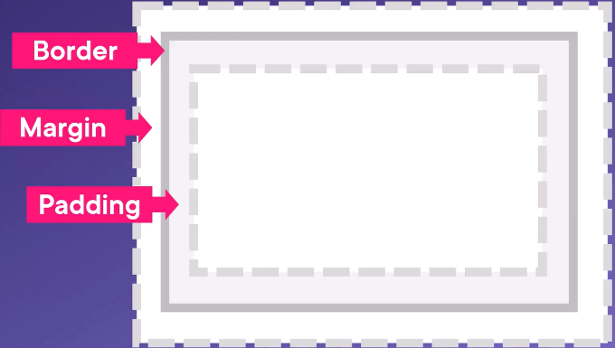

# overview
Cascading Style Sheets format the layout of a webpage.  
Syntax: `property:value;`

# css rulesets
Select an element whose class=container; find the pararaph inside; find the first child inside of it; find the first character of that element
```css
.container p:first-child::first-letter {
    font-size: 42px;
    text-transform: uppercase;
}
```

The first line is the selector — the elements we are targeting.  
`first-child` is the pseudo-class  
`first-letter` is the pseudo-character selector  

# cascading
CSS rulesets cascade.

The `div` will receive the backgroud color of the body, then the background color of `main` (more specific), then the background color of the `div`, but NOT the `width` of `main`, because `width` does NOT cascade:
```html
<head>
    <style>
        body {
            background-color: grey;
        }
        main {
            background-color: white;
            width: 50%;
        }
        div {
            background-color: white;
        }
    </style>
</head>

<body>
    <main>
        <div>Hello</div>
    </main>>
</body>
```

To make the div 50% of its container, it would also need the width property.

# using css
CSS can be added to HTML:
- inline via the style attribute in HTML elements (most specific)
- internal via a `<style>` element in the `<head>` element
- external via a `<link>` element to an external CSS file (least specific)

## inline css
Applies a style to a single HTML element:
```html
<h1 style="color:blue;">A Blue Heading</h1>

<p style="color:red;">A red paragraph.</p>
```

## internal css
Defines a style for a single HTML page. This is done in the `<head>` section within a `<style>` element.  
Here, the text of all of the `<h1>` and `<p>` elements on this page will receive the same color:
```html
<!DOCTYPE html>
<html>
<head>
    <style>
        body {background-color: powderblue;}
        h1 {color: blue;}
        p {color: red;}
    </style>
</head>
…
```

## external css
Link to an external style sheet via a link in `<head>`:
```html
<!DOCTYPE html>
<html>
<head>
    <link rel="stylesheet" href="styles.css" type="text/css">
</head>
…
```
`style.css`
```css
h1 {
    color: blue;
    font-family: verdana;
    font-size: 300%;
}
p {
    color: red;
    font-family: courier;
    font-size: 160%;
}
```

# selectors
Selectors can target tags, class names, IDs, or attributes.
Given this body:
```html
<body>
    <h1>Introduction to CSS</h1>
    <p>How to use CSS</p>
    <div class="tutorial" id="tutorial-1">
        <h2>Tutorial 1</h2>
        
        <p>To begin with tutorial 1...</p>
    </div>
    <div class="tutorial" id="tutorial-2">
        <h2>Tutorial 2</h2>
        
        <p>To begin thsi tutorial 2...</p>
    </div>
</body>
```

## tag selectors
```css
img {
    border: solid 1px #fa0000;
}
```
## class selectors
```html
<style>
    .tutorial { /* class selectors start with a dot */
        border: solid 1px #fa0000;
    }
</style>
```

## id selectors
```html
<style>
    #tutorial-1 { /* id selectors start with a hash */
        background-color: #eee;
    }
</style>
```
## attribute selectors
```html
<style>
    /* attribute selectors have the tag followed by the attribute in brackets */
        img[src="https://via.placeholder.com/150"] {
            border: solid 3px blue;
    }
</style>
```

## list selectors
```html
<style>
    .tutorial, h1 { /* select multiple page elements separated by commas */
        border: solid 1px #ccc;
    }
</style>
```

## combinators
Use combinators to select a specific child of a parent:
```html
<style>
    .tutorial > p { /* parent > child */
        font-size: 1.5em;
    }
</style>
```

# box model
Every element is in a box:  


The classic box model adds the border and padding to the amount of an element:  


The `box-sizing: border-box;` rule renders the padding and margin inside the box:  


To apply this rule to all elements:
```css
html {
    box-sizing: border-box; /* add the rule to the root html element */
}

*, :before, :after { /* instruct downstream elements to inherit the rule */
    box-sizing: inherit;
}
```

# flexbox
```html
<head>
    <style>
        .columns {
            border: solid 1px #39f;
            /* use a flexbox */
            display: flex;
        }

        .columns>div {
            border: solid 1px #ccc;
                /* each div will take up 1 column's worth of space in the container */
                flex: 1;
        }

        /* look for a div in the container based on its position (in this case, the 2nd item in container) */
            .columns>div:nth-of-type(2) {
                /* give the selected item twice the available space as the others */
                flex: 2;
        }
    </style>
</head>

<body>
    <div class="columns">
        <div>Column 1</div>
        <div>Column 2</div>
        <div>Column 3</div>
    </div>
</body>
```

# variables
## defining
In the root element:
```css
:root {
    --variable-name: variable-value;
}
```
## using
```css
var(--variable-name);
```

# common css properties
## Border, Padding, Margin
```css
p {
    border: 2px solid powderblue; /* sets a border around an element */
    padding: 30px; /* sets space between the text and the border */
    margin: 50px; /* sets space outside the border */
}
```

# hyperlinks
To change the color of hyperlinks:
```html
<style>
    a:link { /* unvisited */
        color: green;
        background-color: transparent;
        text-decoration: none;
    }

    a:visited {
        color: pink;
        background-color: transparent;
        text-decoration: none;
    }

    a:hover {
        color: red;
        background-color: transparent;
        text-decoration: underline;
    }

    a:active {
        color: yellow;
        background-color: transparent;
        text-decoration: underline;
    }
</style>
```

To create a flat "button":
```html
<style>
    a:link, a:visited {
        background-color: #f44336;
        color: white;
        padding: 15px 25px;
        text-align: center;
        text-decoration: none;
        display: inline-block;
    }

    a:hover, a:active {
        background-color: red;
    }
</style>
```

# images
## floating
Images can float to the left or right of text via the CSS float property:  
```html
<p>
The image will float to the right of the text.</p>  

<p>
The image will float to the left of the text.</p>
```
