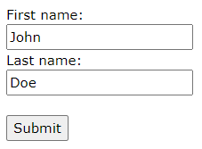
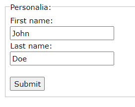

# Overview
Creates a form — a container for different types of input elements.

## action Attribute
```html
<input type="submit">Displays a submit button (for submitting the form)
<!-- where to send the form when submitted -->
<form action="/action_page.php" 
    <label for="fname">First name:</label><br>
    <input type="text" id="fname" name="fname" value="John"><br>
    <label for="lname">Last name:</label><br>
    <input type="text" id="lname" name="lname" value="Doe"><br><br>
    <input type="submit" value="Submit">
</form>
```


## Other `<form>` Attributes
| Attribute        | Values                                           | Description                                                              |
| ---------------- | ------------------------------------------------ | ------------------------------------------------------------------------ |
| `target`         | _blank, _self (default), _parent, top, framename | Where to display the response that is received after submitting the form |
| `method`         | get (default), post                              | HTTP method to use when submitting form data                             |
| `autocomplete`   | on, off                                          | Whether to autocomplete input                                            |
| `novalidate`     | boolean                                          | Whether input should be validated                                        |
| `accept-charset` | The character encoding used for form submission  |
| `enctype`        | Used only for method="post"                      | Defines how the form data should be encoded when submitted               |


Notes on `method="get"`
- appends form data to URL in name=value pairs
- length of URL is must be <= 2048 characters
- insecure

Notes on `method="post"`
- appends form data inside the body of the HTTP request
- no size limitations

# Other `<form>` Elements
## `<select>` Element
Defines a dropdown list:
```html
<label for="cars">Choose a car:</label>
<!-- size: the number of options visible -->
<!-- multiple: allow user to select multiple options -->
<select id="cars" name="cars" size="3" multiple> 
    <option value="volvo">Volvo</option> <!-- this option will be highlighted since its first -->
    <option value="saab" selected>Saab</option> <!-- the selected attribute would override the above -->
    <option value="fiat">Fiat</option>
    <option value="audi">Audi</option>
</select>
```

## `<textarea>` Element
Defines a multi-line input field:
```html
<textarea name="message" rows="10" cols="30">
    The cat was playing in the garden.
</textarea>
```

## `<button>` Element
Defines a clickable button:
```html
<button type="button" onclick="alert('Hello World!')">Click Me!</button>
```

## `<fieldset>` and `<legend>` Elements
Group related data in a form and caption it:
```html
<form action="/action_page.php">
    <fieldset>
        <legend>Personalia:</legend>
        <label for="fname">First name:</label><br>
        <input type="text" id="fname" name="fname" value="John"><br>
        <label for="lname">Last name:</label><br>
        <input type="text" id="lname" name="lname" value="Doe"><br><br>
        <input type="submit" value="Submit">
    </fieldset>
</form>
```


## `<datalist>` Element
Define a list of pre-defined options for an `<input>` element with a dropdown list:
```html
<form action="/action_page.php">
    <input list="browsers"> <!-- list attribute must == datalist id -->
        <datalist id="browsers">
        <option value="Internet Explorer">
        <option value="Firefox">
        <option value="Chrome">
        <option value="Opera">
        <option value="Safari">
    </datalist>
</form>
```

## `<output>` Element
Represents the result of a calculation (like one performed via a script):
```html
<form action="/action_page.php" oninput="x.value=parseInt(a.value)+parseInt(b.value)">
    0
    <input type="range" id="a" name="a" value="50">
    100 +
    <input type="number" id="b" name="b" value="50">
    =
    <output name="x" for="a b"></output>
    <br><br>
    <input type="submit">
</form>
```
