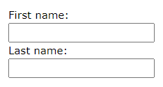

# type Attribute
```html
<input type="text">Displays a single-line text input field
<form>
    <!-- the label element is read by screen readers -->
    <!-- the label's for attribute must be equal to the id
    attribute of the input element to bind them -->
    <labelfor="fname">First name:</label><br>
    <inputtype="text"id="fname"name="fname"><br>
    <labelfor="lname">Last name:</label><br>
    <inputtype="text"id="lname"name="lname">
</form>
```


```html
<input type="radio">Displays a radio button (for selecting one of many choices)
<form>
    <input type="radio" id="html" name="fav_language" value="HTML">
    <label for="html">HTML</label><br>
    <input type="radio" id="css" name="fav_language" value="CSS">
    <label for="css">CSS</label><br>
    <input type="radio" id="javascript" name="fav_language" value="JavaScript">
    <label for="javascript">JavaScript</label>
</form>
```


```html
<input type="checkbox">Displays a checkbox (for selecting zero or more of many choices)
    <form>
    <input type="checkbox" id="vehicle1" name="vehicle1" value="Bike">
    <label for="vehicle1"> I have a bike</label><br>
    <input type="checkbox" id="vehicle2" name="vehicle2" value="Car">
    <label for="vehicle2"> I have a car</label><br>
    <input type="checkbox" id="vehicle3" name="vehicle3" value="Boat">
    <label for="vehicle3"> I have a boat</label>
</form>
```


A server-side script (perhaps in PHP) handles the submitted form.

Input fields must have a `name` attribute for data to be submitted.

## Other `<input>` Element type values
```html
<input type="color"> Displays a color picker if supported by the browser
<input type="date">Date picker
<form>
    <label for="datemax">Enter a date before 1980-01-01:</label>
    <!-- optionally restrict the dates with datemax and datemin: -->
    <input type="date" id="datemax" name="datemax" max="1979-12-31"><br><br>
    <label for="datemin">Enter a date after 2000-01-01:</label>
    <input type="date" id="datemin" name="datemin" min="2000-01-02">
</form>

<input type="datetime-local">A datetime (vs date) input field
<input type="email">Capture email addresses; automatic validation with some browsers
<input type="file">File picker
<input type="hidden">Sends additional data with the submission
<form>
    <label for="fname">First name:</label>
    <input type="text" id="fname" name="fname"><br><br>
    <input type="hidden" id="custId" name="custId" value="3487">
    <input type="submit" value="Submit">
</form>

<input type="image">Defines an image as a button; sends the X,Y coordinates of the click that activated the button - has src, alt, width, and height attributes
<input type="month">Month/year date picker
<input type="number">Numeric input field
<form>
    <label for="quantity">Quantity (between 1 and 5):</label>
    <input type="number" id="quantity" name="quantity" min="1" max="5">
</form>

<input type="password">Masks entered characters
<input type="range">A slider control
<input type="reset">Resets the forms values
<input type="search">Like a regular text input field for searches
<input type="tel">Telephone numbers
<form>
    <label for="phone">Enter your phone number:</label>
    <input type="tel" id="phone" name="phone" pattern="[0-9]{3}-[0-9]{2}-[0-9]{3}">
</form>

<input type="time">Time (no timezone)
<input type="url">URLs; automatic validation with some browsers
<input type="week">Week and year
```

# Other `<input>` Attributes
- `autofocus` - Specifies that this field will get focus when the page loads
- `checked` - Specifies that an input field should be pre-selected when the page loads (for type="checkbox" or type="radio")
- `disabled` - Specifies that an input field should be disabled (cannot select or click; value is not sent when submitting form)
- `max` - Specifies the maximum value for an input field
- `maxlength` - Specifies the maximum number of character for an input field
- `min` - Specifies the minimum value for an input field
- `pattern` - Specifies a regular expression to check the input value against (use global title attribute to add tooltip to help user)
- `placeholder` - Specifies a short hint to help the user
- `readonly` - Specifies that an input field is read only (cannot be changed but is selectable)
- `required` - Specifies that an input field is required (must be filled out)
- `size` - Specifies the width (in characters) of an input field
- `step` - Specifies the legal number intervals for an input field
- `value` - Specifies the default value for an input field

# `<input>` Element  Attributes
## form Attribute
Allows an input field to be outside of the HTML form but still part of the form:
```html
<form action="/action_page.php" id="form1">
    <label for="fname">First name:</label>
    <input type="text" id="fname" name="fname"><br><br>
    <input type="submit" value="Submit">
</form>

<label for="lname">Last name:</label>
<input type="text" id="lname" name="lname" form="form1">
```
## formaction Attribute
Overrides the action attribute of the `<form>` element. Works with submit and image:
```html
<form action="/action_page.php">
    <label for="fname">First name:</label>
    <input type="text" id="fname" name="fname"><br><br>
    <label for="lname">Last name:</label>
    <input type="text" id="lname" name="lname"><br><br>
    <input type="submit" value="Submit">
    <input type="submit" formaction="/action_page2.php" value="Submit as Admin">
</form>
```

## `formenctype` Attribute
Overrides the enctype attribute of the `<form>` element. Works with submit and image.

## `formmethod` Attribute
Overrides the method attribute of the `<form>` element. Works with submit and image.

## `formtarget` Attribute
Overrides the target attribute of the `<form>` element. Works with submit and image.

## `formnovalidate` Attribute
Overrides the novalidate attribute of the `<form>` element. Works with submit.


