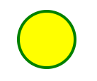
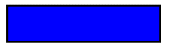
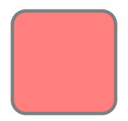
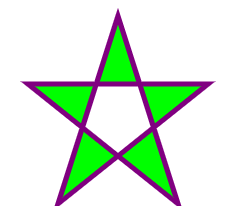
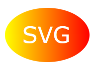

# Overview
SVG defines vector-based graphics in XML format.

# Circle
```html
<!DOCTYPE html>
<html>
<body>

<svg width="100" height="100">
    <circle cx="50" cy="50" r="40" stroke="green" stroke-width="4" fill="yellow" />
</svg>

</body>
</html>
```


# Rectangle
```html
<svg width="400" height="100">
    <rect width="400" height="100" style="fill:rgb(0,0,255);stroke-width:10;stroke:rgb(0,0,0)" />
</svg>
```


# Rounded Rectangle
```html
<svg width="400" height="180">
    <rect x="50" y="20" rx="20" ry="20" width="150" height="150"
        style="fill:red;stroke:black;stroke-width:5;opacity:0.5" />
</svg>
```


# Star
```html
<svg width="300" height="200">
    <polygon points="100,10 40,198 190,78 10,78 160,198"
    style="fill:lime;stroke:purple;stroke-width:5;fill-rule:evenodd;" />
</svg>
```


# Logo
```html
<svg height="130" width="500">
    <defs>
        <linearGradient id="grad1" x1="0%" y1="0%" x2="100%" y2="0%">
            <stop offset="0%" style="stop-color:rgb(255,255,0);stop-opacity:1" />
            <stop offset="100%" style="stop-color:rgb(255,0,0);stop-opacity:1" />
        </linearGradient>
    </defs>
    <ellipse cx="100" cy="70" rx="85" ry="55" fill="url(#grad1)" />
    <text fill="#ffffff" font-size="45" font-family="Verdana" x="50" y="86">SVG</text>
    Sorry, your browser does not support inline SVG.
</svg>
```

