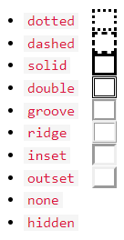

# overview
Like so:
```html
<table>
    <tr> <!-- add a table row -->
    <!-- add a header cell to this row -->
        <th style="width:70%"> <!-- set the column width of this cell-->
        Company
        </th>
        <th colspan="2">Contact</th> <!-- span this column 2 cells -->
        <th>Country</th>
    </tr>
    <tr style="height:200px"> <!-- set the height of this row -->
        <td>Alfreds Futterkiste</td> <!-- add data to this row -->
        <td>Maria Anders</td>
        <td>Germany</td>
    </tr>
    <tr>
        <td>Centro comercial Moctezuma</td>
        <td>Francisco Chang</td>
        <td>Mexico</td>
    </tr>
    </table>
```

Or, like so:
```html
<table>
    <thead>
        <tr>
            <th>Name</th>
            <th>Twitter</th>
        </tr>
    </thead>
    <tbody>
        <tr>
            <td>Some Gal</td>
            <td>@somegal</td>
        </tr>
        <tr>
            <td>Some Guy</td>
            <td>@someguy</td>
        </tr>
    </tbody>
</table>
```

Aligning headers:
```css
th {
    text-align: left;
}
```
Adding padding to the cells:
```css
th, td {
    padding: 15px;
}
```
Or:
```css
th, td {
    padding-top: 10px; /* adds padding above the content */*
    padding-bottom: 20px;
    padding-left: 30px;
    padding-right: 40px;
}
```

Striping rows:
```css
tr:nth-child(even) {
    background-color: #D6EEEE;
}
```
Striping columns:
```css
td:nth-child(even), th:nth-child(even) {
    background-color: #D6EEEE;
}
```

Highlight rows:
```css
tr:hover {background-color: #D6EEEE;}
```
Create a caption for the entire table immediately after the `<table>` tag:
```html
<table style="width:100%">
<caption>Monthly savings</caption>
```

# column groups
You can style specific columns of a table:
```html
<table>
<colgroup>
<col span="2" style="background-color: #D6EEEE">
</colgroup>
<tr>
<th>MON</th>
<th>TUE</th>
<th>WED</th>
<th>THU</th>
...
```
The only valid CSS properties for `colgroup` are `width`, `visibility`, `background`, `border`.

# table borders
Add a border with a CSS border property on these elements:
```css
table, th, td {
    border: 1px solid black;
}
```
Omit the border around the table itself by omitting table.

Other CSS border properties:
```css
border-bottom: 1px solid #ddd; /* only specify a bottom border */
border-color: green;
border-collapse: collapse; /* makes a single-framed instead of double-framed border */
border-radius: 10px; /* rounds the border's corners by 10 pixels */
border-spacing: 30px; /* changes space between cells */
border-style:
```

