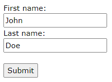
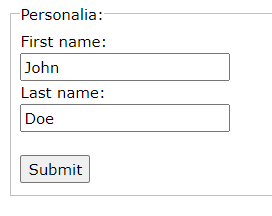

# Overview
Creates a form—a container for different types of input elements.

## `action` Attribute
<input type="submit">Displays a submit button (for submitting the form)
`<form action="/action_page.php" <!-- where to send the form when submitted -->`
`<label for="fname">First name:</label> `
`<input type="text" id="fname" name="fname" value="John"> `
`<label for="lname">Last name:</label> `
`<input type="text" id="lname" name="lname" value="Doe">  `
`<input type="submit" value="Submit">`
`</form>`

## Other `<form>` Attributes
<table>
<colgroup>
<col style="width: 18%" />
<col style="width: 34%" />
<col style="width: 47%" />
</colgroup>
<thead>
<tr class="header">
<th>Attribute</th>
<th>Values</th>
<th>Description</th>
</tr>
</thead>
<tbody>
<tr class="odd">
<td><mark>target</mark></td>
<td><mark>_blank</mark>, <mark>_self</mark> (default), <mark>_parent</mark>, <mark>top</mark>, <em><mark>framename</mark></em></td>
<td>Where to display the response that is received after submitting the form</td>
</tr>
<tr class="even">
<td><mark>method</mark></td>
<td><mark>get</mark> (default), <mark>post</mark></td>
<td>HTTP method to use when submitting form data</td>
</tr>
<tr class="odd">
<td><mark>autocomplete</mark></td>
<td><mark>on</mark>, <mark>off</mark></td>
<td>Whether to autocomplete input</td>
</tr>
<tr class="even">
<td><mark>novalidate</mark></td>
<td>boolean</td>
<td>Whether input should be validated</td>
</tr>
<tr class="odd">
<td><mark>accept-charset</mark></td>
<td></td>
<td>The character encoding used for form submission</td>
</tr>
<tr class="even">
<td><mark>enctype</mark></td>
<td></td>
<td>
Used only for <mark>method="post"</mark>

Defines how the form data should be encoded when submitted
</td>
</tr>
</tbody>
</table>

Notes on `method="get"`
- appends form data to URL in name=value pairs
- length of URL is must be <= 2048 characters
- insecure

Notes on `method="post"`
- appends form data inside the body of the HTTP request
- no size limitations

# Other `<form>` Elements
## `<select>` Element
Defines a dropdown list:
`<label for="cars">Choose a car:</label>`
`<select`
`id="cars"`
`name="cars"`
`size="3" <!-- the number of options visible -->`
`multiple> <!-- allow user to select multiple options -->`
`<option value="volvo">Volvo</option> <!-- this option will be highlighted since its first -->`
`<option value="saab" selected>Saab</option> <!-- the selected attribute would override the above -->`
`<option value="fiat">Fiat</option>`
`<option value="audi">Audi</option>`
`</select>`

## `<textarea>` Element
Defines a multi-line input field:
`<textarea name="message" rows="10" cols="30">`
`The cat was playing in the garden.`
`</textarea>`

## `<button>` Element
Defines a clickable button:
`<button type="button" onclick="alert('Hello World!')">Click Me!</button>`

## `<fieldset>` and `<legend>` Elements
Group related data in a form and caption it:
`<form action="/action_page.php">`
`<fieldset>`
`<legend>Personalia:</legend>`
`<label for="fname">First name:</label> `
`<input type="text" id="fname" name="fname" value="John"> `
` <label for="lname">Last name:</label> `
`<input type="text" id="lname" name="lname" value="Doe">  `
`<input type="submit" value="Submit">`
`</fieldset>`
`</form>`

## `<datalist>` Element
Define a list of pre-defined options for an <input> element with a dropdown list:
`<form action="/action_page.php">`
`<input list="browsers"> <!-- list attribute must == datalist id -->`
`<datalist id="browsers">`
`<option value="Internet Explorer">`
`<option value="Firefox">`
`<option value="Chrome">`
`<option value="Opera">`
`<option value="Safari">`
`</datalist>`
`</form>`

## `<output>` Element
Represents the result of a calculation (like one performed via a script):
`<form action="/action_page.php"`
`oninput="x.value=parseInt(a.value)+parseInt(b.value)">`
`0`
` <input type="range" id="a" name="a" value="50">`
`100 +`
`<input type="number" id="b" name="b" value="50">`
`=`
`<output name="x" for="a b"></output>`
`  `
`<input type="submit">`
`</form>`

