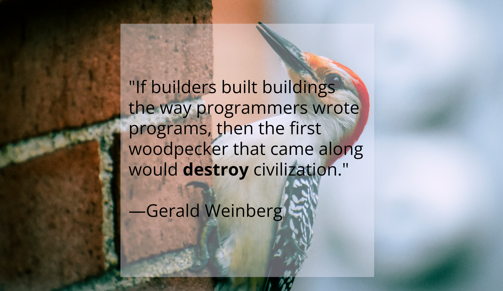

In 2023, the majority of software on planet Earth is poorly constructed.  This is true for everything from small mobile apps to mid-sized line of business applications to large distributed enterprise systems.  It is true for application software, firmware, operating systems, embedded systems, and IoT systems.  Low quality software exists in both open- and closed-source codebases.  The software we use in our personal and professional lives every day is [unreliable](https://encyclopedia.uia.org/en/problem/unreliability-computer-software).  It [malfunctions](https://www.fox26houston.com/news/bmw-recalling-thousands-of-vehicles-over-software-malfunction).  It [frustrates us](https://www.techradar.com/news/software-frustration-is-costing-workers-millions-of-hours-every-week).  And — worst of all — it [endangers us](https://www.forbes.com/sites/taylorarmerding/2018/11/20/hard-questions-raised-when-a-software-glitch-takes-down-an-airliner/).  It is simply not [fit for purpose](https://csrc.nist.gov/glossary/term/fit_for_purpose).  

There are many causes associated with this problem.  Here are the three that I think are the biggest contributing factors:

## (1) no requirements for licensing or certification
There are many causes of the proliferation of low quality software.  One of these is the lack of certification or standardization for certain classes of software.  Today, if you wanted to design a road bridge over a body of water, you would first be required to be a certified engineer.  The same is true if you wanted to build an electrical distribution subsystem for a geographic area.  If you wanted to provide medical care as a nurse, you must first be licensed as one.  States even require licensure for barbers and cosmetologists.  However, if you want to design firmware that operates the landing gear of an aircraft, no such licensure or certification is required.  

Why do we require licensure for some things that, if designed or constructed improperly, could cause harm — or even death — but not others?  Until we treat the discipline of creating creating software systems as one that should be regulated with licensure or certification, this problem will continue.

## (2) poor quality of education
Software is — at least at the time of this writing — still built primarily by humans.  The current state of education for software developers is, unfortunately, inadequate at best.  

Curriculum to teach software development is often created by those without the necessary qualifications to do so.  There are the *Coding Bootcamps* that promise to turn anyone into a full-fledged software engineer in 40 hours, and the *Teach Yourself <Insert Programming Language Here> in 30 Lunches* books.  An entire industry centered around "educating" developers is eager to make money with no regard for how (in)effective this education may be.

Even formal education is lacking.  Most higher education institutions teach software development via computer science programs.  Computer science and software development are two distinct — albeit related — disciplines.  Learning how to create bubble sort algorithms does not provide one the education necessary to construct quality software.

## (3) no accountability
Renowned information security expert Bruce Schneier [reported this late last year](https://www.schneier.com/blog/archives/2022/12/arresting-it-administrators.html):

>"Albanian prosecutors on Wednesday asked for the house arrest of five public employees they blame for not protecting the country from a cyberattack by alleged Iranian hackers.  Prosecutors said the five IT officials of the public administration department had failed to check the security of the system and update it with the most recent antivirus software."

Placing accountability on systems administrators who are responsible for securing an information system is an intriguing step.  If we extrapolated this concept, what would happen if we held software developers — either individuals or organizations — accountable for doing their part in securing an information system?  It may start to change design decisions such as choosing an unsafe programming language when a type-safe alternative exists.

---

What are your thoughts?