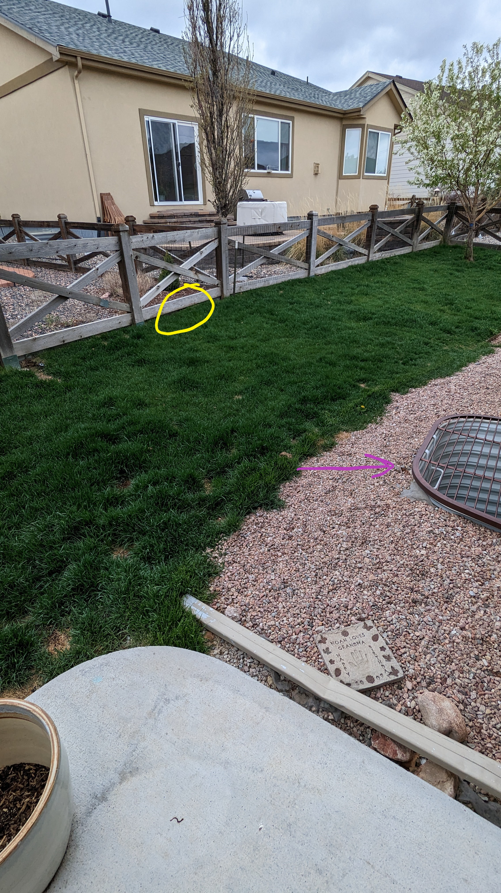
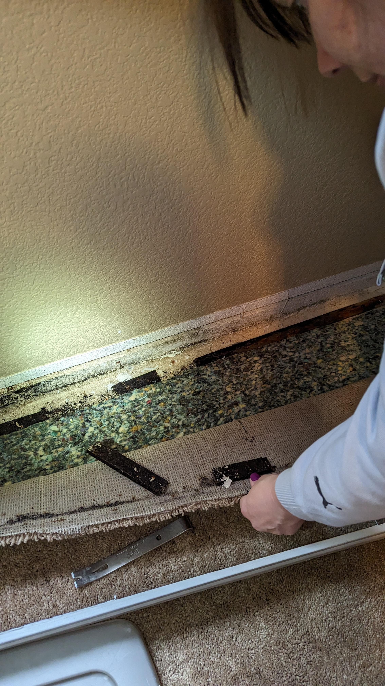
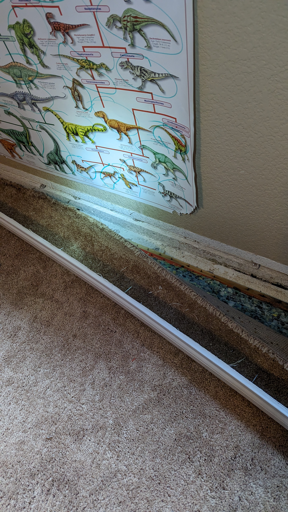
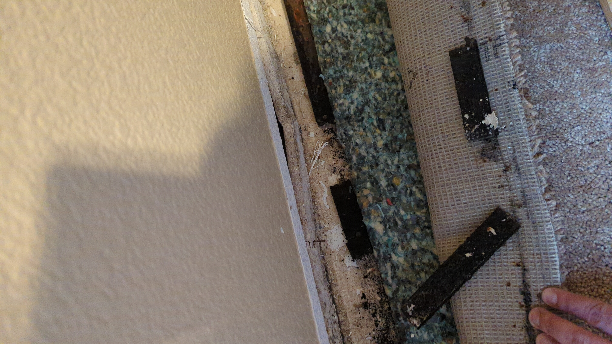

# abstract
I own a house made by [Vantage Homes](https://vantagehomes.com/) in Colorado Springs, CO.  My neighbor directly behind us has a house at an elevation slightly higher than my own.  From his back yard—which faces mine—there are several drains that terminate directly into my back yard.  

Colorado (like other parts of the country) experienced [substantial rainfall](https://kdvr.com/weather/wx-news/denver-rain-2023-june-breaks-record-for-most-rainfall-since-1882/) this summer.  This rainfall resulted in stormwater entering my home.  This details the events that followed.

# the situation
Here's some pictures taken between <g>May 13th and 14th, 2023</g>.  Click on any image for a larger size.  The drains are marked <r>red</r> and <o>yellow</o>.  Note the window well marked with the purple arrow (we'll get to that in a bit):    

Here's another view:  

Here's the "red" drain up close...  

...and closer:  

Here's a view from the other side with the window well again:  

And the "yellow" drain...  

...up close...   

...closer:  

## the damage
Here's the water damage we discovered in the basement of *the room connected to that window well* on <g>May 13th, 2023</g>:  
<video width="360" height="720" controls muted poster="thumbnail.png">
    <source src="video2.mp4">
</video>

And some stills:  

# the recovery