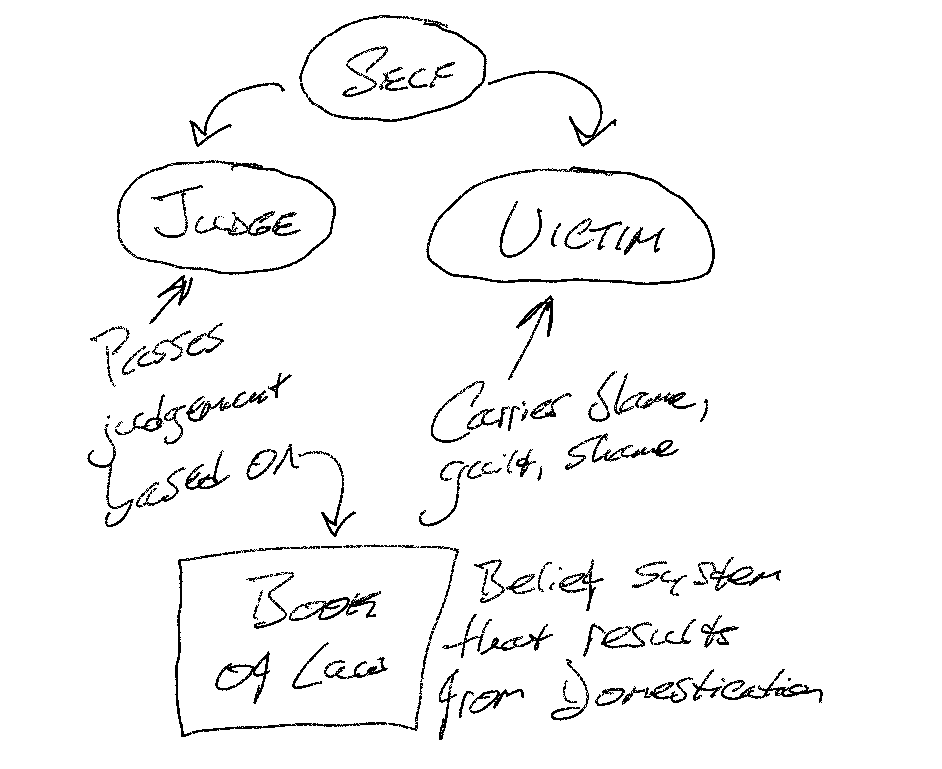

# Overview
This is a summary of [<u>The Four Agreements</u> by Don Miguel Ruiz](https://www.miguelruiz.com/the-four-agreements).  

> Notes on two of the sections are incomplete at this time.

# The Toltec
The Toltec were a society of scientists and artists in Mexico thousands of years ago.  Toltecs means *women and men of knowledge.*

# The Smokey Mirror
- 3,000 years ago, there was a medicine man in training. He slept and saw his own body while dreaming. He said, "I am made of light; I am made of stars." Everything that exists is one living being. Light is the messenger of life—it contains all information. Between stars and light is life. Everything in existence is a manifestation of one living being—God.
- The medicine man no longer had judgement about anything or anyone. He could see himself in everyone, but nobody saw him in themselves. He realized everyone was dreaming but not aware of it. They couldn't see him in themselves because there was *smoke*—the Dream of Humans.
- The medicine man referred to himself as “The Smokey Mirror.”

# Domestication and the Dream of the Planet
- *Dream of the Planet*—all of societies rules, laws, religions, cultures, ways to be, governments, schools, social events...
- We are taught to dream the way society dreams.
- As children, we agreed with the information passed to us from the Dream of the Planet via other humans (namely, our parents).
- The only way to store information is by *agreement*.

## Domestication of Humans
- *Domestication of Humans*—the process by which humans are taught how to live and behave.
- Children are domesticated like dogs and cats—they are given rewards (attention) and punishments ("you're a bad boy/girl") when their behavior does not align with the belief system of the Dream of the Planet.
- We carry this belief system as a *Book of Law*.
- Through this domestication, we develop the *Judge* who judges us based on the Book of Law, and the *Victim* who carries blame, guilt and shame:

## Mistakes
- Humans are the <u>only</u> animal on earth that pay for their mistakes more than once.
- We pay for our mistakes each time we let ourselves be reminded of them—<u>thousands</u> of times.
- In the world we see suffering, anger, revenge, violence, injustice—just like in Hell.
- But all humans are searching for trust, justice and peace.

## The Mind
- Our minds carry a *fog*—a fog is what you believe, concepts of who you are, agreements you have made with yourself, others, God.

# The First Agreement—Be Impeccable with Your Word
- *Impeccable*—without sin.
- *Sin*—anything that you do which goes against who you are.
- Sin begins with the rejection of self.
- In the Gospel of John, he writes "In the beginning was the word, and the word was with God, and the word was God."
- The *word* has the power to bring Heaven on Earth or to destroy.
  - Hitler used the word to manipulate a country.
  - He used the word to plant seeds of fear about Jewish people.
- When we agree with what we are told, we believe it and it affects us <u>deeply</u>, even if it is not true.
  - There was a stressed mother who, after a long day, came home and became angry when her child would not stop singing. She yelled at her child, telling her she had an "ugly voice." Her child, who was only singing out of happiness and joy, stopped singing for years, believing her voice to be ugly.  But she also believed she must repress her emotions to be accepted, because when she displayed her emotions, her mother scolded her harshly.
- <g>Forgive those who love us, but use the word against us; they know not what they do</g>.
- Gossip—the worst "black magic"; a misuse of the word.
  - Gossip is so prominent in human society because misery loves company.\

# The Second Agreement—Don't Take Anything Personally
- <g>Personal importance—which means taking things personally—is the ultimate expression of selfishness</g>.
- If someone insults you, it is about them, so don't make it about you.
- Immunity to others casting poison at you is the gift of this Agreement.
- <g>If you know who you are, others' opinions of you—good or bad—do not matter</g>.

# The Third Agreement—Don't Make Assumptions
- (No notes on this section)

# The Fourth Agreement—Always Do Your Best
- (No notes on this section)

# The Toltec Path to Freedom
## The freedom to be who we really are
- Free like a 2-year-old:  wild and *undomesticated*.
  - Toddlers smile and laugh and play because they are truly free.
  - They are not afraid to express who they really are, or what they feel.
  - They are not afraid of the future.
  - They are not ashamed of the past.
  - <g>Have you ever noticed that when children play and pretend to be adults, their faces always turn serious and they stop smiling</g>?
- Adults are not free because they have the Judge, the Victim, and the Book of Law.
  - <g>But adults also still have the child inside</g>.

## The Parasite
- Toltecs believe that the mind has a *parasite*—the Judge, the Victim, and the Book of Law.
- This parasite dreams through your mind and lives through your body.
- It survives on emotions that stem from fear.
- Do not fuel the emotions that come from fear. <g>Starve the parasite</g>.

# The Art of Transformation—The Dream of the Second Attention
- Domestication is the dream of the first attention; it is how your attention was hooked to create your first dream (how you see the world today).
- To create the Dream of the Second Attention (Dream/2A):
  1. Become aware of the *fog*—that you are dreaming and the way you see the world is not how it really is.
  2. Enumerate all of your fear-based beliefs (agreements) that make you unhappy.
  3. Reprogram your mind by exploring and choosing to adopt alternative beliefs (like The Four Agreements).
  * For every agreement you break that makes you suffer, replace it with one that makes you happy. This prevents the old agreement from returning.
  * Remember that <g>Repetition makes the Master</g>.

# The Discipline of the Warrior—Controlling Your Own Behavior
- Negative emotions drain us of the energy we could otherwise use to change our lives.

## O the Mind and the Skin
- Healthy skin feels good to the touch; wounded skin hurts when touched, so we cover it to protect it.
- <g>So it is with the mind</g>: we have *emotional skin* that has wounds.
- An act of injustice *opens the wound* and we release emotional poison from its infection.
- Domestication has resulted in all of us having wounded, infected emotional skin, so we see this as normal.

## Of Fear and Mental Illness
- Humans are mentally sick with the disease of fear.
- When the fear becomes too great, the reasoning mind fails, and we call this *mental illness*.
- Psychotic behavior results from fear so great and wounds so painful that we break contact with the outside world.

## Becoming a Warrior
- *Awareness*—be aware of the war in your mind.
- *Discipline*—have the discipline to be yourself—no matter what.
- *Control*—have control over your emotions by refraining to express them until the right moment.

# The Initiation of the Dead—Embracing the Angel of Death
The angel of death can teach us how to be truly alive:
- To live in the present.
- To live as our true selves.
- To live each day as if it is our last.

## Surrendering to the Angel
- When we live in the Dream of the Planet it is as if we are dead.
- In the initiation of death, the Judge and Victim die.
- In surviving the initiation, we are resurrected as our true selves as we were as children—wild and free.
- That which is ours really belongs to the angel of death who lets us have it for now but can take it any time.
- <g>Let the angel take the past as dead so we can live in the present</g>.

# The New Dream—Heaven on Earth
"Two thousand years ago, Jesus told us about the Kingdom of Heaven—the Kingdom of Love."

<g>We cannot escape our destiny, but we can choose to suffer it or to enjoy it</g>.